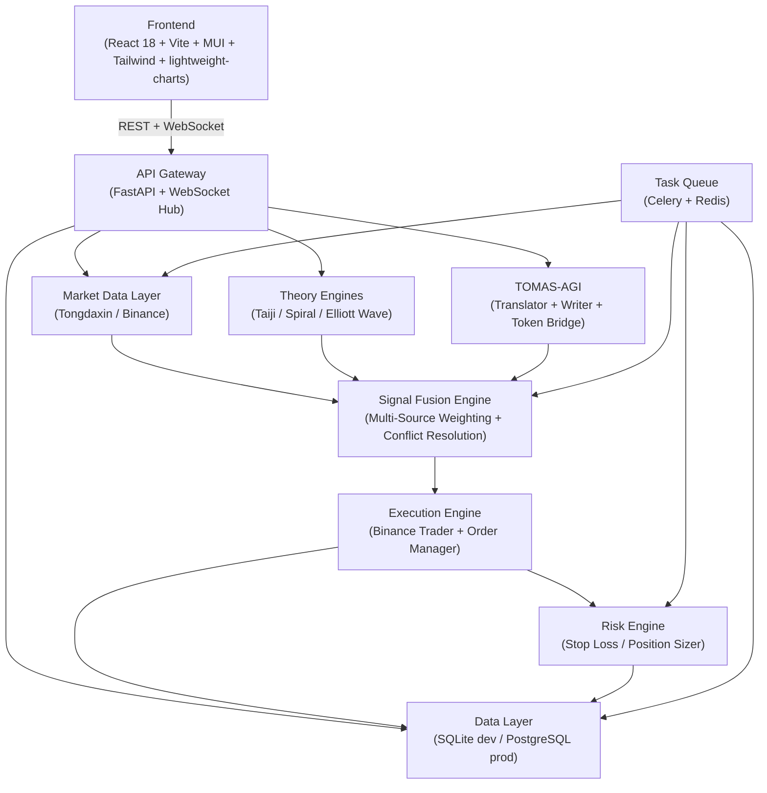
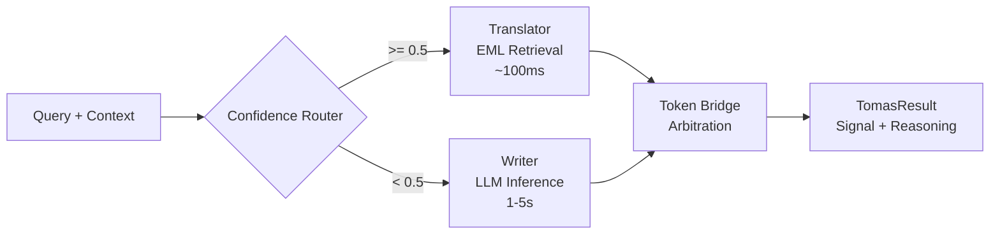

# Sun Dasheng (孙大圣) Quantitative Trading System

[](https://www.python.org/)
[](https://react.dev/)
[](https://www.typescriptlang.org/)
[](https://fastapi.tiangolo.com/)
[](LICENSE)
[](https://www.binance.com/)

> **A dual-market quantitative trading system that fuses Traditional Chinese Yi-Quantitative theory (Lu Zhao Theory) with a modern AGI reasoning framework (TOMAS-AGI), supporting A-share (Tongdaxin) + Binance automated trading.**

---

## Table of Contents

- [Sun Dasheng (孙大圣) Quantitative Trading System](#sun-dasheng-孙大圣-quantitative-trading-system)
  - [Table of Contents](#table-of-contents)
  - [Core Features](#core-features)
  - [System Architecture](#system-architecture)
  - [Quick Start](#quick-start)
  - [Installation Guide](#installation-guide)
    - [Prerequisites](#prerequisites)
    - [Backend Setup](#backend-setup)
    - [Frontend Setup](#frontend-setup)
  - [Configuration](#configuration)
  - [Usage](#usage)
  - [API Documentation](#api-documentation)
  - [Project Structure](#project-structure)
  - [Theoretical Foundations](#theoretical-foundations)
    - [Lu Zhao Theory Engine](#lu-zhao-theory-engine)
    - [TOMAS-AGI Engine](#tomas-agi-engine)
  - [Roadmap](#roadmap)
  - [Contributing](#contributing)
  - [License & References](#license--references)
  - [Acknowledgments](#acknowledgments)

---

## Core Features

- **Dual-Theory Engine Fusion** — Integrates Lu Zhao's quantitative theory (Taiji, Spiral, Elliott Wave, Duality, Cycle, Gann, BG-Moving Average) with the TOMAS-AGI hybrid reasoning engine (Translator + Writer) for high-confidence trading signals.
- **Dual-Market Support** — Simultaneously monitors and trades A-share (via Tongdaxin/pytdx) and crypto (via Binance REST + WebSocket) markets from a single dashboard.
- **Confidence-Based Signal Fusion** — Theoretical pre-screening + TOMAS-AGI final arbitration: high-confidence signals (>=0.5) use fast EML retrieval (<100ms), while low-confidence signals trigger LLM creative reasoning (1-5s).
- **Real-Time Risk Control** — Dynamic stop-loss, take-profit, position sizing, and drawdown limits with per-second monitoring via Celery Beat + WebSocket alerts.
- **Interactive Visualization Dashboard** — Vite + React 18 + MUI + Tailwind CSS, featuring lightweight-charts K-line charts with theory overlays, real-time signal panels, backtesting center, and D3.js knowledge graphs.
- **EML Knowledge Distillation** — Automatic extraction of knowledge graphs from Lu Zhao theory texts, enabling semantic search and conflict resolution for the Translator engine.
- **WebSocket Real-Time Push** — Real-time market data, signal generation, order updates, and risk alerts pushed to the frontend via FastAPI WebSocket Hub.

---

## System Architecture



**Data Flow**: Market Data (Celery Beat 60s) → Theory Engines (parallel) → TOMAS-AGI Arbitration → Signal Fusion → Risk Check → Order Execution → WebSocket Push to Frontend

---

## Quick Start

Get the system running in **3 steps**:

```bash
# 1. Clone the repository
git clone https://github.com/your-org/sundasheng-quant.git
cd sundasheng-quant

# 2. Start the backend
cd backend
python -m venv venv
source venv/bin/activate  # Windows: venv\Scripts\activate
pip install -r requirements.txt
uvicorn app.main:app --reload --port 8000

# 3. Start the frontend (in a new terminal)
cd frontend
npm install
npm run dev
```

Open your browser at `http://localhost:5173`.

> **Note:** Redis must be running locally on port 6379 for Celery. See the full installation guide below for details.

---

## Installation Guide

### Prerequisites

| Component | Version | Purpose |
|-----------|---------|---------|
| Python | 3.11+ | Backend runtime |
| Node.js | 18+ | Frontend runtime |
| Redis | 5.0+ | Celery broker + result backend |
| SQLite | bundled | Development database |

### Backend Setup

1. **Create a Python virtual environment**
   ```bash
   cd backend
   python -m venv venv
   source venv/bin/activate
   ```

2. **Install dependencies**
   ```bash
   pip install -r requirements.txt
   ```

3. **Configure environment variables**
   ```bash
   cp .env.example .env
   # Edit .env with your settings (see Configuration section)
   ```

4. **Initialize the database**
   ```bash
   # SQLite is zero-config; the app will auto-create tables
   # For Alembic migrations (production):
   alembic upgrade head
   ```

5. **Start the services**
   ```bash
   # Start FastAPI server
   uvicorn app.main:app --reload --port 8000

   # In a separate terminal, start Celery worker
   celery -A app.tasks.celery_app worker --loglevel=info

   # In another terminal, start Celery Beat (scheduler)
   celery -A app.tasks.celery_app beat --loglevel=info
   ```

### Frontend Setup

1. **Install dependencies**
   ```bash
   cd frontend
   npm install
   ```

2. **Start the dev server**
   ```bash
   npm run dev
   ```

The frontend will be served at `http://localhost:5173` with HMR enabled.

---

## Configuration

All configuration is loaded via environment variables. Copy `backend/.env.example` to `backend/.env` and customize the following variables:

| Variable | Default | Description |
|----------|---------|-------------|
| `DATABASE_URL` | `sqlite+aiosqlite:///./sundasheng.db` | Database connection string |
| `REDIS_URL` | `redis://localhost:6379/0` | Redis connection for general caching |
| `BINANCE_API_KEY` | *(empty)* | Binance API key |
| `BINANCE_API_SECRET` | *(empty)* | Binance API secret |
| `BINANCE_TESTNET` | `true` | Use Binance testnet (safe for testing) |
| `TOMAS_TRANSLATOR_URL` | `http://localhost:8001/api/translator` | TOMAS Translator endpoint |
| `TOMAS_WRITER_URL` | `http://localhost:8002/api/writer` | TOMAS Writer endpoint |
| `OPENAI_API_KEY` | *(empty)* | OpenAI API key (Writer engine) |
| `OPENAI_MODEL` | `gpt-4` | LLM model for Writer |
| `RISK_MAX_POSITION_PCT` | `0.1` | Max position size per trade (10%) |
| `RISK_STOP_LOSS_PCT` | `0.05` | Default stop-loss percentage (5%) |
| `RISK_TAKE_PROFIT_PCT` | `0.10` | Default take-profit percentage (10%) |
| `RISK_MAX_DRAWDOWN_PCT` | `0.20` | Max portfolio drawdown limit (20%) |
| `MARKET_FETCH_INTERVAL` | `60` | Market data fetch interval in seconds |
| `MARKET_SYMBOLS` | `BTCUSDT,ETHUSDT` | Default symbols to monitor (comma-separated) |
| `CELERY_BROKER_URL` | `redis://localhost:6379/1` | Celery message broker |
| `CELERY_RESULT_BACKEND` | `redis://localhost:6379/2` | Celery result store |
| `CORS_ORIGINS` | `["http://localhost:5173", ...]` | Allowed frontend origins |
| `LOG_LEVEL` | `INFO` | Logging level (DEBUG/INFO/WARNING/ERROR) |
| `LOG_FILE` | `logs/sundasheng.log` | Log file path |

---

## Usage

### Dashboard Overview

After starting both backend and frontend, open `http://localhost:5173`:

| Page | Route | Description |
|------|-------|-------------|
| K-Line Chart | `/` | Main view with candlestick charts, theory overlays, and recent signals |
| Signal Panel | `/signals` | Real-time signal stream with filtering and statistics |
| Backtest Center | `/backtest` | Historical strategy testing with equity curves and performance metrics |
| Risk Monitor | `/risk` | Position monitoring, risk configuration, and alert management |
| Knowledge Graph | `/knowledge` | D3.js force-directed graph of EML knowledge distilled from Lu Zhao theory |


*Main dashboard with K-line chart and theory overlays (placeholder — add your own screenshot)*

### Market Switching

Use the market selector in the top app bar to switch between **A-share** and **Binance** markets. The system automatically routes data requests to the appropriate provider (Tongdaxin for A-share, Binance for crypto).

### Signal Execution

1. Signals are automatically generated by Celery Beat every 60 seconds.
2. The signal fusion engine weighs outputs from all enabled theory engines.
3. TOMAS-AGI provides the final arbitration with confidence scoring.
4. If auto-trading is enabled and risk checks pass, the system will place orders on Binance automatically.

---

## API Documentation

The backend exposes RESTful APIs and WebSocket channels. Auto-generated OpenAPI docs are available at `http://localhost:8000/docs` (Swagger UI) when the server is running.

### REST Endpoints

| Method | Path | Description | Auth |
|--------|------|-------------|------|
| GET | `/health` | System health check | No |
| GET | `/api/market/bars` | Get K-line (OHLCV) data | No |
| GET | `/api/market/symbols` | List available symbols | No |
| GET | `/api/signals` | List signals (paginated) | No |
| GET | `/api/signals/latest` | Get latest signals | No |
| POST | `/api/signals/generate` | Manually trigger signal generation | No |
| POST | `/api/orders` | Create a new order | No |
| GET | `/api/orders` | List orders (paginated) | No |
| GET | `/api/orders/{id}` | Get order details | No |
| DELETE | `/api/orders/{id}` | Cancel an order | No |
| GET | `/api/positions` | List open positions | No |
| GET | `/api/risk/config` | Get risk configuration | No |
| PUT | `/api/risk/config` | Update risk configuration | No |
| GET | `/api/risk/alerts` | Get risk alerts | No |
| GET | `/api/strategy/engines` | List theory engines | No |
| PUT | `/api/strategy/engines/{name}/toggle` | Enable/disable an engine | No |
| POST | `/api/strategy/eml/distill` | Trigger EML knowledge distillation | No |

### WebSocket Channels

| Channel | Path | Message Types |
|---------|------|---------------|
| Market | `/ws/market` | `bar_update` |
| Signals | `/ws/signals` | `signal_generated`, `order_update`, `risk_alert` |

**Response Format**: All REST responses follow `{ "code": int, "data": Any, "message": str }` where `code=0` indicates success.

---

## Project Structure

```
sundasheng-quant/
├── backend/
│   ├── app/
│   │   ├── __init__.py
│   │   ├── main.py              # FastAPI entry point, WebSocket Hub
│   │   ├── config.py            # Pydantic Settings
│   │   ├── database.py          # SQLAlchemy async engine
│   │   ├── models/              # SQLAlchemy ORM models
│   │   │   ├── base.py
│   │   │   ├── market.py
│   │   │   ├── signal.py
│   │   │   ├── order.py
│   │   │   ├── position.py
│   │   │   └── risk.py
│   │   ├── schemas/             # Pydantic request/response schemas
│   │   │   ├── market.py
│   │   │   ├── signal.py
│   │   │   ├── order.py
│   │   │   └── risk.py
│   │   ├── api/                 # REST API routers
│   │   │   ├── router.py
│   │   │   ├── market.py
│   │   │   ├── signal.py
│   │   │   ├── order.py
│   │   │   ├── risk.py
│   │   │   ├── strategy.py
│   │   │   └── ws.py
│   │   ├── services/            # Core business logic
│   │   │   ├── market_data/     # Data providers (Tdx/Binance)
│   │   │   ├── theory/          # Lu Zhao theory engines
│   │   │   ├── tomas/           # TOMAS-AGI reasoning
│   │   │   ├── signal/          # Fusion & generation
│   │   │   ├── execution/       # Binance trading
│   │   │   └── risk/            # Risk management
│   │   └── tasks/               # Celery tasks
│   │       ├── celery_app.py
│   │       ├── market_tasks.py
│   │       ├── signal_tasks.py
│   │       └── risk_tasks.py
│   ├── alembic/                 # Database migrations
│   ├── tests/                   # Pytest test suite
│   ├── requirements.txt
│   ├── pyproject.toml
│   └── .env.example
├── frontend/
│   ├── src/
│   │   ├── main.tsx             # React entry point
│   │   ├── App.tsx              # Root component + routing
│   │   ├── types/               # Global TypeScript types
│   │   ├── api/                 # Axios API clients
│   │   ├── store/               # Zustand state slices
│   │   ├── hooks/               # Custom React hooks
│   │   ├── components/
│   │   │   ├── Layout/          # AppLayout, Sidebar, StatusBar
│   │   │   ├── Chart/           # KlineChart, TheoryOverlay, SignalMarker
│   │   │   ├── Signal/          # SignalPanel
│   │   │   ├── Position/        # PositionPanel
│   │   │   ├── Risk/            # RiskMonitor
│   │   │   └── KnowledgeGraph/  # EmlGraph (D3.js)
│   │   ├── pages/               # 5 main pages
│   │   │   ├── ChartPage.tsx
│   │   │   ├── SignalsPage.tsx
│   │   │   ├── BacktestPage.tsx
│   │   │   ├── RiskMonitorPage.tsx
│   │   │   └── KnowledgePage.tsx
│   │   └── utils/               # Formatters
│   ├── package.json
│   ├── vite.config.ts
│   ├── tailwind.config.ts
│   └── tsconfig.json
├── docs/
│   ├── PRD.md
│   ├── ARCHITECTURE.md
│   ├── TEST_REPORT.md
│   └── USER_GUIDE.md
└── README.md
```

---

## Theoretical Foundations

### Lu Zhao Theory Engine

The Lu Zhao quantitative theory engine is a mathematical formalization of traditional Chinese Yi-quantitative analysis, comprising the following sub-engines:

| Engine | Key Concepts | Output |
|--------|-------------|--------|
| **Taiji Center Law** | DNA29 / DNA13 time windows, Taiji center points | Time-window vertical markers, center-point annotations |
| **Spiral Law** | Fibonacci retracement / extension levels | Horizontal price levels, spiral targets |
| **Elliott Wave** | Impulse waves (1-5), corrective waves (ABC) | Wave labels, pattern recognition |
| **Duality Law** | Form symmetry, time symmetry (Bagua flying/hiding) | Symmetry annotations |
| **Cycle Law** | 360° circular cycle, 45° sectors, Benner cycle | Cycle boundary markers |
| **Gann Angle Lines** | Gann boxes based on Gua-position numbers | Angle lines from pivot points |
| **BG Moving Average** | 6 bottom patterns + 7 top patterns, medium-term MA | Pattern icons, MA crossovers |
| **Everything is Number** | Tai Xuan numbers, Laozi sequence, Later Heaven Bagua | Numeric mappings |
| **DNA Core Number Evolution** | DNA core hidden factors, 3 life propagation modes | Evolution trajectory |

Each engine implements the `TheoryEngine` abstract base class, taking a `List[Bar]` as input and returning a `TheoryResult` with annotations, hints, and a confidence score.

### TOMAS-AGI Engine



**Translator** — Fast EML (Epistemology Meta Language) knowledge retrieval from the distilled Lu Zhao knowledge graph. Used for high-confidence, fact-based queries. Average latency < 100ms.

**Writer** — Creative LLM reasoning (OpenAI GPT-4 or compatible) for ambiguous scenarios requiring novel interpretation. Average latency 1-5s.

**Token Bridge** — Routes each query to the appropriate engine based on a real-time confidence threshold. If Translator times out (>2s), it gracefully falls back to Writer. If Writer times out (>10s), the system falls back to pure theory-engine signals.

**EML Distiller** — Parses Lu Zhao theory texts into a structured knowledge graph (nodes + edges), resolves conflicts, and persists the graph for Translator indexing. Accessible via `POST /api/strategy/eml/distill`.

---

## Roadmap

| Phase | Target | Milestones |
|-------|--------|------------|
| **v0.1.0** (Current) | MVP | Core backend + frontend skeleton, 3 theory engines (P0), mock TOMAS-AGI, mock trading, backtest UI |
| **v0.2.0** | Real Data | Connect real Binance API, real Tongdaxin data, real signal generation, EML distillation |
| **v0.3.0** | Full Automation | Auto-order execution, risk engine live, Celery production deployment, PostgreSQL migration |
| **v0.4.0** | Theory Expansion | Add Duality, Cycle, Gann, BG-MA, Everything-is-Number, DNA-Core engines (P1) |
| **v0.5.0** | Production Ready | Paper-trading mode, Telegram/WeChat alerts, Docker deployment, multi-account support |
| **v1.0.0** | Stable Release | A-share auto-order (compliant), strategy market, mobile adaptation, full test coverage |

---

## Contributing

We welcome contributions from quantitative traders, data scientists, and developers!

1. **Fork** the repository and create your branch (`git checkout -b feature/AmazingFeature`).
2. **Code** following the style guides: Black (Python, line-length=120) and Prettier (TypeScript, 2-space indent).
3. **Test** your changes with pytest and ensure existing tests pass.
4. **Commit** with clear messages (`git commit -m 'Add: spiral law extension levels'`).
5. **Push** to your branch and open a Pull Request.

Please read our [Code of Conduct](CODE_OF_CONDUCT.md) and ensure your PR includes:
- A clear description of the change
- Relevant tests or test updates
- Documentation updates if public APIs or behaviors change

---

## License & References

This project is licensed under the **MIT License**. See [LICENSE](LICENSE) for details.

### Key References

- **Lu Zhao Theory** — Based on the quantitative research of Lu Zhao (鲁兆), covering Taiji center law, spiral law, and cycle theory in Chinese stock markets.
- **TOMAS-AGI Framework** — Inspired by the "Token Bridge" dual-reasoning architecture (Translator + Writer) with EML knowledge distillation.
- **Technical Tools** — FastAPI, Celery, Redis, SQLAlchemy, pytdx, python-binance, lightweight-charts, D3.js, MUI, Tailwind CSS.

---

## Acknowledgments

- **Zhang Feng (章锋 / "Lao Tie")** — Product owner and domain expert who envisioned the fusion of traditional Chinese quantitative theory with modern AGI.
- **Gao Jianyuan (高见远)** — Lead architect who designed the system architecture and technology stack.
- **Open Source Community** — Special thanks to the authors of FastAPI, Celery, lightweight-charts, and D3.js for the excellent tools that power this system.
- **The Lu Zhao Theory Research Community** — For the decades of research that form the theoretical foundation of this project.

---

*Built with the spirit of the Monkey King — Sun Dasheng (孙大圣) — traversing both the celestial and the earthly markets with wisdom and agility.*
