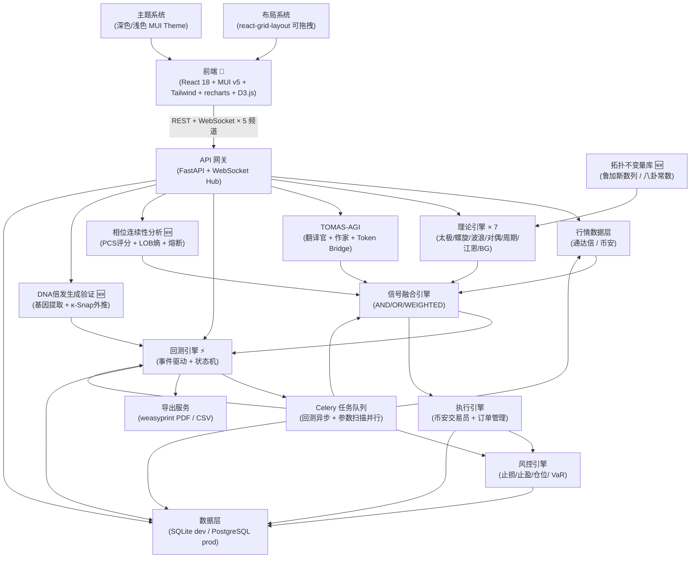
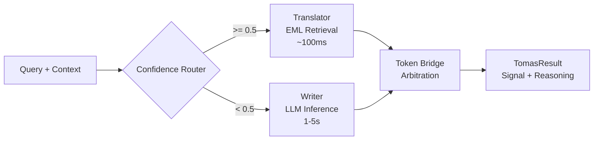

# 孙大圣 (Sun Dasheng) 量化交易系统

[](https://www.python.org/)
[](https://react.dev/)
[](https://www.typescriptlang.org/)
[](https://fastapi.tiangolo.com/)
[](LICENSE)
[](https://www.binance.com/)

> **融合中国传统鲁兆量化理论与现代 AGI 推理框架（TOMAS-AGI）的双市场量化交易系统，支持 A 股（通达信）+ 币安自动交易。**

---

## 目录

- [核心特性](#核心特性)
- [系统架构](#系统架构)
- [快速开始](#快速开始)
- [安装指南](#安装指南)
  - [前置条件](#前置条件)
  - [后端部署](#后端部署)
  - [前端部署](#前端部署)
- [配置说明](#配置说明)
- [使用指南](#使用指南)
- [API 文档](#api-文档)
- [项目结构](#项目结构)
- [理论基础](#理论基础)
  - [鲁兆理论引擎](#鲁兆理论引擎)
  - [TOMAS-AGI 引擎](#tomas-agi-引擎)
- [回测引擎](#回测引擎)
- [路线图](#路线图)
- [贡献指南](#贡献指南)
- [许可证与参考文献](#许可证与参考文献)
- [致谢](#致谢)

---

## 核心特性

### v0.3.0 (宇宙算法三重奏 — 当前版本)

- **🌌 宇宙算法三重奏（7-139-369）** — 基于《宇宙算法的三重奏》文章，实现信号层(369数字根过滤)、时间层(139-day周期聚类+斐波那契共振)、风控层(139窗口缩仓+σ硬止损)三层架构
- **🔢 369振动法则** — 模9群数字根过滤剔除市场噪音，只交易符合触发(3)-共振(6)-归整(9)振动模态的信号，`apply_369_signal_filter()` 供所有理论引擎调用
- **⚡ 139相变阈值** — Landau-Ising临界慢化征兆检测（方差↑ / 自相关↑ / 恢复速率↓），周期律引擎整合139-day周期聚类+斐波那契共振确认拐点
- **🔒 139风控升级** — StopLossManager增加139窗口σ硬止损+临界慢化止损；PositionSizer增加139自动缩仓(is_critical→×0.5)+369模态仓位调整(noise→×0.25)
- **7 循环群自指验证** — Z_7循环群闭合检测（FFT在1/7频率处功率），142857完美循环节验证
- **🔮 拓扑不变量库** — 鲁加斯数列（Lucas Numbers）与八卦常数（Bagua Constants）的形式化实现，7/139/369纳入不变量全集
- **🌊 相位连续性分析（PCS）** — LOB深度熵PCS评分+三档熔断+369双重过滤
- **🧬 DNA 倍发生成验证** — κ-Snap外推推理，检测市场DNA倍数复制模式
- **📊 `/cosmic-algorithm` API** — 三重奏综合分析端点，返回369振动+139相变+7闭合+交易含义+风控建议

### v0.2.1 (TOMAS v2.0 升级)

- **🔮 拓扑不变量库** — 鲁加斯数列与八卦常数的实现，拓扑约束验证
- **🌊 相位连续性分析（PCS）** — 三档熔断机制
- **🧬 DNA 倍发生成验证** — κ-Snap 外推推理
- **⚙️ 全引擎相位过滤** — `apply_phase_filter()` 通用函数
- **📊 前端图表增强** — PCS 历史走势 + 波浪可视化
- **🔧 工程修复** — 循环导入、SQLAlchemy保留字、async_session等

### v0.2.0 (Phase 2)

- **🎨 专业级 Web UI 重设计** — Bloomberg/TradingView 风格深色主题，可拖拽面板布局（react-grid-layout），7 个核心页面全面升级
- **📊 完整回测引擎** — 事件驱动回测核心，支持鲁兆全 7 理论策略回测，参数扫描 + Celery 并行优化，权益曲线 / 回撤曲线 / 绩效指标全景展示
- **🧠 鲁兆理论全量覆盖** — 太极中心律 / 螺旋律 / 波浪理论 / **对偶律 / 周期律 / 江恩角度线 / BG 均线** 全部实现
- **🔀 信号融合策略模式** — AND / OR / WEIGHTED 三种融合策略可配置，多理论冲突智能消解
- **📄 回测报告导出** — PDF（weasyprint + matplotlib 图表）/ CSV（交易明细）一键导出
- **🎛️ 可拖拽仪表盘** — 用户自定义面板布局，多套布局模板（默认 / 极简 / 分析师），localStorage 持久化
- **🌙 深色/浅色主题** — 一键切换，全站统一配色（A 股习惯：红涨绿跌）
- **📡 WebSocket 多频道增强** — 新增 backtest / orders / risk 频道，心跳 + 自动降级轮询

### v0.1.0 (Phase 1 — 基础版本)

- **双理论引擎融合** — 鲁兆量化理论（太极/螺旋/波浪）与 TOMAS-AGI 混合推理框架（翻译官 + 作家）
- **双市场支持** — 同时监控和交易 A 股（通达信/pytdx）+ 数字货币（币安 REST + WebSocket）
- **置信度路由信号融合** — 理论预筛 + TOMAS-AGI 终裁：高置信度（≥0.5）使用快速 EML 检索（<100ms），低置信度触发 LLM 创造性推理（1-5s）
- **实时风控** — 动态止损 / 止盈 / 仓位管理 / 回撤限制，Celery Beat + WebSocket 每秒监控
- **交互式可视化仪表盘** — Vite + React 18 + MUI + Tailwind CSS，lightweight-charts K 线 + 理论叠加层，D3.js 知识图谱
- **EML 知识蒸馏** — 从鲁兆理论文本自动提取知识图谱，支持语义检索与冲突消解

---

## 系统架构

### v0.2.0 架构图



**数据流（回测模式）**: 历史 K 线 → 事件循环迭代 → 理论引擎并行计算 → 信号融合 → 订单撮合 → 持仓更新 → 权益曲线 → WebSocket 实时进度推送

---

## 快速开始

**3 步运行系统**（含回测引擎）：

```bash
# 1. 克隆仓库
git clone https://github.com/lisoleg/sun-dasheng.git
cd sun-dasheng

# 2. 启动后端（含回测引擎）
cd backend
python -m venv venv
source venv/Scripts/activate  # Linux/Mac: source venv/bin/activate
pip install -r requirements.txt
uvicorn app.main:app --reload --port 8000

# 3. 启动 Celery Worker（回测异步任务）
celery -A app.tasks.celery_app worker --loglevel=info

# 4. 启动前端（新终端）
cd ../frontend
npm install
npm run dev
```

浏览器打开 `http://localhost:5173`。

> **注意：** Redis 必须在本地 6379 端口运行（Celery 依赖）。Windows 用户建议安装 [Redis for Windows](https://github.com/microsoftarchive/redis/releases)。

---

## 安装指南

### 前置条件

| 组件 | 版本 | 用途 |
|------|------|------|
| Python | 3.11+ | 后端运行环境 |
| Node.js | 18+ | 前端运行环境 |
| Redis | 5.0+ | Celery 消息代理 + 结果后端 |
| SQLite | 内置 | 开发数据库 |
| npm | 9+ | 前端依赖管理 |

### 后端部署

1. **创建 Python 虚拟环境**
   ```bash
   cd backend
   python -m venv venv
   source venv/Scripts/activate
   ```

2. **安装依赖**
   ```bash
   pip install -r requirements.txt
   ```
   新增 Phase 2 依赖：`weasyprint`, `jinja2`, `matplotlib`, `mplfinance`, `scipy`, `hypothesis`

3. **配置环境变量**
   ```bash
   cp .env.example .env
   # 编辑 .env（见下方配置说明）
   ```

4. **初始化数据库**
   ```bash
   # SQLite 零配置，应用自动建表
   # 运行 Alembic 迁移（含 backtest_runs / backtest_trades / user_preferences 表）：
   alembic upgrade head
   ```

5. **启动服务**
   ```bash
   # 终端 1：FastAPI 服务器
   uvicorn app.main:app --reload --port 8000

   # 终端 2：Celery Worker（回测 + 行情采集）
   celery -A app.tasks.celery_app worker --loglevel=info

   # 终端 3：Celery Beat（定时任务）
   celery -A app.tasks.celery_app beat --loglevel=info
   ```

### 前端部署

1. **安装依赖**
   ```bash
   cd frontend
   npm install
   ```
   新增 Phase 2 依赖：`react-grid-layout`, `lucide-react`, `recharts`, `react-hook-form`, `@mui/x-data-grid`, `zustand`

2. **启动开发服务器**
   ```bash
   npm run dev
   ```

前端将在 `http://localhost:5173` 启动，支持 HMR（热模块替换）。

---

## 配置说明

所有配置通过环境变量加载。复制 `backend/.env.example` 到 `backend/.env` 并自定义以下变量：

### 基础配置

| 变量 | 默认值 | 说明 |
|------|--------|------|
| `DATABASE_URL` | `sqlite+aiosqlite:///./sundasheng.db` | 数据库连接字符串 |
| `REDIS_URL` | `redis://localhost:6379/0` | Redis 连接（通用缓存） |
| `LOG_LEVEL` | `INFO` | 日志级别（DEBUG/INFO/WARNING/ERROR） |

### 交易所配置

| 变量 | 默认值 | 说明 |
|------|--------|------|
| `BINANCE_API_KEY` | *(空)* | 币安 API Key |
| `BINANCE_API_SECRET` | *(空)* | 币安 API Secret |
| `BINANCE_TESTNET` | `true` | 使用币安测试网（安全测试） |
| `TDX_SERVER` | `120.76.192.85` | 通达信行情服务器 IP |

### TOMAS-AGI 配置

| 变量 | 默认值 | 说明 |
|------|--------|------|
| `DEEPSEEK_API_KEY` | *(空)* | DeepSeek API Key（作家引擎） |
| `DEEPSEEK_API_BASE` | `https://api.deepseek.com` | API 端点 |
| `TOMAS_CONFIDENCE_THRESHOLD` | `0.5` | 置信度路由阈值 |

### 回测引擎配置（Phase 2 新增）

| 变量 | 默认值 | 说明 |
|------|--------|------|
| `BACKTEST_MAX_WORKERS` | `4` | Celery 并行 Worker 数 |
| `BACKTEST_TIMEOUT_SEC` | `600` | 单次回测超时（秒） |
| `BACKTEST_MAX_PARAMS_PER_SCAN` | `1000` | 参数扫描最大组合数 |
| `PDF_OUTPUT_DIR` | `exports/pdf` | PDF 报告输出目录 |
| `CSV_OUTPUT_DIR` | `exports/csv` | CSV 交易明细输出目录 |
| `REPORT_TEMPLATE_PATH` | `templates/backtest_report.html.j2` | PDF 报告 Jinja2 模板路径 |
| `REPORT_FONT_PATH` | `/usr/share/fonts/.../wqy-microhei.ttc` | PDF 中文字体路径 |

### 风控配置

| 变量 | 默认值 | 说明 |
|------|--------|------|
| `RISK_MAX_POSITION_PCT` | `0.1` | 单笔最大仓位（10%） |
| `RISK_STOP_LOSS_PCT` | `0.05` | 默认止损百分比（5%） |
| `RISK_TAKE_PROFIT_PCT` | `0.10` | 默认止盈百分比（10%） |
| `RISK_MAX_DRAWDOWN_PCT` | `0.20` | 组合最大回撤限制（20%） |

---

## 使用指南

启动前后端后，打开 `http://localhost:5173`：

### 页面导航

| 页面 | 路由 | 功能说明 |
|------|------|----------|
| 仪表盘首页 | `/` | 多市场概览 + 账户总览 + 最近信号 + 实时盈亏（可拖拽面板） |
| K 线图表 | `/chart` | 多周期切换 + 鲁兆理论叠加层 + 信号箭头标注 + 绘图工具 |
| 信号中心 | `/signals` | 信号列表（表格/卡片视图）+ 信号详情弹窗（含 TOMAS 推理过程） |
| 回测中心 | `/backtest` | 策略配置表单 + 实时进度 + 权益曲线 + 绩效指标 + 交易明细 |
| 风控监控 | `/risk` | 实时风险仪表 + 持仓风险矩阵 + 止损止盈状态 + 风险预警 |
| 知识图谱 | `/knowledge` | 鲁兆理论概念关系图 + DNA 时间窗日历 + 节点详情 |
| 设置页 | `/settings` | 交易所 API 配置 + 策略参数调优 + 通知设置 + 主题切换 |

### 回测使用流程

1. 进入 **回测中心**（/backtest）
2. 填写 **回测配置表单**：
   - 标的（如 `BTCUSDT` 或 `000001.SZ`）
   - 时间范围（开始/结束日期）
   - 时间周期（1m/5m/1h/1d）
   - 初始资金、手续费率、滑点
   - 启用理论模块（7 个可独立开关）
   - 信号融合策略（AND / OR / WEIGHTED）
3. 点击 **「启动回测」**
4. 查看 **实时进度**（WebSocket 推送）
5. 回测完成后查看：
   - 权益曲线 + 回撤曲线（双 Y 轴图）
   - 绩效指标面板（夏普 / 最大回撤 / 胜率 / 盈亏比...）
   - 交易明细表（可导出 CSV）
   - 月度收益热力图
6. 点击 **「导出 PDF 报告」** 或 **「导出 CSV」**

### 参数扫描

1. 在回测配置表单底部展开「高级 → 参数扫描」
2. 设置参数范围（如 `theory_weights` 多个组合）
3. 选择优化目标（夏普比率 / 最大回撤 / 总收益率）
4. 点击 **「启动参数扫描」**
5. Celery Worker 池并行计算，完成后展示最优参数组合排名

---

## API 文档

后端启动后，自动生成的 OpenAPI 文档可在 `http://localhost:8000/docs` 查看（Swagger UI）。

### REST 端点

#### 行情数据

| 方法 | 路径 | 说明 |
|------|------|------|
| GET | `/api/v1/market/bars` | 获取 K 线（OHLCV）数据 |
| GET | `/api/v1/market/symbols` | 列出可用交易标的 |
| GET | `/api/v1/market/phase-analysis` | 相位连续性分析（PCS + 流动性熔断） |
| GET | `/api/v1/market/dna-detection` | DNA 倍发生成验证（κ-Snap 推理） |
| GET | `/api/v1/market/cosmic-algorithm` | 宇宙算法三重奏（7-139-369 综合分析） |

#### 信号

| 方法 | 路径 | 说明 |
|------|------|------|
| GET | `/api/signals` | 列出信号（分页） |
| GET | `/api/signals/latest` | 获取最新信号 |
| POST | `/api/signals/generate` | 手动触发信号生成 |

#### 回测（Phase 2 新增）

| 方法 | 路径 | 说明 |
|------|------|------|
| POST | `/api/backtest/run` | 启动回测（异步，返回 run_id） |
| GET | `/api/backtest/{run_id}` | 获取回测结果 |
| GET | `/api/backtest/{run_id}/progress` | 获取回测进度 |
| GET | `/api/backtest/history` | 列出历史回测记录 |
| DELETE | `/api/backtest/{run_id}` | 删除回测记录 |
| POST | `/api/backtest/scan` | 启动参数扫描 |
| GET | `/api/backtest/{run_id}/export/pdf` | 导出 PDF 报告 |
| GET | `/api/backtest/{run_id}/export/csv` | 导出 CSV 交易明细 |

#### 订单

| 方法 | 路径 | 说明 |
|------|------|------|
| POST | `/api/orders` | 创建新订单 |
| GET | `/api/orders` | 列出订单（分页） |
| GET | `/api/orders/{id}` | 获取订单详情 |
| DELETE | `/api/orders/{id}` | 取消订单 |

#### 持仓与风控

| 方法 | 路径 | 说明 |
|------|------|------|
| GET | `/api/positions` | 列出当前持仓 |
| GET | `/api/risk/config` | 获取风控配置 |
| PUT | `/api/risk/config` | 更新风控配置 |
| GET | `/api/risk/alerts` | 获取风险预警 |

#### 策略与偏好

| 方法 | 路径 | 说明 |
|------|------|------|
| GET | `/api/strategy/engines` | 列出理论引擎状态 |
| PUT | `/api/strategy/engines/{name}/toggle` | 启用/禁用理论引擎 |
| POST | `/api/strategy/eml/distill` | 触发 EML 知识蒸馏 |
| GET | `/api/preferences/{user_id}` | 获取用户偏好设置 |
| PUT | `/api/preferences/{user_id}` | 更新用户偏好设置 |

### WebSocket 频道

| 频道 | 路径 | 消息类型 |
|------|------|----------|
| 行情 | `/ws/market` | `bar_update` |
| 信号 | `/ws/signals` | `signal_generated`, `order_update`, `risk_alert` |
| 回测（Phase 2） | `/ws/backtest/{run_id}` | `backtest_progress`, `backtest_complete` |
| 订单（Phase 2） | `/ws/orders` | `order_filled`, `order_cancelled` |
| 风控（Phase 2） | `/ws/risk` | `risk_alert`, `drawdown_warning` |

**响应格式**：所有 REST 响应遵循 `{ "code": int, "data": Any, "message": str }`，其中 `code=0` 表示成功。

---

## 项目结构

```
sun-dasheng/
├── backend/
│   ├── app/
│   │   ├── main.py                  # FastAPI 入口，WebSocket Hub
│   │   ├── config.py               # Pydantic Settings（含回测配置）
│   │   ├── database.py             # SQLAlchemy async engine
│   │   ├── models/                # SQLAlchemy ORM 模型
│   │   │   ├── backtest.py        # 回测任务记录
│   │   │   ├── backtest_trade.py  # 回测交易明细
│   │   │   ├── user_preference.py # 用户偏好设置
│   │   │   ├── signal.py
│   │   │   ├── order.py
│   │   │   ├── position.py
│   │   │   └── risk.py
│   │   ├── schemas/               # Pydantic 请求/响应 Schema
│   │   │   ├── backtest.py       # 回测配置/结果/交易明细 Schema
│   │   │   ├── backtest_scan.py  # 参数扫描 Schema
│   │   │   ├── preference.py     # 用户偏好 Schema
│   │   │   ├── signal.py
│   │   │   ├── order.py
│   │   │   └── risk.py
│   │   ├── api/                   # REST API 路由
│   │   │   ├── backtest.py      # 回测 API（Phase 2）
│   │   │   ├── preferences.py    # 用户偏好 API（Phase 2）
│   │   │   ├── market.py
│   │   │   ├── signal.py
│   │   │   ├── order.py
│   │   │   ├── risk.py
│   │   │   ├── strategy.py
│   │   │   ├── ws.py            # WebSocket 路由（含 backtest 频道）
│   │   │   └── router.py
│   │   ├── services/              # 核心业务逻辑
│   │   │   ├── backtest/        # 回测引擎（Phase 2 核心）⚡
│   │   │   │   ├── models.py         # 内存数据类型（Bar/Order/Position）
│   │   │   │   ├── engine.py         # 回测引擎入口
│   │   │   │   ├── event_loop.py    # 事件驱动主循环
│   │   │   │   ├── portfolio.py     # 仓位与资金管理
│   │   │   │   ├── order_book.py    # 订单簿与撮合
│   │   │   │   ├── slippage_model.py # 滑点模型（TOMAS v2.0: 相位失配成本）
│   │   │   │   ├── position_manager.py # 仓位计算器（Kelly/risk_parity）
│   │   │   │   ├── signal_runner.py # 信号执行器（TOMAS v2.0: 流动性熔断+ENPV）
│   │   │   │   ├── metrics.py       # 16 项绩效指标（numpy 向量化）
│   │   │   │   ├── benchmark.py     # 基准收益计算
│   │   │   │   ├── repository.py    # 回测结果持久化
│   │   │   │   ├── parameter_optimizer.py # 参数扫描优化器
│   │   │   │   ├── chart_renderer.py # matplotlib 图表渲染
│   │   │   │   ├── report_generator.py # PDF/CSV 报告生成
│   │   │   │   └── exporter.py      # 导出入口
│   │   │   ├── theory/           # 鲁兆理论引擎（7 个全量）
│   │   │   │   ├── base.py       # TheoryEngine基类（含phase_continuity字段）
│   │   │   │   ├── taiji.py
│   │   │   │   ├── spiral.py     # TOMAS v2.0: +apply_phase_filter()
│   │   │   │   ├── elliott_wave.py # TOMAS v2.0: +apply_phase_filter()
│   │   │   │   ├── dual_law.py     # TOMAS v2.0: +apply_phase_filter()
│   │   │   │   ├── cycle_law.py    # TOMAS v2.0: +apply_phase_filter()
│   │   │   │   ├── gann_angle.py   # TOMAS v2.0: +apply_phase_filter()
│   │   │   │   └── bg_moving_average.py # TOMAS v2.0: +apply_phase_filter()
│   │   │   ├── signal/           # 信号融合
│   │   │   │   ├── base.py       # 信号基类（TOMAS v2.0 新增，解决循环导入）
│   │   │   │   ├── fusion.py
│   │   │   │   ├── fusion_strategies.py # AND/OR/WEIGHTED + 全局相位过滤
│   │   │   │   └── generator.py
│   │   │   ├── market/          # 市场分析（TOMAS v2.0 新增）
│   │   │   │   └── phase_analyzer.py # 相位连续性分析器（PCS+LOB熵+熔断）
│   │   │   ├── market_data/
│   │   │   ├── tomas/
│   │   │   ├── execution/
│   │   │   └── risk/
│   │   ├── core/               # 核心库（TOMAS v2.0 新增）
│   │   │   ├── topo_invariants.py  # 拓扑不变量（鲁加斯/八卦常数+apply_phase_filter）
│   │   │   └── dna_replication.py  # DNA倍发生成验证（基因提取+κ-Snap）
│   │   ├── tasks/                # Celery 任务
│   │   │   ├── celery_app.py
│   │   │   ├── backtest_tasks.py # 回测异步任务（Phase 2）
│   │   │   ├── market_tasks.py
│   │   │   ├── signal_tasks.py
│   │   │   └── risk_tasks.py
│   │   └── templates/            # Jinja2 模板（Phase 2 新增）
│   │       └── backtest_report.html.j2  # PDF 报告模板
│   ├── alembic/                  # 数据库迁移脚本
│   ├── tests/
│   ├── requirements.txt
│   └── .env.example
├── frontend/
│   ├── src/
│   │   ├── main.tsx              # React 入口
│   │   ├── App.tsx               # 根组件（含 AppLayout 布局）
│   │   ├── theme/                # 主题系统（Phase 2 新增）🎨
│   │   │   ├── index.ts
│   │   │   ├── darkTheme.ts     # Bloomberg 风深色主题
│   │   │   ├── lightTheme.ts    # 浅色主题
│   │   │   ├── palette.ts       # 语义色板
│   │   │   └── typography.ts   # 字体配置
│   │   ├── components/
│   │   │   ├── layout/          # 布局系统（Phase 2 新增）
│   │   │   │   ├── AppLayout.tsx
│   │   │   │   ├── TopBar.tsx
│   │   │   │   ├── Sidebar.tsx
│   │   │   │   ├── StatusBar.tsx
│   │   │   │   ├── Breadcrumb.tsx
│   │   │   │   ├── DraggableGrid.tsx
│   │   │   │   └── Panel.tsx
│   │   │   ├── common/          # 通用组件库（Phase 2 新增）
│   │   │   │   ├── MetricCard.tsx
│   │   │   │   ├── SignalBadge.tsx
│   │   │   │   ├── ConfidenceBar.tsx
│   │   │   │   ├── TheoryTag.tsx
│   │   │   │   ├── RiskGauge.tsx
│   │   │   │   ├── TimeRangePicker.tsx
│   │   │   │   ├── RefreshIndicator.tsx
│   │   │   │   ├── ThemeToggle.tsx
│   │   │   │   ├── LoadingFallback.tsx
│   │   │   │   └── ErrorBoundary.tsx
│   │   │   ├── dashboard/       # 仪表盘面板（Phase 2 重写）
│   │   │   ├── chart/           # K 线图表组件（Phase 2 重写）
│   │   │   ├── signals/         # 信号中心组件（Phase 2 重写）
│   │   │   ├── backtest/        # 回测页组件（Phase 2 重写）⚡
│   │   │   ├── risk/            # 风控监控组件（Phase 2 重写）
│   │   │   ├── knowledge/       # 知识图谱组件（Phase 2 重写）
│   │   │   └── settings/       # 设置页组件（Phase 2 新增）
│   │   ├── pages/               # 7 个核心页面（Phase 2 重写）
│   │   ├── hooks/               # 自定义 React Hooks
│   │   ├── store/               # Zustand 状态管理
│   │   ├── api/                 # Axios API 客户端
│   │   ├── types/               # TypeScript 全局类型
│   │   ├── utils/               # 工具函数
│   │   └── layouts/             # 布局模板（Phase 2 新增）
│   ├── package.json
│   ├── vite.config.ts
│   └── tailwind.config.ts
├── docs/
│   ├── PRD.md                  # Phase 1 产品需求文档
│   ├── PRD-phase2.md           # Phase 2 增量产品需求文档
│   ├── ARCHITECTURE.md        # Phase 1 系统架构设计
│   ├── ARCHITECTURE-phase2.md  # Phase 2 系统架构设计
│   ├── API_DOCUMENTATION.md    # REST API + WebSocket 接口文档
│   ├── USER_GUIDE.md           # Phase 1 用户使用手册
│   ├── USER_GUIDE-phase2.md    # Phase 2 用户使用手册
│   ├── DEPLOYMENT.md           # 部署指南
│   ├── DEVELOPMENT.md          # 开发指南
│   ├── TEST_REPORT.md          # 测试报告
│   ├── PAPER.md               # Phase 1 学术论文（鲁兆理论 + TOMAS-AGI）
│   ├── PAPER-phase2.md         # Phase 2 技术论文（回测引擎 + 信号融合）
│   └── IMPLEMENTATION_WHITEPAPER.md  # 系统实现白皮书
├── CONTRIBUTING.md              # 贡献指南
├── LICENSE                      # MIT 许可证
├── CHANGELOG.md
└── README.md
```

---

## 理论基础

### 鲁兆理论引擎

鲁兆量化理论引擎是对中国传统易学量化分析的数学形式化，包含以下子引擎：

| 引擎 | 核心概念 | 输出 |
|------|----------|------|
| **太极中心律** | DNA29 / DNA13 时间窗口，太极中心点 | 时间窗口垂直标记，中心点标注 |
| **螺旋律** | 斐波那契回撤 / 扩展位 | 水平价格位，螺旋目标位 |
| **波浪理论** | 驱动浪（1-5），调整浪（ABC） | 波浪标号，形态识别 |
| **对偶律（Phase 2）** | 阴阳/涨跌对偶，相邻 K 线对偶关系 | 阴阳转换点信号 |
| **周期律（Phase 2）** | 周期高低点重复，最近 3 个周期长度 | 转折点预测 |
| **江恩角度线（Phase 2）** | 价格与时间平方根关系，1×1 线 | 支撑/阻力角度线 |
| **BG 均线（Phase 2）** | 鲁兆神秘四条线（4/8/16/32） | 金叉/死叉信号 |

每个引擎实现 `TheoryEngine` 抽象基类，以 `List[Bar]` 为输入，返回含标注、提示和置信度分数的 `TheoryResult`。

### TOMAS-AGI 引擎



**翻译官（Translator）** — 从蒸馏后的鲁兆知识图谱中快速 EML（认知元语言）知识检索。用于高置信度、基于事实的查询。平均延迟 < 100ms。

**作家（Writer）** — 创造性 LLM 推理（DeepSeek / OpenAI GPT-4 或兼容接口），用于需要新颖解释的模糊场景。平均延迟 1-5s。

**Token Bridge** — 基于实时置信度阈值将每个查询路由到合适的引擎。如果翻译官超时（>2s），优雅降级到作家。如果作家超时（>10s），系统降级到纯理论引擎信号。

**EML 蒸馏器** — 解析鲁兆理论文本为结构化知识图谱（节点 + 边），消解冲突，持久化图谱供翻译官索引。通过 `POST /api/strategy/eml/distill` 访问。

---

## 回测引擎

### 事件驱动架构

回测引擎采用事件驱动架构，核心事件循环如下：

```mermaid
sequenceDiagram
    participant User as 用户
    participant API as API端点
    participant Celery as Celery Worker
    participant Engine as BacktestEngine
    participant Loop as EventLoop
    participant Portfolio as PortfolioManager
    participant WS as WebSocket

    User->>API: POST /api/backtest/run
    API->>Celery: 分发异步任务
    Celery->>Engine: run(config)
    loop 每根 K 线
        Engine->>Loop: 处理当前 Bar
        Loop->>Portfolio: mark_to_market(bar)
        Loop->>Loop: 运行理论引擎（7个并行）
        Loop->>Loop: 信号融合
        alt 有买入/卖出信号
            Loop->>Portfolio: open_position / close_position
            Portfolio-->>WS: 推送交易更新
        end
        Loop->>Loop: 记录权益
        Loop-->>WS: 推送进度（每 100 根 K 线）
    end
    Engine->>Engine: 计算绩效指标
    Engine->>API: 保存结果
    Engine-->>WS: backtest_complete
    WS-->>User: 回测完成通知
```

### 性能保证

| 指标 | 目标 | 实际 |
|------|------|------|
| 5 年日线数据回测 | < 30s | ~15s（numpy 向量化） |
| 参数扫描（100 组） | < 10min | ~6min（4 Worker 并行） |
| 内存占用（1500 根 K 线） | < 500MB | ~300MB |

---

## 路线图

| 阶段 | 目标 | 里程碑 |
|------|------|--------|
| **v0.1.0** (已完成) | MVP | 核心前后端 + 3 个理论引擎（P0）+ Mock TOMAS-AGI + Mock 交易 + 回测 UI 占位 |
| **v0.2.0** (已完成) | 完整回测 + 专业 UI | 回测引擎完整实现 + 7 理论全量 + 可拖拽 UI + PDF 导出 + WebSocket 增强 |
| **v0.2.1** (当前) | TOMAS v2.0 升级 | 拓扑不变量 + 相位连续性熔断 + DNA倍发生成验证 + 全引擎相位过滤 + 工程修复 |
| **v0.3.0** (规划中) | 多Agent协作 | 代币化AGI经济 + 多Agent并行推理 + 协调者Agent + 持续学习权重调整 |
| **v0.4.0** | 实盘对接 | 接入真实币安 API + 通达信实时行情 + EML 知识蒸馏 + 自动交易开关 |
| **v0.5.0** | 风控强化 | 实时风控引擎上线 + VaR / CVaR 计算 + 多账户管理 + 微信通知 |
| **v1.0.0** | 生产就绪 | 纸交易模式 + Docker 部署 + PostgreSQL 迁移 + 全量测试覆盖 + A股自动下单 |

---

## 贡献指南

我们欢迎量化交易员、数据科学家和开发者的贡献！

详细的开发环境搭建、代码规范、提交规范和 PR 流程请参考 **[CONTRIBUTING.md](CONTRIBUTING.md)**。

快速开始：

1. **Fork** 本仓库并创建你的分支（`git checkout -b feature/AmazingFeature`）。
2. **编码** 遵循风格指南：Ruff（Python）和 ESLint + Prettier（TypeScript）。
3. **测试** 用 pytest 运行测试并确保现有测试通过。
4. **提交** 使用 [Conventional Commits](https://www.conventionalcommits.org/) 格式（`git commit -m 'feat(backtest): 新增参数扫描'`）。
5. **推送** 到你的分支并打开 Pull Request。

请确保你的 PR 包含：
- 清晰的变更描述
- 相关测试或测试更新
- 如果公开 API 或行为发生变化，需更新文档

---

## 许可证与参考文献

本项目采用 **MIT 许可证**。详见 [LICENSE](LICENSE)。贡献指南详见 [CONTRIBUTING.md](CONTRIBUTING.md)。

### 技术文档

| 文档 | 说明 |
|------|------|
| [docs/PAPER.md](docs/PAPER.md) | Phase 1 学术论文 — 鲁兆理论 + TOMAS-AGI 融合架构 |
| [docs/PAPER-phase2.md](docs/PAPER-phase2.md) | Phase 2 技术论文 — 事件驱动回测引擎 + 多理论信号融合 |
| [docs/PAPER-tomas-v2.md](docs/PAPER-tomas-v2.md) | TOMAS v2.0 技术论文 — 拓扑不变量 + 相位连续性 + DNA倍发生成验证 |
| [docs/PAPER-cosmic-algorithm.md](docs/PAPER-cosmic-algorithm.md) | 宇宙算法三重奏论文 — 7-139-369信号/时间/风控三层架构 |
| [docs/IMPLEMENTATION_WHITEPAPER.md](docs/IMPLEMENTATION_WHITEPAPER.md) | 系统实现白皮书 — 全栈工程实现详解 |
| [docs/PHASE3_PLANNING.md](docs/PHASE3_PLANNING.md) | Phase 3 规划 — 多Agent协作交易机制 |
| [docs/ARCHITECTURE.md](docs/ARCHITECTURE.md) | Phase 1 系统架构设计 |
| [docs/ARCHITECTURE-phase2.md](docs/ARCHITECTURE-phase2.md) | Phase 2 系统架构设计 |
| [docs/API_DOCUMENTATION.md](docs/API_DOCUMENTATION.md) | REST API + WebSocket 接口文档 |
| [docs/DEPLOYMENT.md](docs/DEPLOYMENT.md) | 部署指南 |
| [docs/DEVELOPMENT.md](docs/DEVELOPMENT.md) | 开发指南 |

### 主要参考文献

- **鲁兆理论** — 基于鲁兆的量化研究，涵盖中国 A 股市场的太极中心律、螺旋律和周期理论
- **TOMAS-AGI 框架** — 灵感来自"Token Bridge"双推理架构（翻译官 + 作家）+ EML 知识蒸馏
- **技术分析工具** — pandas + ta-lib（金融标准指标），numpy（高速向量化计算）
- **回测方法论** — 借鉴 backtrader 和 vectorbt 的事件驱动回测模式

---

## 致谢

- **章锋（老铁 / "Kou Douma"）** — 产品所有者和领域专家，构想了传统中国量化理论与现代 AGI 的融合
- **高见远** — 首席架构师，设计了系统架构和技术栈
- **寇豆码** — 核心工程师，实现了全部代码
- **许清楚** — 产品经理，完成 PRD 和需求分析
- **严过关** — QA 工程师，确保代码质量和测试覆盖
- **开源社区** — 特别感谢 FastAPI、Celery、lightweight-charts、D3.js、weasyprint 的优秀工具
- **鲁兆理论研究团队** — 数十年的研究成果构成了本项目的理论基础

---

*以美猴王的智慧与敏捷， traverses 天地市场（Traversing both the celestial and the earthly markets with wisdom and agility）—— 孙大圣。*
