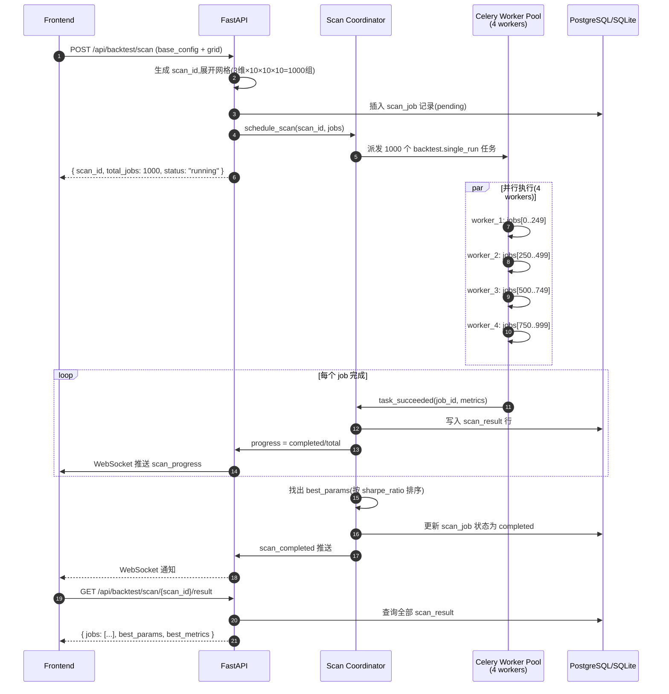
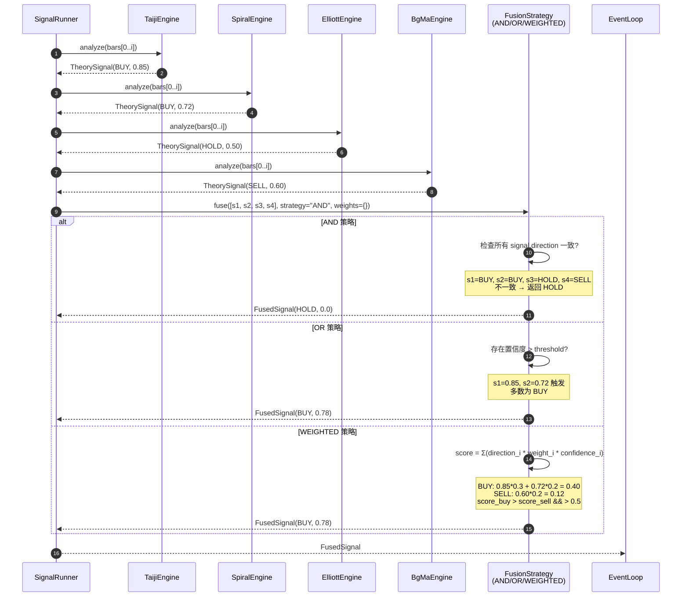
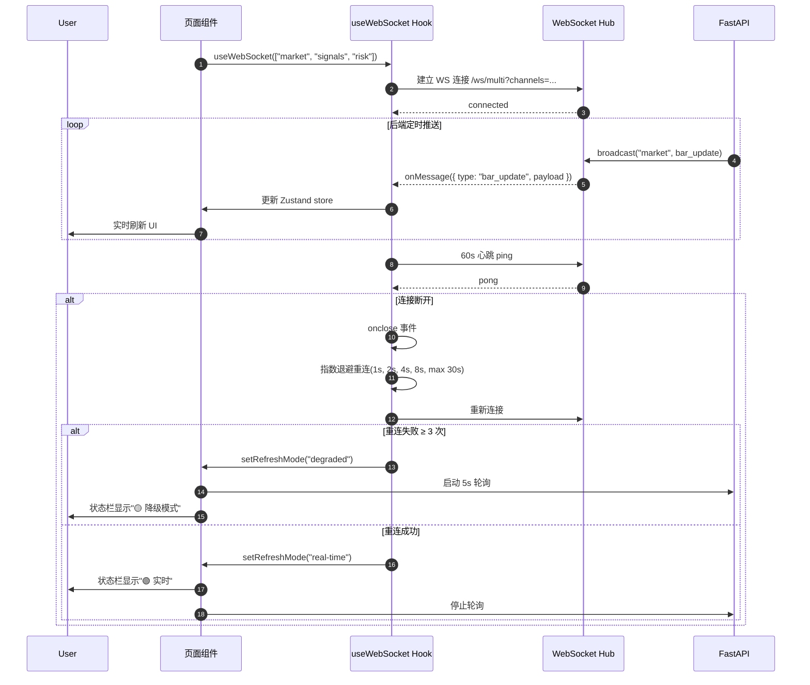
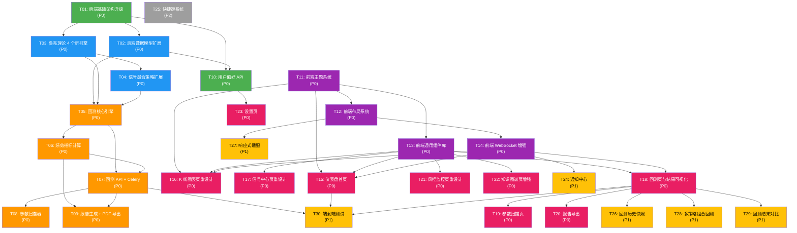

# 孙大圣量化交易系统 - Phase 2 系统架构设计

> 架构师：高见远（Gao） | 版本：v2.0 | 日期：2026-06-17
> 适用版本：v0.2.0 | 增量范围：Web UI 重设计 + 回测引擎 + 鲁兆理论扩展

---

## 目录

- [Part A: 系统设计](#part-a-系统设计)
  - [1. 实现方案与框架选型](#1-实现方案与框架选型)
  - [2. 文件列表及相对路径](#2-文件列表及相对路径)
  - [3. 数据结构与接口](#3-数据结构与接口)
  - [4. 程序调用流程](#4-程序调用流程时序图)
  - [5. 待明确事项](#5-待明确事项)
- [Part B: 任务分解](#part-b-任务分解)
  - [6. 依赖包列表](#6-依赖包列表)
  - [7. 任务列表](#7-任务列表)
  - [8. 共享知识](#8-共享知识)
  - [9. 任务依赖图](#9-任务依赖图)

---

## Part A: 系统设计

### 1. 实现方案与框架选型

#### 1.1 Phase 2 核心挑战

| 挑战 | 说明 | 应对方案 |
|------|------|----------|
| **专业级 Web UI 重构** | Phase 1 仅为 MVP 布局,需达到 TradingView/Bloomberg 终端级体验 | 引入 `react-grid-layout` 可拖拽栅格 + 自研深色主题 + 7 个核心页面重设计 |
| **事件驱动回测引擎** | 真实回测需重放历史 K 线、模拟撮合、计算订单事件 | 借鉴 backtrader/vectorbt 模式:BarReplayer 迭代 → SignalRunner → Portfolio.update → EventBus 派发 |
| **多策略信号融合** | 鲁兆 7 个子模块输出可能方向冲突 | 抽象 `FusionStrategy` 接口:AND/OR/WEIGHTED 三种策略,产出统一 `FusedSignal` |
| **参数扫描并行化** | 3 维网格 100 组需在 10 分钟内完成 | Celery 任务按"参数组合"粒度分片,worker 进程池(默认 4 并发) |
| **回测历史快照** | 每次回测需持久化全量结果,支持重开/对比/审计 | BacktestRun + BacktestResult 1:1 表,JSON 快照字段 + Postgres JSONB(生产) |
| **PDF 报告生成** | 服务端生成包含图表/表格/指标的高质量 PDF | `weasyprint` + `jinja2` 模板,后端 matplotlib 渲染图表为 PNG 嵌入 |
| **可拖拽布局持久化** | 用户拖拽后的布局需保存且支持多套预设 | localStorage(本地) + 服务端 user_preferences 表(预留云同步接口) |
| **WebSocket 频道扩展** | Phase 1 仅 2 频道(market/signals),Phase 2 需 ≥5 频道 | 扩展 `WebSocketHub` 支持频道订阅 + 模式降级(断连自动切轮询) |

#### 1.2 前端框架选型

| 组件 | 选型 | 理由 | Phase 1 | Phase 2 |
|------|------|------|---------|---------|
| 构建工具 | **Vite 5** | 极速 HMR | 沿用 | 沿用 |
| 核心框架 | **React 18 + TypeScript 5** | 组件化 + 类型安全 | 沿用 | 沿用 |
| 组件库 | **MUI v5** | 企业级组件 + 主题系统 | 沿用 | 沿用 |
| 样式方案 | **Tailwind CSS** | 原子化布局 | 沿用 | 沿用 |
| 可拖拽布局 | **react-grid-layout** 🆕 | 业界标准栅格拖拽库,响应式断点支持 | — | **新增** |
| 图标库 | **lucide-react** 🆕 | 风格统一,Tree-shake 友好 | — | **替换** MUI Icons |
| K线图表 | **lightweight-charts v4.2** 🆕 | 升级到 v4.2 支持更大数据集 | v4.1 | **升级** |
| 热力图/雷达 | **recharts** 🆕 | 声明式 API,支持热力图/雷达/堆叠 | — | **新增** |
| 知识图谱 | **D3.js v7** | 力导向图 | 沿用 | 沿用 |
| 状态管理 | **Zustand 4.5 + immer middleware** 🆕 | 支持不可变更新,便于回测大状态 | 无中间件 | **增加 immer** |
| HTTP 客户端 | **axios** | 拦截器/取消 | 沿用 | 沿用 |
| 表单 | **react-hook-form 7** 🆕 | 回测配置表单 ≥10 字段,性能更优 | — | **新增** |
| 表格 | **@mui/x-data-grid** 🆕 | 交易明细虚拟滚动 + 筛选 + 排序 | — | **新增** |
| 路由 | **react-router-dom v6** | 嵌套路由/懒加载 | 沿用 | 沿用 |
| 工具 | date-fns, lodash-es | 格式化/工具 | 沿用 | 沿用 |

#### 1.3 后端框架选型

| 组件 | 选型 | 理由 | Phase 1 | Phase 2 |
|------|------|------|---------|---------|
| Web 框架 | **FastAPI 0.115** | async + WebSocket + OpenAPI | 沿用 | 沿用 |
| 任务队列 | **Celery 5.4 + Redis** | 分布式任务队列 | 沿用 | 沿用 |
| 数据库 | **SQLAlchemy 2.0 async + Alembic** | 迁移支持 | 沿用 | 沿用 |
| 数据库 | **SQLite(开发)/PostgreSQL(生产)** | dev/prod 切换 | 沿用 | 沿用 |
| A股数据 | **pytdx** | 通达信接口 | 沿用 | 沿用 |
| 币安 | **python-binance** | 官方 SDK | 沿用 | 沿用 |
| 技术指标 | **pandas + ta-lib** | 金融标准 | 沿用 | 沿用 |
| 数值计算 | **numpy** | 高速向量化 | 沿用 | 沿用 |
| **回测引擎** 🆕 | **自研 + vectorbt 借鉴** | 事件循环 + 状态机 | — | **新增** |
| **PDF 生成** 🆕 | **weasyprint + jinja2** | HTML→PDF,中文支持 | — | **新增** |
| **图表渲染(服务端)** 🆕 | **matplotlib + mplfinance** | 后端生成图表 PNG 嵌入 PDF | — | **新增** |
| **HTTP 客户端** | **httpx** | async 客户端 | 沿用 | 沿用 |
| LLM 集成 | **openai 1.50** | 作家推理 | 沿用 | 沿用 |
| 配置 | **pydantic-settings 2.5** | 类型安全配置 | 沿用 | 沿用 |
| 日志 | **loguru 0.7** | 结构化日志 | 沿用 | 沿用 |

#### 1.4 整体架构模式

保留 Phase 1 的**分层 + 事件驱动**模式,Phase 2 新增**回测引擎**作为独立的离线计算层,通过 Celery 异步调度。

```
┌──────────────────────────────────────────────────────────────────────┐
│                Frontend (React 18 + Vite + TypeScript)                │
│  ┌──────────────────────────────────────────────────────────────┐    │
│  │  深色主题 + react-grid-layout 可拖拽栅格 + MUI v5 + Tailwind  │    │
│  │  7 页面: 仪表盘 / K线 / 信号 / 回测 / 风控 / 知识图谱 / 设置  │    │
│  └──────────────────────────────────────────────────────────────┘    │
│              REST + WebSocket 频道订阅 / 降级轮询 5s                    │
└──────────────────────────┬───────────────────────────────────────────┘
                           │
┌──────────────────────────▼───────────────────────────────────────────┐
│                 API Gateway (FastAPI 0.115)                            │
│   REST API + WebSocket Hub (5 频道: market/signals/orders/risk/backtest)│
├──────────────────────────────────────────────────────────────────────┤
│                       Service Layer (业务层)                          │
│  ┌──────────────┐ ┌──────────────┐ ┌──────────────┐ ┌─────────────┐ │
│  │  Market Data │ │  Theory 7×  │ │  TOMAS-AGI   │ │  Signal     │ │
│  │  Tdx/Binance │ │ Taiji/Spiral │ │ Translator/  │ │  Fusion     │ │
│  │  Phase 1     │ │ /Elliott/    │ │ Writer 🆕    │ │  Phase 1    │ │
│  │              │ │  对偶/周期/  │ │              │ │             │ │
│  │              │ │  江恩/BG 🆕  │ │              │ │             │ │
│  └──────┬───────┘ └──────┬───────┘ └──────┬───────┘ └──────┬──────┘ │
│         │                │                 │                │        │
│  ┌──────▼─────────────────▼─────────────────▼────────────────▼──────┐ │
│  │              Execution Engine (Phase 1)                            │ │
│  │  BinanceTrader + OrderManager + RiskEngine                        │ │
│  └──────────────────────────────────────────────────────────────────┘ │
│  ┌──────────────────────────────────────────────────────────────────┐ │
│  │              ★ Backtest Engine (Phase 2 NEW)                      │ │
│  │  ┌──────────────┐ ┌──────────────┐ ┌──────────────┐ ┌─────────┐  │ │
│  │  │  Event Loop  │ │  Position    │ │   Metrics    │ │ Report  │  │ │
│  │  │  BarReplay   │ │  Manager     │ │  Calculator  │ │ Export  │  │ │
│  │  └──────┬───────┘ └──────┬───────┘ └──────┬───────┘ └────┬────┘  │ │
│  │         │                │                 │              │       │ │
│  │  ┌──────▼─────────────────▼─────────────────▼──────────────▼───┐ │ │
│  │  │   Signal Runner + Fusion Strategy (AND/OR/WEIGHTED)         │ │ │
│  │  └────────────────────────────────────────────────────────────┘ │ │
│  │  ┌──────────────────────────────────────────────────────────────┐ │ │
│  │  │   Parameter Optimizer (网格扫描 + Celery 任务分片)           │ │ │
│  │  └──────────────────────────────────────────────────────────────┘ │ │
│  └──────────────────────────────────────────────────────────────────┘ │
├──────────────────────────────────────────────────────────────────────┤
│                  Task Queue (Celery 5.4 + Redis 5.0)                  │
│   Beat(定时调度) + Worker(异步执行) + 4 进程池(回测并行)               │
├──────────────────────────────────────────────────────────────────────┤
│                Data Layer (SQLAlchemy 2.0 + Alembic)                  │
│   SQLite(dev) / PostgreSQL(prod)                                       │
│   新增表: backtest_runs / backtest_trades / user_preferences           │
└──────────────────────────────────────────────────────────────────────┘
```

---

### 2. 文件列表及相对路径

> **标注说明**: 🆕 = 新建 | ♻️ = Phase 1 修改 | ✅ = Phase 1 沿用不变

#### 2.1 后端文件

```
backend/
├── app/
│   ├── __init__.py
│   ├── main.py                                    ♻️ 修改(版本号/启动横幅/Phase 2 模块加载)
│   ├── config.py                                  ♻️ 修改(新增 BACKTEST_*/PDF_* 配置项)
│   ├── database.py                                ✅ 不变
│   │
│   ├── models/                                    [Phase 1 沿用 + Phase 2 新增]
│   │   ├── __init__.py                            ♻️ 修改(导出新模型)
│   │   ├── base.py                                ✅
│   │   ├── market.py                              ✅
│   │   ├── signal.py                              ✅
│   │   ├── order.py                               ✅
│   │   ├── position.py                            ✅
│   │   ├── risk.py                                ✅
│   │   ├── backtest.py                            🆕 回测配置/结果/任务表
│   │   ├── backtest_trade.py                      🆕 回测交易明细表
│   │   └── user_preference.py                     🆕 用户偏好(布局模板/主题)
│   │
│   ├── schemas/                                   [Phase 1 沿用 + Phase 2 新增]
│   │   ├── __init__.py                            ♻️ 修改
│   │   ├── market.py                              ✅
│   │   ├── signal.py                              ✅
│   │   ├── order.py                               ✅
│   │   ├── risk.py                                ✅
│   │   ├── backtest.py                            🆕 回测 Pydantic Schema (Config/Result/Trade/Progress)
│   │   ├── backtest_scan.py                       🆕 参数扫描 Schema
│   │   └── preference.py                          🆕 用户偏好 Schema
│   │
│   ├── api/                                       [Phase 1 沿用 + Phase 2 新增]
│   │   ├── __init__.py                            ✅
│   │   ├── router.py                              ♻️ 修改(注册 backtest/preferences/ws_backtest)
│   │   ├── market.py                              ✅
│   │   ├── signal.py                              ✅
│   │   ├── order.py                               ✅
│   │   ├── risk.py                                ✅
│   │   ├── strategy.py                            ✅
│   │   ├── ws.py                                  ♻️ 修改(增加 backtest 频道 + 重连协议)
│   │   ├── backtest.py                            🆕 /api/backtest/* 路由(run/status/result/history/export/scan)
│   │   └── preferences.py                         🆕 /api/preferences/* 路由
│   │
│   ├── services/                                  [Phase 1 沿用 + Phase 2 大幅扩展]
│   │   ├── __init__.py                            ✅
│   │   ├── market_data/                           ✅ 不变
│   │   │   ├── __init__.py
│   │   │   ├── base.py
│   │   │   ├── tdx_provider.py
│   │   │   └── binance_provider.py
│   │   │
│   │   ├── theory/                                ♻️ 修改(新增 4 个理论引擎)
│   │   │   ├── __init__.py                        ♻️
│   │   │   ├── base.py                            ♻️ 修改(扩展 annotations 协议)
│   │   │   ├── taiji.py                           ✅
│   │   │   ├── spiral.py                          ✅
│   │   │   ├── elliott_wave.py                    ✅
│   │   │   ├── dual_law.py                        🆕 对偶律引擎
│   │   │   ├── cycle_law.py                       🆕 周期律引擎
│   │   │   ├── gann_angle.py                      🆕 江恩角度线引擎
│   │   │   └── bg_moving_average.py               🆕 BG 均线引擎
│   │   │
│   │   ├── tomas/                                 ✅ 不变
│   │   │   ├── __init__.py
│   │   │   ├── token_bridge.py
│   │   │   ├── translator.py
│   │   │   ├── writer.py
│   │   │   └── eml_distiller.py
│   │   │
│   │   ├── signal/                                ♻️ 修改(支持回测场景)
│   │   │   ├── __init__.py                        ♻️
│   │   │   ├── fusion.py                          ♻️ 修改(支持 AND/OR/WEIGHTED 三策略)
│   │   │   ├── generator.py                       ♻️ 修改(支持离线回测信号生成)
│   │   │   └── fusion_strategies.py               🆕 三种融合策略实现
│   │   │
│   │   ├── execution/                             ✅ 不变
│   │   │   ├── __init__.py
│   │   │   ├── binance_trader.py
│   │   │   └── order_manager.py
│   │   │
│   │   ├── risk/                                  ✅ 不变
│   │   │   ├── __init__.py
│   │   │   ├── stop_loss.py
│   │   │   └── position_sizer.py
│   │   │
│   │   └── backtest/                              🆕 [Phase 2 核心新增]
│   │       ├── __init__.py
│   │       ├── engine.py                          🆕 BacktestEngine 主类
│   │       ├── event_loop.py                      🆕 事件循环(Bar→Signal→Order→Fill)
│   │       ├── signal_runner.py                   🆕 信号计算调度(理论引擎 + 融合)
│   │       ├── position_manager.py                🆕 仓位与资金管理(虚拟账户)
│   │       ├── portfolio.py                       🆕 组合状态(现金/持仓/权益曲线)
│   │       ├── order_book.py                      🆕 订单簿与撮合模拟
│   │       ├── slippage_model.py                  🆕 滑点模型(固定比例/波动率挂钩)
│   │       ├── metrics.py                         🆕 绩效指标(8+ 指标)
│   │       ├── benchmark.py                       🆕 基准数据加载(沪深300/BTC)
│   │       ├── report_generator.py                🆕 报告生成(JSON/HTML 模板)
│   │       ├── exporter.py                        🆕 PDF 导出(weasyprint+jinja2)
│   │       ├── chart_renderer.py                  🆕 图表渲染(matplotlib→PNG)
│   │       ├── parameter_optimizer.py             🆕 参数网格扫描
│   │       ├── progress_reporter.py               🆕 进度上报(Redis pub/sub)
│   │       ├── models.py                          🆕 内部数据模型(Bar/Order/Fill)
│   │       └── repository.py                      🆕 结果持久化(写 backtest_runs/trades)
│   │
│   └── tasks/                                     [Phase 1 沿用 + Phase 2 新增]
│       ├── __init__.py                            ♻️
│       ├── celery_app.py                          ♻️ 修改(注册 backtest 队列 + worker 配置)
│       ├── market_tasks.py                        ✅
│       ├── signal_tasks.py                        ♻️ 修改(支持批量回测信号生成)
│       ├── risk_tasks.py                          ✅
│       └── backtest_tasks.py                      🆕 回测/参数扫描异步任务
│
├── alembic/                                       ♻️ 修改
│   ├── env.py                                     ✅
│   └── versions/                                  ♻️ 新增迁移脚本
│       ├── xxxx_add_backtest_tables.py            🆕
│       └── xxxx_add_user_preferences.py           🆕
│
├── templates/                                     🆕 [PDF 报告模板]
│   └── backtest_report.html.j2                    🆕 Jinja2 模板
│
├── reports/                                       🆕 [生成报告输出目录,gitignore]
│   ├── pdf/
│   └── csv/
│
├── tests/                                         ♻️ 扩展
│   ├── conftest.py                                ♻️
│   ├── test_taiji.py                              ✅
│   ├── test_spiral.py                             ✅
│   ├── test_elliott_wave.py                       ✅
│   ├── test_signal_fusion.py                      ♻️
│   ├── test_risk_engine.py                        ✅
│   ├── test_binance_trader.py                     ✅
│   ├── test_backtest_engine.py                    🆕 回测核心单测
│   ├── test_metrics.py                            🆕 绩效指标正确性测试
│   ├── test_position_manager.py                   🆕
│   ├── test_parameter_optimizer.py                🆕
│   ├── test_pdf_export.py                         🆕
│   └── fixtures/                                  🆕 测试数据
│       ├── btc_5y_daily.csv                       🆕
│       └── backtest_configs.json                  🆕
│
├── requirements.txt                               ♻️ 新增依赖
└── pyproject.toml                                 ✅
```

#### 2.2 前端文件

```
frontend/
├── index.html                                     ✅
├── package.json                                   ♻️ 新增依赖
├── vite.config.ts                                 ♻️ 修改(代理后端/路径别名)
├── tailwind.config.ts                             ♻️ 修改(深色主题 token)
├── tsconfig.json                                  ✅
├── postcss.config.js                              ✅
│
├── public/                                        ✅
│
└── src/
    ├── main.tsx                                   ♻️ 修改(加载主题 Provider)
    ├── App.tsx                                    ♻️ 重大重写(AppLayout + 路由)
    ├── index.css                                  ♻️ 修改(深色主题基础样式)
    ├── vite-env.d.ts                              ✅
    │
    ├── theme/                                     🆕 [Phase 2 新增]
    │   ├── index.ts                               🆕 主题入口(暗/亮切换)
    │   ├── darkTheme.ts                           🆕 深色主题(Bloomberg 风格)
    │   ├── lightTheme.ts                          🆕 浅色主题
    │   ├── palette.ts                             🆕 色板常量
    │   └── typography.ts                          🆕 字体配置(JetBrains Mono + Inter)
    │
    ├── types/                                     ♻️ 扩展
    │   └── index.ts                               ♻️ 新增 BacktestConfig/Result/Trade/Progress 等类型
    │
    ├── api/                                       ♻️ 扩展
    │   ├── client.ts                              ♻️ 修改(WebSocket 心跳/重试)
    │   ├── market.ts                              ✅
    │   ├── signal.ts                              ✅
    │   ├── order.ts                               ✅
    │   ├── risk.ts                                ✅
    │   ├── backtest.ts                            🆕 回测 API 封装
    │   ├── preferences.ts                         🆕 用户偏好 API
    │   └── backtestScan.ts                        🆕 参数扫描 API
    │
    ├── store/                                     ♻️ 扩展
    │   ├── index.ts                               ♻️
    │   ├── marketSlice.ts                         ✅
    │   ├── signalSlice.ts                         ✅
    │   ├── riskSlice.ts                           ✅
    │   ├── backtestSlice.ts                       🆕 回测状态(进度/结果/历史)
    │   ├── preferencesSlice.ts                    🆕 布局/主题/快捷键
    │   └── wsSlice.ts                             🆕 WebSocket 连接状态
    │
    ├── hooks/                                     ♻️ 扩展
    │   ├── useWebSocket.ts                        ♻️ 修改(频道订阅 + 重连降级)
    │   ├── useMarketData.ts                       ✅
    │   ├── useSignals.ts                          ✅
    │   ├── useBacktestProgress.ts                 🆕 订阅 backtest 频道获取进度
    │   ├── useLayoutTemplate.ts                   🆕 布局模板保存/加载
    │   └── useThemeMode.ts                        🆕 暗/亮主题切换
    │
    ├── components/                                🆕🆕🆕 大量新增与重设计
    │   ├── layout/                                🆕 [重组]
    │   │   ├── AppLayout.tsx                      🆕 主布局(TopBar+Sidebar+Main+StatusBar)
    │   │   ├── TopBar.tsx                         🆕 顶栏(Logo+面包屑+搜索+通知+主题+账户)
    │   │   ├── Sidebar.tsx                        🆕 二级菜单侧边栏(可折叠)
    │   │   ├── StatusBar.tsx                      🆕 底部状态栏(WS连接+最后更新+风控+余额)
    │   │   ├── Breadcrumb.tsx                     🆕 面包屑
    │   │   ├── DraggableGrid.tsx                  🆕 react-grid-layout 包装
    │   │   └── Panel.tsx                          🆕 可拖拽面板容器
    │   │
    │   ├── common/                                🆕 [通用组件]
    │   │   ├── MetricCard.tsx                     🆕 数值指标卡
    │   │   ├── SignalBadge.tsx                    🆕 信号方向徽章
    │   │   ├── ConfidenceBar.tsx                  🆕 置信度条
    │   │   ├── TheoryTag.tsx                      🆕 理论标签
    │   │   ├── RiskGauge.tsx                      🆕 风险仪表
    │   │   ├── TimeRangePicker.tsx                🆕 时间范围选择器
    │   │   ├── RefreshIndicator.tsx               🆕 数据刷新指示器
    │   │   ├── ThemeToggle.tsx                    🆕 主题切换按钮
    │   │   ├── LoadingFallback.tsx                🆕 Suspense 加载态
    │   │   └── ErrorBoundary.tsx                  🆕 错误边界
    │   │
    │   ├── Chart/                                 ♻️ 重设计
    │   │   ├── KlineChart.tsx                     🆕 升级版 K 线(多周期+绘图工具+标注)
    │   │   ├── TheoryOverlay.tsx                  🆕 理论叠加层(7 个理论)
    │   │   ├── SignalMarker.tsx                   🆕 信号箭头(置信度颜色编码)
    │   │   ├── IndicatorPanel.tsx                 🆕 指标图层开关
    │   │   ├── DrawingTools.tsx                   🆕 绘图工具栏(趋势线/水平线等)
    │   │   ├── CrosshairSync.tsx                  🆕 副图十字光标联动
    │   │   └── ChartWidget.tsx                    ♻️ 兼容旧版
    │   │
    │   ├── Dashboard/                             🆕 [新页面组件]
    │   │   ├── MarketOverviewPanel.tsx            🆕 多市场概览
    │   │   ├── AccountSummaryPanel.tsx            🆕 账户总览
    │   │   ├── RecentSignalsPanel.tsx             🆕 最近信号
    │   │   ├── PnLCurvePanel.tsx                  🆕 盈亏曲线
    │   │   ├── TheoryStatusPanel.tsx              🆕 理论引擎状态
    │   │   └── SystemStatusPanel.tsx              🆕 系统状态
    │   │
    │   ├── Signal/                                ♻️ 重设计
    │   │   ├── SignalListView.tsx                 🆕 列表视图
    │   │   ├── SignalCardView.tsx                 🆕 卡片视图
    │   │   ├── SignalFilterBar.tsx                🆕 筛选+排序
    │   │   ├── SignalDetailDialog.tsx             🆕 详情弹窗(TOMAS 推理+理论模块)
    │   │   └── SignalPanel.tsx                    ♻️ 兼容旧版
    │   │
    │   ├── Backtest/                              🆕 [回测核心组件]
    │   │   ├── BacktestConfigForm.tsx             🆕 回测配置表单(react-hook-form)
    │   │   ├── BacktestProgressBar.tsx            🆕 进度条
    │   │   ├── BacktestOverview.tsx               🆕 结果总览 Tab
    │   │   ├── PerformanceMetrics.tsx             🆕 8+ 绩效指标卡
    │   │   ├── EquityCurveChart.tsx               🆕 权益+回撤曲线
    │   │   ├── MonthlyHeatmap.tsx                 🆕 月度收益热力图(recharts)
    │   │   ├── TradeTable.tsx                     🆕 交易明细表(@mui/x-data-grid)
    │   │   ├── TheoryContribution.tsx             🆕 理论贡献度饼图
    │   │   ├── ParameterScanner.tsx               🆕 参数扫描器
    │   │   ├── ScanResultsTable.tsx               🆕 扫描结果表
    │   │   ├── ReportExporter.tsx                 🆕 报告导出
    │   │   └── BacktestHistoryList.tsx            🆕 回测历史列表
    │   │
    │   ├── Risk/                                  ♻️ 重设计
    │   │   ├── RiskGaugeGrid.tsx                  🆕 风险仪表组(4 个)
    │   │   ├── PositionRiskMatrix.tsx             🆕 持仓风险矩阵
    │   │   ├── StopLossStatusList.tsx             🆕 止损止盈状态
    │   │   ├── RiskAlertList.tsx                  🆕 风险预警列表
    │   │   └── RiskMonitor.tsx                    ♻️ 兼容旧版
    │   │
    │   ├── KnowledgeGraph/                        ♻️ 重设计
    │   │   ├── EmlGraph.tsx                       🆕 升级版 D3 力导向图
    │   │   ├── DnaCalendar.tsx                    🆕 DNA 时间窗日历
    │   │   ├── NodeDetailDrawer.tsx               🆕 节点详情抽屉
    │   │   ├── GraphSearchBar.tsx                 🆕 搜索高亮
    │   │   └── KnowledgeGraph.tsx                 ♻️ 兼容旧版
    │   │
    │   ├── Settings/                              🆕 [新页面组件]
    │   │   ├── ExchangeApiTab.tsx                 🆕 交易所 API Tab
    │   │   ├── StrategyParamsTab.tsx              🆕 策略参数 Tab
    │   │   ├── NotificationTab.tsx                🆕 通知设置 Tab
    │   │   ├── SystemTab.tsx                      🆕 系统 Tab
    │   │   └── SettingsLayout.tsx                 🆕 Tab 容器
    │   │
    │   └── Notification/                          🆕
    │       ├── NotificationCenter.tsx             🆕 通知中心
    │       └── NotificationToast.tsx              🆕 Toast 通知
    │
    ├── pages/                                     ♻️ 重组与重写
    │   ├── DashboardPage.tsx                      🆕 仪表盘首页
    │   ├── ChartPage.tsx                          ♻️ K线图重设计
    │   ├── SignalsPage.tsx                        ♻️ 信号中心重设计
    │   ├── BacktestPage.tsx                       ♻️ 回测页重写(原本占位)
    │   ├── RiskMonitorPage.tsx                    ♻️ 风控页重设计
    │   ├── KnowledgePage.tsx                      ♻️ 知识图谱重设计
    │   └── SettingsPage.tsx                       🆕 设置页
    │
    ├── layouts/                                   🆕 布局模板
    │   ├── defaultLayout.ts                       🆕 默认布局(6 面板)
    │   ├── minimalLayout.ts                       🆕 极简布局
    │   └── analystLayout.ts                       🆕 分析师视图布局
    │
    └── utils/                                     ♻️ 扩展
        ├── formatters.ts                          ♻️ 新增回测格式化函数
        ├── colorHelpers.ts                        🆕 颜色工具(热力图)
        ├── constants.ts                           🆕 全局常量
        ├── mockData.ts                            ♻️ 减少 mock,逐步替换为真实 API
        └── downloadFile.ts                        🆕 浏览器下载工具
```

---

### 3. 数据结构与接口

#### 3.1 关键 TypeScript 类型

```typescript
// ============================================================
// 回测引擎相关
// ============================================================

/** 回测配置(对齐 PRD §5.2) */
export interface BacktestConfig {
  // 标的选择
  market: 'a-stock' | 'binance';
  symbol: string;
  timeframe: '1m' | '5m' | '15m' | '30m' | '1h' | '4h' | '1d' | '1w';

  // 时间范围
  start_date: string;          // ISO 8601 date
  end_date: string;            // ISO 8601 date

  // 资金
  initial_capital: number;

  // 成本
  commission_rate: number;     // 0.001 = 0.1%
  slippage_rate: number;       // 0.0005 = 0.05%

  // 仓位
  position_sizing: 'fixed_pct' | 'fixed_amount' | 'kelly' | 'risk_parity';
  position_value: number;      // 仓位大小
  max_position_pct: number;    // 单笔最大仓位

  // 策略
  enabled_theories: TheoryName[];
  signal_fusion: 'AND' | 'OR' | 'weighted';
  theory_weights?: Record<TheoryName, number>;

  // 基准
  benchmark: 'csi300' | 'btc' | 'eth' | 'none';

  // 止损止盈
  stop_loss_pct?: number;
  take_profit_pct?: number;
  trailing_stop_pct?: number;

  // 高级
  allow_short?: boolean;
  reinvest_profits?: boolean;

  // 参数扫描(可选)
  parameter_grid?: Record<string, number[]>;
}

export type TheoryName =
  | 'taiji' | 'spiral' | 'elliott' | 'dual'
  | 'cycle' | 'gann' | 'bg_ma';

/** 回测结果 */
export interface BacktestResult {
  backtest_id: string;
  config: BacktestConfig;
  started_at: string;
  finished_at: string;
  duration_seconds: number;
  status: 'running' | 'completed' | 'failed' | 'cancelled';
  error_message?: string;
  progress?: number;             // 0-100

  metrics: PerformanceMetrics;
  equity_curve: EquityPoint[];
  monthly_returns: MonthlyReturn[];
  trades: BacktestTrade[];
  theory_contribution: TheoryContribution[];
}

export interface PerformanceMetrics {
  total_return: number;
  annualized_return: number;
  sharpe_ratio: number;
  sortino_ratio: number;
  calmar_ratio: number;
  max_drawdown: number;             // 负数
  max_drawdown_duration_days: number;
  win_rate: number;
  profit_factor: number;
  total_trades: number;
  avg_trade_return: number;
  avg_holding_period_hours: number;
  volatility: number;
  var_95: number;
  cvar_95: number;
}

export interface EquityPoint {
  timestamp: string;
  equity: number;
  benchmark_equity: number;
  drawdown: number;
}

export interface MonthlyReturn {
  year: number;
  month: number;                    // 1-12
  return: number;                   // 0.05 = 5%
}

export interface BacktestTrade {
  trade_id: string;
  symbol: string;
  side: 'BUY' | 'SELL';
  open_time: string;
  open_price: number;
  close_time: string;
  close_price: number;
  quantity: number;
  pnl: number;
  pnl_pct: number;
  holding_hours: number;
  theory_tags: TheoryName[];
  confidence: number;
  exit_reason: 'SIGNAL' | 'STOP_LOSS' | 'TAKE_PROFIT' | 'TRAILING_STOP' | 'END_OF_DATA';
}

export interface TheoryContribution {
  theory_name: TheoryName;
  signal_count: number;
  winning_trades: number;
  contribution_pct: number;
}

/** 回测进度(WebSocket 推送) */
export interface BacktestProgress {
  backtest_id: string;
  status: 'running' | 'completed' | 'failed' | 'cancelled';
  progress: number;                 // 0-100
  stage: 'loading_data' | 'computing_signals' | 'simulating_orders' | 'calculating_metrics' | 'generating_report';
  message?: string;
  current_bar?: number;
  total_bars?: number;
}

/** 参数扫描结果 */
export interface ParameterScanResult {
  scan_id: string;
  base_config: BacktestConfig;
  grid: Record<string, number[]>;
  results: Array<{
    params: Record<string, number>;
    metrics: Pick<PerformanceMetrics, 'sharpe_ratio' | 'total_return' | 'max_drawdown' | 'win_rate'>;
  }>;
  best_params?: Record<string, number>;
  best_metrics?: PerformanceMetrics;
}

// ============================================================
// 用户偏好(布局/主题)
// ============================================================

export interface UserPreferences {
  theme_mode: 'dark' | 'light';
  layout_template: 'default' | 'minimal' | 'analyst' | 'custom';
  custom_layout?: GridLayoutItem[];   // react-grid-layout 格式
  chart_indicators: {
    bg_ma: boolean;
    gann: boolean;
    fibonacci: boolean;
    macd: boolean;
    kdj: boolean;
    rsi: boolean;
  };
  notifications: {
    browser_enabled: boolean;
    sound_enabled: boolean;
    alert_level: 'info' | 'warning' | 'critical';
  };
  refresh_mode: 'auto' | 'manual';   // auto = WebSocket 实时
  shortcuts_enabled: boolean;
}

export interface GridLayoutItem {
  i: string;            // 面板 ID
  x: number; y: number; w: number; h: number;
  minW?: number; minH?: number;
}

// ============================================================
// 主题与 UI
// ============================================================

export type ThemeMode = 'dark' | 'light';
export type RefreshMode = 'real-time' | 'degraded' | 'manual';

// ============================================================
// WebSocket 消息扩展
// ============================================================

export type WsMessageType =
  | 'bar_update' | 'signal_generated' | 'order_update'
  | 'risk_alert' | 'position_update'
  | 'backtest_progress' | 'backtest_completed'   // 🆕
  | 'scan_progress' | 'scan_completed'           // 🆕
  | 'pong' | 'ping';

export interface WsMessage<T = any> {
  type: WsMessageType;
  channel: 'market' | 'signals' | 'orders' | 'risk' | 'backtest';
  payload: T;
  timestamp: string;
}
```

#### 3.2 关键 Python 类型

```python
# ============================================================
# backend/app/services/backtest/models.py
# ============================================================
from dataclasses import dataclass, field
from datetime import datetime
from decimal import Decimal
from enum import Enum
from typing import List, Optional


class SignalDirection(str, Enum):
    """信号方向"""
    BUY = "BUY"
    SELL = "SELL"
    HOLD = "HOLD"


class PositionSide(str, Enum):
    LONG = "LONG"
    SHORT = "SHORT"


class OrderType(str, Enum):
    MARKET = "MARKET"
    LIMIT = "LIMIT"


class OrderStatus(str, Enum):
    PENDING = "PENDING"
    FILLED = "FILLED"
    PARTIALLY_FILLED = "PARTIALLY_FILLED"
    CANCELLED = "CANCELLED"
    REJECTED = "REJECTED"


class ExitReason(str, Enum):
    SIGNAL = "SIGNAL"
    STOP_LOSS = "STOP_LOSS"
    TAKE_PROFIT = "TAKE_PROFIT"
    TRAILING_STOP = "TRAILING_STOP"
    END_OF_DATA = "END_OF_DATA"


@dataclass
class Bar:
    """K线数据(回测内部使用,与 schemas 分离以提升性能)"""
    timestamp: datetime
    open: float
    high: float
    low: float
    close: float
    volume: float


@dataclass
class TheorySignal:
    """单个理论引擎的原始信号"""
    theory_name: str
    timestamp: datetime
    direction: SignalDirection
    confidence: float        # 0.0-1.0
    annotations: dict = field(default_factory=dict)


@dataclass
class FusedSignal:
    """信号融合后的最终信号"""
    timestamp: datetime
    direction: SignalDirection
    confidence: float
    contributing_theories: List[str] = field(default_factory=list)
    weights: dict = field(default_factory=dict)


@dataclass
class Order:
    """模拟订单"""
    order_id: str
    symbol: str
    side: str              # BUY/SELL
    order_type: OrderType
    quantity: float
    price: Optional[float] = None
    status: OrderStatus = OrderStatus.PENDING
    filled_quantity: float = 0.0
    filled_price: float = 0.0
    commission: float = 0.0
    created_at: Optional[datetime] = None
    filled_at: Optional[datetime] = None


@dataclass
class Position:
    """虚拟持仓"""
    position_id: str
    symbol: str
    side: PositionSide
    quantity: float
    entry_price: float
    entry_time: datetime
    stop_loss_price: Optional[float] = None
    take_profit_price: Optional[float] = None
    trailing_stop_pct: Optional[float] = None
    highest_price: float = 0.0     # 用于追踪止损
    theory_tags: List[str] = field(default_factory=list)
    confidence: float = 0.0


@dataclass
class Fill:
    """成交回报"""
    order_id: str
    symbol: str
    side: str
    quantity: float
    price: float
    commission: float
    timestamp: datetime
    slippage: float = 0.0


@dataclass
class Portfolio:
    """组合状态"""
    initial_capital: float
    cash: float
    positions: dict = field(default_factory=dict)    # symbol -> Position
    closed_trades: List[dict] = field(default_factory=list)
    equity_curve: List[dict] = field(default_factory=list)

    @property
    def total_equity(self) -> float:
        return self.cash + sum(
            p.quantity * self._mark_price(p.symbol)
            for p in self.positions.values()
        )

    def _mark_price(self, symbol: str) -> float:
        # 由 EventLoop 注入当前 bar close
        ...


@dataclass
class BacktestMetrics:
    """绩效指标"""
    total_return: float
    annualized_return: float
    sharpe_ratio: float
    sortino_ratio: float
    calmar_ratio: float
    max_drawdown: float
    max_drawdown_duration_days: int
    win_rate: float
    profit_factor: float
    total_trades: int
    avg_trade_return: float
    avg_holding_period_hours: float
    volatility: float
    var_95: float
    cvar_95: float
```

#### 3.3 API 端点清单

##### 3.3.1 Phase 1 沿用(部分升级)

| 方法 | 路径 | 变更 |
|------|------|------|
| GET | `/api/market/bars` | ✅ |
| GET | `/api/market/symbols` | ✅ |
| GET | `/api/signals` | ✅ |
| GET | `/api/signals/latest` | ✅ |
| POST | `/api/orders` | ✅ |
| GET | `/api/orders` | ✅ |
| GET | `/api/positions` | ✅ |
| GET | `/api/risk/config` | ✅ |
| PUT | `/api/risk/config` | ✅ |
| GET | `/api/risk/alerts` | ✅ |
| GET | `/api/strategy/engines` | ♻️ 返回 7 个理论引擎状态(新增 4 个) |
| PUT | `/api/strategy/engines/{name}/toggle` | ♻️ |
| POST | `/api/strategy/eml/distill` | ✅ |
| WS | `/ws/market` | ✅ |
| WS | `/ws/signals` | ✅ |
| WS | `/ws/orders` | 🆕 新增 |
| WS | `/ws/risk` | 🆕 新增 |

##### 3.3.2 Phase 2 新增(回测)

| 方法 | 路径 | 说明 |
|------|------|------|
| POST | `/api/backtest/run` | 启动回测(异步,返回 task_id 与 backtest_id) |
| GET | `/api/backtest/status/{task_id}` | 轮询任务状态(也可走 WebSocket) |
| GET | `/api/backtest/result/{backtest_id}` | 获取完整回测结果 |
| GET | `/api/backtest/history` | 回测历史列表(分页: page/page_size) |
| DELETE | `/api/backtest/{backtest_id}` | 删除回测记录 |
| POST | `/api/backtest/{backtest_id}/cancel` | 取消正在运行的回测 |
| GET | `/api/backtest/{backtest_id}/export?format=pdf\|csv` | 导出报告 |
| GET | `/api/backtest/{backtest_id}/preview` | 报告 HTML 预览(无 PDF) |
| POST | `/api/backtest/scan` | 启动参数扫描(异步) |
| GET | `/api/backtest/scan/{scan_id}/result` | 获取扫描结果 |
| POST | `/api/backtest/scan/{scan_id}/cancel` | 取消扫描 |
| POST | `/api/backtest/compare` | 提交 2-4 个回测 ID 进行对比 |
| GET | `/api/backtest/templates` | 获取已保存的回测模板 |
| POST | `/api/backtest/templates` | 保存回测模板 |
| WS | `/ws/backtest` | 回测/扫描进度实时推送 |

##### 3.3.3 Phase 2 新增(用户偏好)

| 方法 | 路径 | 说明 |
|------|------|------|
| GET | `/api/preferences` | 获取当前用户偏好 |
| PUT | `/api/preferences` | 更新偏好 |
| GET | `/api/preferences/layouts` | 获取布局模板列表 |
| POST | `/api/preferences/layouts` | 保存自定义布局 |
| DELETE | `/api/preferences/layouts/{id}` | 删除布局模板 |

#### 3.4 WebSocket 协议扩展

**新增/修改频道**：
- `market` ✅(Phase 1)
- `signals` ✅(Phase 1)
- `orders` 🆕
- `risk` 🆕
- `backtest` 🆕(进度推送)

**消息格式(扩展)**:
```typescript
// 客户端订阅
{ "action": "subscribe", "channel": "backtest", "task_id": "bt-2026-06-17-001" }

// 服务端推送(回测进度)
{
  "type": "backtest_progress",
  "channel": "backtest",
  "payload": {
    "backtest_id": "bt-2026-06-17-001",
    "status": "running",
    "progress": 45,
    "stage": "computing_signals",
    "current_bar": 820,
    "total_bars": 1825
  },
  "timestamp": "2026-06-17T12:34:56Z"
}

// 心跳
{ "action": "ping" }  →  { "type": "pong", "timestamp": "..." }

// 客户端模式降级指令(断连时)
{ "action": "set_mode", "mode": "degraded" }   // 5s 轮询
```

---

### 4. 程序调用流程(时序图)

#### 4.1 回测引擎主流程(核心)

```mermaid
sequenceDiagram
    autonumber
    participant UI as Frontend (BacktestPage)
    participant API as FastAPI<br/>(backtest router)
    participant Task as Celery Task<br/>(backtest_tasks)
    participant Engine as BacktestEngine
    participant Loader as BarDataLoader
    participant Runner as SignalRunner
    participant Loop as EventLoop
    participant Port as Portfolio
    participant Calc as MetricsCalculator
    participant Repo as Repository
    participant WS as WebSocketHub<br/>(backtest channel)
    participant PDF as ReportExporter

    UI->>API: POST /api/backtest/run (config)
    API->>API: 校验参数 + 生成 backtest_id (UUID)
    API->>Task: task.delay(config, backtest_id)
    API-->>UI: { task_id, backtest_id, status: "pending" }

    Task->>Repo: 创建 backtest_runs 记录(status=running)
    Task->>Engine: engine.run(config)

    Engine->>Loader: load_bars(symbol, timeframe, start, end)
    Loader->>Loader: 优先 DB -> 缺失则 Provider 拉取
    Loader-->>Engine: List[Bar] (1825 根)

    Engine->>Runner: instantiate(enabled_theories)
    Engine->>Port: Portfolio(initial_capital)

    loop 对每根 Bar (i = 0..N-1)
        Engine->>Runner: run_theories(bars[0..i+1])
        Runner->>Runner: Taiji.analyze() / Spiral.analyze() / ...
        Runner->>Runner: FusedSignal = fuse_strategy.fuse(theory_signals)
        Runner-->>Engine: FusedSignal

        Engine->>Loop: process_bar(bar, fused_signal, portfolio)

        Loop->>Port: update_position_value(bar.close)

        loop 每个 open position
            Loop->>Loop: 检查 bar.low <= stop_loss?
            alt 触发止损
                Loop->>Port: close_position(stop_price, STOP_LOSS)
            else bar.high >= take_profit?
                Loop->>Port: close_position(tp_price, TAKE_PROFIT)
            else 计算追踪止损
                Loop->>Port: update_trailing_stop(bar.close)
            end
        end

        alt fused_signal = BUY 且无持仓
            Loop->>Loop: size = PositionSizer.calculate(...)
            Loop->>Loop: entry_price = bar.close * (1 + slippage)
            Loop->>Port: open_position(symbol, size, entry_price, ...)
        else fused_signal = SELL 且有持仓
            Loop->>Loop: exit_price = bar.close * (1 - slippage)
            Loop->>Port: close_position(exit_price, SIGNAL)
        end

        Loop->>Port: record_equity(bar.timestamp)
    end

    Engine->>Calc: calculate_metrics(equity_curve, trades)
    Calc->>Calc: 总收益 / 年化 / 夏普 / 索提诺 / 最大回撤 / 胜率 / ...
    Calc-->>Engine: BacktestMetrics

    Engine->>Calc: calculate_theory_contribution(trades)
    Calc-->>Engine: List[TheoryContribution]

    Engine->>Repo: save_result(backtest_runs, backtest_trades)
    Repo-->>Engine: persisted

    Engine-->>Task: BacktestResult
    Task->>WS: broadcast("backtest", { type: "backtest_completed", payload: result })
    Task->>Repo: 更新 backtest_runs.status = completed

    UI->>WS: 订阅 backtest 频道
    WS-->>UI: backtest_completed 消息
    UI->>UI: 跳转到结果 Tab / 弹出"查看结果"提示

    UI->>API: GET /api/backtest/result/{backtest_id}
    API->>Repo: 查询完整结果
    API-->>UI: BacktestResult JSON

    UI->>API: GET /api/backtest/{id}/export?format=pdf
    API->>PDF: exporter.generate(result, template)
    PDF->>PDF: 渲染图表(matplotlib → PNG)
    PDF->>PDF: Jinja2 模板填充
    PDF->>PDF: weasyprint HTML → PDF
    PDF-->>API: PDF bytes
    API-->>UI: application/pdf (流式下载)
```

#### 4.2 参数扫描并行流程



#### 4.3 信号融合(策略模式)



#### 4.4 前端实时刷新机制



---

### 5. 待明确事项

| # | 事项 | 影响范围 | 当前假设 / 建议 |
|---|------|----------|----------------|
| 1 | **鲁兆理论 4 个新引擎的实现细节** | T08 (新增理论) | 对偶律/周期律/江恩/BG 均值的精确数学模型需要鲁兆文献专家评审,初期用文献常见默认值,预留配置文件可调 |
| 2 | **回测是否支持做空** | T09-T12 | **本期仅做多**,做空 P3 再加(A 股融券受限、币安合约可做空,统一做多降低开发量) |
| 3 | **PDF 报告生成方案** | T13 | **方案 A**:服务端 weasyprint + jinja2 + matplotlib 图表(质量可控、需安装系统字体);**方案 B**:前端 jsPDF + html2canvas(轻量、图表清晰度受限) |
| 4 | **参数扫描的并行模型** | T14 | **方案 A**:每组参数独立 Celery 任务(粒度细、调度开销大但通用);**方案 B**:按维度分片(首维串行、其余并行)。**建议 A**,通用且与 4 worker pool 自然契合 |
| 5 | **可拖拽布局的存储粒度** | T07 | **方案 A**:仅本地 localStorage;**方案 B**:本地 + 云端同步(多设备)。**建议先 A**,云端 P3 |
| 6 | **回测数据来源** | T09 | **方案 A**:仅用本地数据库缓存(受限于历史导入范围);**方案 B**:回测时按需从 Provider 拉取(可能超限)。**建议 A 为主、B 兜底**(若 DB 不足则回退到 Provider) |
| 7 | **理论贡献度统计方法** | T11 | **建议**:按"该理论触发的交易盈利占比"(更反映实际贡献) |
| 8 | **月度收益热力图颜色** | T12 | 跟随系统已采用的红涨绿跌(A 股习惯) |
| 9 | **是否需要回测任务取消** | T09-T10 | **需要**,前端"停止"按钮 + 后端 `revoke` Celery task + DB 状态置 cancelled |
| 10 | **回测的指标卡是否可自定义** | T12 | **建议先固定 8 个**,自定义 P3 |
| 11 | **回测历史快照保留时长** | T16 | 默认永久保留,设置页提供"清理 N 天前"按钮 |
| 12 | **图表渲染库选择** | T12 | **服务端** matplotlib + mplfinance(嵌入 PDF);**前端** 复用以 lightweight-charts(权益曲线) + recharts(热力图/饼图) |
| 13 | **理论引擎的默认权重** | T08 | 初始等权(各 1.0),回测报告中给出网格扫描推荐值 |
| 14 | **回测的最大数据规模** | T09 | 单次回测支持 5 年日线 ≈ 1825 根;分钟级受 Celery 内存限制(默认 512MB/worker),可配置提升 |

---

## Part B: 任务分解

### 6. 依赖包列表

#### 6.1 前端 npm 新增/升级

```json
{
  "dependencies新增": {
    "react-grid-layout": "^1.4.4",
    "lucide-react": "^0.400.0",
    "recharts": "^2.12.7",
    "react-hook-form": "^7.52.2",
    "@hookform/resolvers": "^3.9.0",
    "yup": "^1.4.0",
    "@mui/x-data-grid": "^7.18.0",
    "zustand": "^4.5.4"
  },
  "dependencies升级": {
    "lightweight-charts": "^4.2.0",
    "@mui/material": "^5.16.7",
    "@mui/icons-material": "^5.16.7"
  },
  "devDependencies新增": {
    "@types/react-grid-layout": "^1.3.5"
  }
}
```

#### 6.2 后端 pip 新增

```txt
# 回测引擎
numpy>=1.26.0
pandas>=2.2.0
scipy>=1.13.0

# PDF 报告
weasyprint>=62.3
jinja2>=3.1.4
matplotlib>=3.9.0
mplfinance>=0.12.10b0

# 测试
pytest>=8.3.0
pytest-asyncio>=0.23.0
pytest-cov>=5.0.0
hypothesis>=6.108.0

# 任务进度
tqdm>=4.66.0
```

#### 6.3 后端 pip 升级

```txt
pydantic>=2.9.2
fastapi>=0.115.2
sqlalchemy>=2.0.35
celery>=5.4.0
```

---

### 7. 任务列表

> 优先级:**P0**(必须)| **P1**(应该)| **P2**(锦上添花)
> 标注:🆕= 新建 | ♻️ = 修改 | ✅ = 沿用
> 实现顺序:按 ID 顺序即可,后置任务依赖前置任务的文件/类型定义

#### T01: 后端基础架构升级 (P0) ♻️

```
- 文件:
  backend/app/config.py                                  ♻️ 新增 BACKTEST_* / PDF_* 配置
  backend/app/database.py                                ✅
  backend/app/main.py                                    ♻️ 版本号 0.2.0 + 启动横幅
  backend/app/models/__init__.py                         ♻️ 导出新模型
  backend/app/schemas/__init__.py                        ♻️ 导出新 schemas
  backend/app/api/router.py                              ♻️ 注册 backtest/preferences 路由
- 依赖: 无
- 描述:
  升级全局配置,新增回测相关参数(BACKTEST_MAX_WORKERS=4, BACKTEST_TIMEOUT_SEC=600,
  PDF_OUTPUT_DIR, REPORT_TEMPLATE_PATH 等),注册 Phase 2 新路由。
```

#### T02: 后端数据模型扩展 (P0) 🆕

```
- 文件:
  backend/app/models/backtest.py                        🆕 BacktestRun / BacktestScan
  backend/app/models/backtest_trade.py                  🆕 BacktestTrade 明细
  backend/app/models/user_preference.py                 🆕 UserPreferences
  backend/app/schemas/backtest.py                       🆕 BacktestConfig/Result/Progress Pydantic
  backend/app/schemas/backtest_scan.py                  🆕 ParameterScan Schema
  backend/app/schemas/preference.py                     🆕 UserPreferences Schema
  alembic/versions/xxxx_add_backtest_tables.py          🆕 Alembic 迁移
- 依赖: T01
- 描述:
  数据库新增 3 张表:backtest_runs(配置+结果摘要+状态)、backtest_trades(交易明细),
  user_preferences(用户偏好 JSON)。Pydantic schemas 完整覆盖 PRD §5.2/5.3 的所有字段。
```

#### T03: 鲁兆理论 4 个新引擎 (P0) 🆕

```
- 文件:
  backend/app/services/theory/dual_law.py               🆕 对偶律引擎
  backend/app/services/theory/cycle_law.py              🆕 周期律引擎
  backend/app/services/theory/gann_angle.py             🆕 江恩角度线引擎
  backend/app/services/theory/bg_moving_average.py      🆕 BG 均线引擎
  backend/app/services/theory/__init__.py               ♻️ 导出新引擎
  backend/app/services/theory/base.py                   ♻️ 扩展 annotations 协议(支持图表图层标识)
  tests/test_dual_law.py                                🆕
  tests/test_cycle_law.py                               🆕
  tests/test_gann_angle.py                              🆕
  tests/test_bg_moving_average.py                       🆕
- 依赖: T01(理论基类)
- 描述:
  实现 PRD P2-12 列出的 4 个新理论引擎,继承 TheoryEngine 基类:
  - DualLawEngine:对偶律(阴阳/涨跌对偶关系检测)
  - CycleLawEngine:周期律(检测周期性高点低点)
  - GannAngleEngine:江恩角度线(1×1, 2×1, 1×2 等关键角度)
  - BgMovingAverageEngine:BG 均线(4/8/16/32 周期均线交叉)
  每个引擎输出统一 TheoryResult,理论名称字符串:taiji/spiral/elliott/dual/cycle/gann/bg_ma
```

#### T04: 信号融合策略扩展 (P0) 🆕

```
- 文件:
  backend/app/services/signal/fusion_strategies.py      🆕 AND/OR/WEIGHTED 三策略实现
  backend/app/services/signal/fusion.py                 ♻️ 重构以使用策略模式
  backend/app/services/signal/generator.py              ♻️ 支持离线场景(无 TOMAS)
  backend/app/services/signal/__init__.py               ♻️
  tests/test_signal_fusion.py                           ♻️ 扩展 3 策略测试
- 依赖: T03(理论引擎完备)
- 描述:
  将 SignalFusion 拆为 FusionStrategy 接口 + 3 个具体实现:
  - AndFusionStrategy:所有启用的理论一致才输出(保守)
  - OrFusionStrategy:任一理论 confidence > threshold 即输出(激进)
  - WeightedFusionStrategy:按权重加权求和,score > threshold 输出
  回测时使用这套融合;实盘 SignalGenerator 可选择性启用 TOMAS-AGI 终裁。
```

#### T05: 回测核心引擎 (P0) 🆕

```
- 文件:
  backend/app/services/backtest/__init__.py             🆕
  backend/app/services/backtest/models.py               🆕 内部数据类(Bar/Order/Position/Portfolio)
  backend/app/services/backtest/portfolio.py            🆕 Portfolio 状态(现金/持仓/权益)
  backend/app/services/backtest/order_book.py           🆕 模拟撮合
  backend/app/services/backtest/slippage_model.py       🆕 滑点模型
  backend/app/services/backtest/position_manager.py     🆕 开仓/平仓/止损止盈/追踪止损
  backend/app/services/backtest/signal_runner.py        🆕 信号计算+融合
  backend/app/services/backtest/event_loop.py           🆕 事件循环主逻辑
  backend/app/services/backtest/engine.py               🆕 BacktestEngine 入口
  backend/app/services/backtest/benchmark.py            🆕 基准数据加载(沪深300/BTC/ETH)
  backend/app/services/backtest/repository.py           🆕 持久化到 DB
  tests/test_backtest_engine.py                         🆕 端到端测试
  tests/test_position_manager.py                        🆕
  tests/fixtures/btc_5y_daily.csv                       🆕
  tests/fixtures/backtest_configs.json                  🆕
- 依赖: T02, T03, T04
- 描述:
  实现完整的事件驱动回测核心,严格遵循 PRD §5.4.4 流程:
  1. BarDataLoader 加载历史数据(优先 DB,缺失则 Provider)
  2. 初始化 Portfolio(initial_capital)
  3. 对每根 Bar 顺序执行:
     a. update_position_value
     b. 检查止损/止盈(用 bar.high/low 模拟)
     c. 计算追踪止损
     d. SignalRunner.run_theories + fuse
     e. 根据 FusedSignal 开仓/平仓
     f. 记录 equity_curve
  4. MetricsCalculator 计算 8+ 指标
  5. 持久化结果
  性能目标:5 年日线单次回测 < 30s
```

#### T06: 回测绩效指标计算 (P0) 🆕

```
- 文件:
  backend/app/services/backtest/metrics.py              🆕 16 项绩效指标
  tests/test_metrics.py                                 🆕 准确性测试(对比 pandas 手动实现)
- 依赖: T05
- 描述:
  实现 PRD §5.3 metrics 中的全部 16 项指标:
  - total_return, annualized_return, sharpe_ratio
  - sortino_ratio, calmar_ratio
  - max_drawdown, max_drawdown_duration_days
  - win_rate, profit_factor, total_trades
  - avg_trade_return, avg_holding_period_hours
  - volatility, var_95, cvar_95
  公式严格遵循 PRD §5.4.5,使用 numpy 向量化,无循环。
  单测覆盖:与 pandas 手动实现对比,误差 < 0.01%
```

#### T07: 回测 API + Celery 异步任务 (P0) 🆕

```
- 文件:
  backend/app/api/backtest.py                           🆕 /api/backtest/* 路由
  backend/app/tasks/backtest_tasks.py                   🆕 Celery 异步任务
  backend/app/tasks/celery_app.py                       ♻️ 注册 backtest 队列
  backend/app/api/ws.py                                 ♻️ 新增 backtest 频道
  backend/app/services/backtest/progress_reporter.py    🆕 Redis pub/sub 进度上报
  tests/test_backtest_api.py                            🆕
- 依赖: T05, T06
- 描述:
  - POST /api/backtest/run:同步校验参数 → 写 DB pending → 派发 Celery 任务 → 返回 task_id
  - GET /api/backtest/status/{task_id}:轮询(也可走 WS)
  - WS /ws/backtest:进度推送(订阅 backtest_id)
  - POST /api/backtest/{id}/cancel:revoke Celery task
  - GET /api/backtest/{id}/export?format=pdf|csv
  - 进度上报机制:Worker 内部每 N 根 Bar 推送 progress 到 Redis,WS 路由订阅并广播
```

#### T08: 参数扫描器 (P0) 🆕

```
- 文件:
  backend/app/services/backtest/parameter_optimizer.py  🆕 网格扫描
  backend/app/api/backtest.py                           ♻️ /api/backtest/scan 路由
  tests/test_parameter_optimizer.py                     🆕
- 依赖: T07
- 描述:
  - 接收 base_config + parameter_grid
  - 展开笛卡尔积(3 维 × 10×10×10 = 1000 组)
  - 写入 backtest_scans 表(每行一组参数)
  - 按"每组参数一个 Celery 任务"粒度分片(方案 A)
  - worker 并行执行(默认 4 worker,可配置)
  - 实时写结果,前端 WebSocket 推送进度
  - 完成后自动找出 sharpe_ratio 最高的 best_params
  性能目标:3 维 × 100 组 < 10 分钟
```

#### T09: 报告生成 + PDF 导出 (P0) 🆕

```
- 文件:
  backend/app/services/backtest/chart_renderer.py       🆕 matplotlib 图表 → PNG
  backend/app/services/backtest/report_generator.py     🆕 报告 JSON + HTML
  backend/app/services/backtest/exporter.py             🆕 weasyprint+jinja2 → PDF
  backend/templates/backtest_report.html.j2             🆕 Jinja2 模板
  backend/app/api/backtest.py                           ♻️ /export 路由
  tests/test_pdf_export.py                              🆕
- 依赖: T06
- 描述:
  - ChartRenderer:用 matplotlib 渲染权益曲线、回撤曲线、月度热力图、理论贡献饼图 → PNG bytes
  - ReportGenerator:组装完整 JSON(对齐 PRD §5.3) + HTML 模板渲染
  - Exporter:weasyprint HTML→PDF,支持中文(Jinja2 模板声明 font-family)
  - CSV 导出:pandas DataFrame.to_csv
  - 报告文件保存到 backend/reports/{pdf,csv}/,路径写入 DB
```

#### T10: 用户偏好 API (P0) 🆕

```
- 文件:
  backend/app/api/preferences.py                        🆕 /api/preferences/* 路由
  backend/app/schemas/preference.py                     ♻️ (T02 已建)
  tests/test_preferences_api.py                         🆕
- 依赖: T02
- 描述:
  - GET /api/preferences:返回当前用户偏好(默认主题暗色 + 默认布局)
  - PUT /api/preferences:更新偏好
  - GET /api/preferences/layouts:布局模板列表(默认/极简/分析师/自定义)
  - POST /api/preferences/layouts:保存自定义布局(react-grid-layout 格式)
  - DELETE /api/preferences/layouts/{id}:删除
  数据存储:user_preferences 表(JSON 字段)
```

#### T11: 前端主题系统 (P0) 🆕

```
- 文件:
  frontend/src/theme/index.ts                           🆕
  frontend/src/theme/darkTheme.ts                       🆕 Bloomberg 风深色
  frontend/src/theme/lightTheme.ts                      🆕
  frontend/src/theme/palette.ts                         🆕 色板常量
  frontend/src/theme/typography.ts                      🆕 字体
  frontend/src/main.tsx                                 ♻️ 包 ThemeProvider
  frontend/src/index.css                                ♻️ 基础样式
  frontend/tailwind.config.ts                           ♻️ 注入深色 token
- 依赖: 无
- 描述:
  按 PRD §4.1 设计:
  - 深色背景 #0d1117 / 面板 #161b22 / 边框 #30363d / 主文 #c9d1d9
  - 浅色背景 #ffffff / 面板 #f6f8fa
  - 语义色:涨 #ef4444(A 股红涨) / 跌 #22c55e / 警示 #f59e0b
  - 字体:JetBrains Mono(数字)/ Inter(中文回退 PingFang SC)
  - 8px 基准栅格、4px 圆角
  - 暗/亮主题切换,localStorage 持久化
```

#### T12: 前端布局系统 (P0) 🆕

```
- 文件:
  frontend/src/components/layout/AppLayout.tsx          🆕 主布局
  frontend/src/components/layout/TopBar.tsx             🆕 顶栏
  frontend/src/components/layout/Sidebar.tsx            🆕 二级菜单侧边栏
  frontend/src/components/layout/StatusBar.tsx          🆕 底部状态栏
  frontend/src/components/layout/Breadcrumb.tsx         🆕 面包屑
  frontend/src/components/layout/DraggableGrid.tsx      🆕 react-grid-layout 包装
  frontend/src/components/layout/Panel.tsx              🆕 可拖拽面板容器
  frontend/src/layouts/defaultLayout.ts                 🆕 默认布局
  frontend/src/layouts/minimalLayout.ts                 🆕 极简布局
  frontend/src/layouts/analystLayout.ts                 🆕 分析师布局
  frontend/src/hooks/useLayoutTemplate.ts               🆕 布局模板保存/加载
  frontend/src/hooks/useThemeMode.ts                    🆕 主题切换
  frontend/src/store/preferencesSlice.ts                🆕
  frontend/src/api/preferences.ts                       🆕
  frontend/src/App.tsx                                  ♻️ 重大重写
- 依赖: T11
- 描述:
  实现 PRD §4.2 整体布局:
  - TopBar(48px):Logo + 面包屑 + 全局搜索 + 通知 + 主题 + 账户
  - Sidebar(200px,可折叠 64px):一级菜单 + 悬停展开二级
  - Main(12 列响应式栅格):react-grid-layout 拖拽
  - StatusBar(28px):WS 连接 + 最后更新 + 风控 + 余额 + 版本
  - 布局变更防抖 500ms 后保存到 localStorage
  - "恢复默认布局"按钮
  - 三套预设布局:默认/极简/分析师
```

#### T13: 前端通用组件库 (P0) 🆕

```
- 文件:
  frontend/src/components/common/MetricCard.tsx         🆕
  frontend/src/components/common/SignalBadge.tsx        🆕
  frontend/src/components/common/ConfidenceBar.tsx      🆕
  frontend/src/components/common/TheoryTag.tsx          🆕
  frontend/src/components/common/RiskGauge.tsx          🆕
  frontend/src/components/common/TimeRangePicker.tsx    🆕
  frontend/src/components/common/RefreshIndicator.tsx   🆕
  frontend/src/components/common/ThemeToggle.tsx        🆕
  frontend/src/components/common/LoadingFallback.tsx    🆕
  frontend/src/components/common/ErrorBoundary.tsx      🆕
  frontend/src/utils/colorHelpers.ts                    🆕
  frontend/src/utils/downloadFile.ts                    🆕
  frontend/src/utils/formatters.ts                      ♻️ 新增回测格式化
- 依赖: T11
- 描述:
  抽取 §PRD 4.4 列出的 10 个通用组件,所有页面复用,prop 类型完整(无 any)。
```

#### T14: 前端 WebSocket 增强 (P0) 🆕

```
- 文件:
  frontend/src/hooks/useWebSocket.ts                    ♻️ 频道订阅 + 重连降级
  frontend/src/store/wsSlice.ts                         🆕 WS 连接状态
  frontend/src/components/common/RefreshIndicator.tsx   🆕 (T13 含)
  frontend/src/api/client.ts                            ♻️ 心跳/重试
- 依赖: T12
- 描述:
  - useWebSocket 支持多频道订阅(["market", "signals", "orders", "risk", "backtest"])
  - 自动心跳(60s ping/pong)
  - 断连指数退避重连(1s/2s/4s/8s/16s/30s)
  - 失败 3 次后切 degraded 模式(5s 轮询)
  - 状态栏显示当前模式(🟢 实时 / 🟡 降级 / 🔴 断连)
```

#### T15: 仪表盘首页 (P0) 🆕

```
- 文件:
  frontend/src/pages/DashboardPage.tsx                  🆕
  frontend/src/components/Dashboard/MarketOverviewPanel.tsx     🆕
  frontend/src/components/Dashboard/AccountSummaryPanel.tsx     🆕
  frontend/src/components/Dashboard/RecentSignalsPanel.tsx      🆕
  frontend/src/components/Dashboard/PnLCurvePanel.tsx           🆕
  frontend/src/components/Dashboard/TheoryStatusPanel.tsx       🆕
  frontend/src/components/Dashboard/SystemStatusPanel.tsx       🆕
  frontend/src/api/market.ts                            ♻️
  frontend/src/api/signal.ts                            ♻️
  frontend/src/types/index.ts                           ♻️ 新增类型
- 依赖: T11-T14
- 描述:
  按 PRD §4.3.1 实现 6 个面板:
  1. 多市场概览(A股 6 指数 + 币安 6 标的)→ 点击跳转 K 线
  2. 账户总览(总资产/日盈亏/总收益率/可用资金/持仓市值/风险敞口)
  3. 最近信号(10 条,虚拟滚动,点击弹详情)
  4. 实时盈亏曲线(今日/7日/30日切换)
  5. 理论引擎状态(7 个子模块启用/禁用/最近信号数/平均置信度)
  6. 系统状态(WS/风控/Celery/Redis,异常红色闪烁)
```

#### T16: K 线图表页重设计 (P0) 🆕

```
- 文件:
  frontend/src/pages/ChartPage.tsx                      ♻️ 重设计
  frontend/src/components/Chart/KlineChart.tsx          🆕 升级
  frontend/src/components/Chart/TheoryOverlay.tsx       🆕 7 理论叠加
  frontend/src/components/Chart/SignalMarker.tsx        🆕 置信度颜色编码
  frontend/src/components/Chart/IndicatorPanel.tsx      🆕 图层开关
  frontend/src/components/Chart/DrawingTools.tsx        🆕 绘图工具
  frontend/src/components/Chart/CrosshairSync.tsx       🆕 副图联动
  frontend/src/components/Chart/ChartWidget.tsx          ♻️ 兼容旧版
- 依赖: T11-T14
- 描述:
  按 PRD §4.3.2 实现:
  - 周期切换(1m/5m/15m/30m/1h/4h/1d/1w/1m)
  - 技术指标:鲁兆 BG 均线(4/8/16/32)/ 江恩角度线 / 斐波那契回撤 / MACD / KDJ / RSI
  - 信号箭头(置信度颜色编码)
  - 绘图工具:趋势线/水平线/矩形/文本
  - 副图联动(十字光标)
  - 顶部快捷:截图/全屏/分享/添加画线
```

#### T17: 信号中心页重设计 (P0) 🆕

```
- 文件:
  frontend/src/pages/SignalsPage.tsx                    ♻️ 重设计
  frontend/src/components/Signal/SignalListView.tsx     🆕
  frontend/src/components/Signal/SignalCardView.tsx     🆕
  frontend/src/components/Signal/SignalFilterBar.tsx    🆕
  frontend/src/components/Signal/SignalDetailDialog.tsx 🆕
  frontend/src/components/Signal/SignalPanel.tsx        ♻️ 兼容
- 依赖: T13
- 描述:
  按 PRD §4.3.3 实现:
  - 列表/卡片双视图
  - 筛选:标的/方向/置信度区间/理论模块/时间范围
  - 排序:时间/置信度/收益预测
  - 详情弹窗:方向/标的/价格/置信度/TOMAS 推理过程/参与理论模块/历史回测快链
  - 详情弹窗 < 200ms 展示
```

#### T18: 回测页与结果可视化 (P0) 🆕

```
- 文件:
  frontend/src/pages/BacktestPage.tsx                   ♻️ 重写
  frontend/src/components/Backtest/BacktestConfigForm.tsx       🆕
  frontend/src/components/Backtest/BacktestProgressBar.tsx      🆕
  frontend/src/components/Backtest/BacktestOverview.tsx         🆕
  frontend/src/components/Backtest/PerformanceMetrics.tsx       🆕
  frontend/src/components/Backtest/EquityCurveChart.tsx         🆕
  frontend/src/components/Backtest/MonthlyHeatmap.tsx           🆕
  frontend/src/components/Backtest/TradeTable.tsx               🆕
  frontend/src/components/Backtest/TheoryContribution.tsx       🆕
  frontend/src/components/Backtest/BacktestHistoryList.tsx      🆕
  frontend/src/api/backtest.ts                          🆕
  frontend/src/hooks/useBacktestProgress.ts             🆕
  frontend/src/store/backtestSlice.ts                   🆕
  frontend/src/types/index.ts                           ♻️
- 依赖: T07-T09, T13, T14
- 描述:
  按 PRD §4.3.4 + §5 实现:
  - 左侧配置面板(react-hook-form, ≥10 字段,校验完备)
  - 顶部 Tab:结果总览 / 交易明细 / 报告导出
  - 8+ 绩效指标卡(总收益/年化/夏普/最大回撤/胜率/盈亏比/卡尔玛/索提诺)
  - 权益曲线 + 回撤曲线(双 Y 轴)
  - 月度收益热力图(recharts)
  - 交易明细表(@mui/x-data-grid 虚拟滚动)
  - 理论贡献度饼图
  - 进度条订阅 WS 实时更新
  - 取消任务按钮
```

#### T19: 参数扫描页 (P0) 🆕

```
- 文件:
  frontend/src/components/Backtest/ParameterScanner.tsx 🆕
  frontend/src/components/Backtest/ScanResultsTable.tsx 🆕
  frontend/src/api/backtestScan.ts                      🆕
  frontend/src/store/backtestSlice.ts                   ♻️
- 依赖: T08, T18
- 描述:
  按 PRD §4.3.4 参数扫描 Tab:
  - 扫描参数选择器(≥3 维滑块/输入框)
  - 网格规模预览(自动计算笛卡尔积)
  - 开始扫描按钮 + 实时进度条
  - 扫描结果表(参数组合 → 关键指标,可排序)
  - 选中行高亮,点击查看完整结果
  - 最优参数组合自动高亮
```

#### T20: 报告导出 (P0) 🆕

```
- 文件:
  frontend/src/components/Backtest/ReportExporter.tsx   🆕
  frontend/src/utils/downloadFile.ts                    🆕 (T13 含)
- 依赖: T09, T18
- 描述:
  按 PRD P2-15:
  - PDF 报告下载(含图表、绩效、交易明细)
  - CSV 交易明细下载
  - 流式下载,大文件分块
```

#### T21: 风控监控页重设计 (P0) 🆕

```
- 文件:
  frontend/src/pages/RiskMonitorPage.tsx                ♻️ 重设计
  frontend/src/components/Risk/RiskGaugeGrid.tsx        🆕 4 个仪表
  frontend/src/components/Risk/PositionRiskMatrix.tsx   🆕
  frontend/src/components/Risk/StopLossStatusList.tsx   🆕
  frontend/src/components/Risk/RiskAlertList.tsx        🆕
  frontend/src/components/Risk/RiskMonitor.tsx          ♻️ 兼容
- 依赖: T13
- 描述:
  按 PRD §4.3.5:
  - 4 个风险仪表(账户杠杆/单笔最大亏损/VaR/最大回撤)
  - 持仓风险矩阵(标的 × 风险等级,颜色编码)
  - 止损止盈状态(已触发/待触发/追踪中)
  - 风险预警列表(连接异常/价格跳空/策略偏离)
  - 1s 刷新,触发即时通知
```

#### T22: 知识图谱页增强 (P0) 🆕

```
- 文件:
  frontend/src/pages/KnowledgePage.tsx                  ♻️ 重设计
  frontend/src/components/KnowledgeGraph/EmlGraph.tsx  🆕 升级
  frontend/src/components/KnowledgeGraph/DnaCalendar.tsx 🆕
  frontend/src/components/KnowledgeGraph/NodeDetailDrawer.tsx 🆕
  frontend/src/components/KnowledgeGraph/GraphSearchBar.tsx 🆕
  frontend/src/components/KnowledgeGraph/KnowledgeGraph.tsx ♻️ 兼容
- 依赖: T13
- 描述:
  按 PRD P2-20:
  - 顶部搜索框(高亮匹配节点)
  - D3.js 力导向图(节点=理论概念,边=关系)
  - 右侧抽屉(节点详情/相关信号数/历史回测/关联论文)
  - 底部 DNA 时间窗日历
  - 邻居聚焦 + 边权重过滤
```

#### T23: 设置页 (P0) 🆕

```
- 文件:
  frontend/src/pages/SettingsPage.tsx                   🆕
  frontend/src/components/Settings/SettingsLayout.tsx  🆕 Tab 容器
  frontend/src/components/Settings/ExchangeApiTab.tsx   🆕
  frontend/src/components/Settings/StrategyParamsTab.tsx 🆕
  frontend/src/components/Settings/NotificationTab.tsx  🆕
  frontend/src/components/Settings/SystemTab.tsx       🆕
  frontend/src/api/preferences.ts                       ♻️
- 依赖: T10, T11
- 描述:
  按 PRD P2-21,4 个 Tab:
  - 交易所 API:多 profile 切换(币安 API Key / A 股模拟盘)
  - 策略参数:7 理论模块阈值/权重/信号融合策略
  - 通知:浏览器通知 + WebSocket 声音告警 + 告警等级
  - 系统:主题/布局模板/快捷键/数据刷新频率
```

#### T24: 通知中心 (P1) 🆕

```
- 文件:
  frontend/src/components/Notification/NotificationCenter.tsx 🆕
  frontend/src/components/Notification/NotificationToast.tsx 🆕
  frontend/src/hooks/useBrowserNotification.ts          🆕
  frontend/src/store/notificationSlice.ts               🆕
- 依赖: T14
- 描述:
  - 浏览器原生通知(Notification API)
  - WebSocket 收到 risk_alert/signal_generated 自动弹通知
  - 通知中心侧边抽屉(历史通知)
  - Toast 短暂提示
```

#### T25: 快捷键系统 (P2) 🆕

```
- 文件:
  frontend/src/hooks/useShortcuts.ts                    🆕
  frontend/src/components/ShortcutHint.tsx              🆕
- 依赖: T12
- 描述:
  按 PRD P2-27:
  - G+D 首页 / G+C K线 / G+S 信号 / G+B 回测 / G+R 风控
  - 焦点环可见
  - 快捷键提示浮层
```

#### T26: 回测历史快照 (P1) 🆕

```
- 文件:
  frontend/src/components/Backtest/BacktestHistoryList.tsx 🆕
  frontend/src/store/backtestSlice.ts                   ♻️
- 依赖: T18
- 描述:
  按 PRD P2-19:
  - 每次回测生成 backtest_id(已在 T07 完成)
  - 前端历史列表:按时间/标的/策略筛选
  - 一键重新打开历史结果
  - 删除历史记录
```

#### T27: 响应式适配 (P1) 🆕

```
- 文件:
  frontend/tailwind.config.ts                           ♻️ 断点配置
  frontend/src/utils/responsive.ts                      🆕
- 依赖: T12
- 描述:
  按 PRD P2-25:
  - 1920×1080 主分辨率
  - 1366×768 起步(隐藏次要面板)
  - ≥2560×1440 启用更宽图表
  - 媒体查询 hook
```

#### T28: 多策略组合回测 (P1) 🆕

```
- 文件:
  backend/app/services/backtest/engine.py               ♻️ 已在 T05 支持 enabled_theories,前端增强
  frontend/src/components/Backtest/BacktestConfigForm.tsx ♻️ 组合选择器
- 依赖: T04, T18
- 描述:
  按 PRD P2-23:
  - 启用 ≥2 个理论模块
  - 信号融合策略可选(AND/OR/WEIGHTED)
  - 组合结果可对比单策略结果(T29)
```

#### T29: 回测结果对比 (P1) 🆕

```
- 文件:
  backend/app/api/backtest.py                           ♻️ /compare 路由
  frontend/src/components/Backtest/ComparisonView.tsx   🆕
- 依赖: T18
- 描述:
  按 PRD P2-24:
  - 选择 2-4 次回测结果
  - 关键指标并排对比表
  - 权益曲线叠加图
  - 颜色编码区分不同回测
```

#### T30: 端到端测试 (P1) 🆕

```
- 文件:
  tests/e2e/test_backtest_e2e.py                       🆕 Playwright/Pytest
  frontend/tests/e2e/backtest.spec.ts                   🆕 Playwright
- 依赖: T07-T23
- 描述:
  关键路径 E2E:
  - 启动回测 → 等待完成 → 查看结果 → 导出 PDF
  - 启动参数扫描 → 等待完成 → 查看 best_params
  - 切换布局模板
  - 切换主题
  - WS 断连降级
```

---

### 8. 共享知识

#### 8.1 编码规范(Phase 2 增量)

```yaml
Python:
  - 沿用 PEP 8 + Black (line-length=120)
  - 新增:类型注解必须完整(dataclass 优先于 dict)
  - 新增:所有 public API 必须有 docstring(Args/Returns/Raises)
  - 新增:复杂算法必须有单元测试覆盖(目标 ≥70%)

TypeScript:
  - 沿用 ESLint + Prettier (2 空格)
  - 新增:严禁 any,统一用 unknown + 类型守卫
  - 新增:所有组件 Props 必须定义 interface
  - 新增:大状态用 Zustand + immer 中间件

命名:
  - Python: 类名 PascalCase, 函数/变量 snake_case
  - TypeScript: 组件 PascalCase, 函数/变量 camelCase
  - 数据库表名: snake_case 复数 (backtest_runs, backtest_trades)
  - 文件名: kebab-case (dual_law.py, kline-chart.tsx)
  - API 端点: 复数 (/api/backtest/runs)
  - 理论名称常量: TheoryName 联合类型 ('taiji' | 'spiral' | ...)
```

#### 8.2 API 规范(Phase 2 扩展)

```yaml
统一响应:
  格式: { "code": int, "data": Any, "message": str }
  code 含义:
    - 0 成功
    - 1001 参数错误
    - 1002 资源不存在(backtest_id 无效)
    - 2001 行情异常
    - 3001 风控拒绝
    - 4001 下单失败
    - 5001 回测失败
    - 5002 回测超时
    - 5003 任务已取消
    - 6001 PDF 生成失败

分页:
  参数: page (1-based), page_size (default 20)
  返回: { code: 0, data: { items: [...], total: N, page: 1, page_size: 20 } }

时间:
  所有时间字段使用 ISO 8601 UTC: "2026-06-17T08:00:00Z"

WebSocket:
  频道: market / signals / orders / risk / backtest
  客户端订阅: { "action": "subscribe", "channel": "backtest", "task_id": "..." }
  服务端推送: { "type": "...", "channel": "...", "payload": {...}, "timestamp": "..." }
  心跳: 60s 间隔 ping/pong
```

#### 8.3 状态管理约定(Phase 2)

```yaml
Zustand Store 划分:
  - marketSlice: 行情数据 + 标的切换
  - signalSlice: 信号流
  - riskSlice: 风控状态
  - backtestSlice: 回测任务列表 + 当前结果 + 历史
  - preferencesSlice: 主题/布局/快捷键
  - wsSlice: WebSocket 连接状态
  - notificationSlice: 通知队列

派生状态:
  - 不在 store 中存派生数据,用 selector
  - 大列表用 immer 中间件保证不可变更新

持久化:
  - 用户偏好: 后端 user_preferences 表(主) + localStorage(缓存)
  - 布局模板: localStorage 优先,云同步 P3
  - 回测历史: 仅后端 DB
```

#### 8.4 错误处理策略(Phase 2 扩展)

```yaml
后端:
  - 数据层: 行情缺失使用最近缓存 + WARNING 日志
  - 理论引擎: 单个异常不影响其他,捕获后返回空 TheoryResult
  - TOMAS-AGI: 翻译官 > 2s 降级作家,作家 > 10s 纯理论
  - 回测引擎: 
    * 数据加载失败 → 5001 错误
    * 单次回测 > 600s → 5002 超时(可配置)
    * Celery 任务异常 → 5001 + 状态置 failed + 错误消息写 DB
  - PDF 生成: 
    * 模板不存在 → 6001 + 回退 HTML 下载
    * 字体缺失 → 6001 + 提示安装
  - 风控: 异常保守处理(拒绝新开仓 + 保持现有止损)
  
前端:
  - API 失败: MUI Snackbar 错误提示
  - WS 断连: 状态栏降级提示 + 5s 轮询 + 自动重连
  - 回测失败: BacktestPage 错误态 + 错误消息展示
  - 表单校验: react-hook-form 实时校验 + yup schema
  - 路由懒加载失败: ErrorBoundary 兜底页
```

#### 8.5 配置管理(Phase 2 新增)

```yaml
.env 新增项:
  # 回测
  BACKTEST_MAX_WORKERS=4
  BACKTEST_TIMEOUT_SEC=600
  BACKTEST_MAX_PARAMS_PER_SCAN=1000
  
  # PDF
  PDF_OUTPUT_DIR=./reports/pdf
  CSV_OUTPUT_DIR=./reports/csv
  REPORT_TEMPLATE_PATH=./app/templates/backtest_report.html.j2
  REPORT_FONT_PATH=/usr/share/fonts/truetype/wqy/wqy-microhei.ttc
  
  # 通知
  NOTIFICATION_BROWSER_ENABLED=true
  NOTIFICATION_SOUND_ENABLED=false
```

#### 8.6 测试策略(Phase 2)

```yaml
后端:
  单元测试:
    - metrics.py: 与 pandas 手动实现对比,误差 < 0.01%
    - 各理论引擎: 给定输入,验证输出 annotations 格式
    - 融合策略: AND/OR/WEIGHTED 各场景
    - PositionManager: 开仓/平仓/止损/止盈/追踪止损
  集成测试:
    - 完整回测: 5 年 BTC 日线 + 3 理论 + 1 仓位 < 30s
    - 参数扫描: 3×10×10×10 < 10 分钟
  E2E:
    - API → Celery → DB 完整流程

前端:
  组件测试(Vitest + RTL):
    - 关键组件 prop 变更 → 正确渲染
  E2E(Playwright):
    - 启动回测 → 等待完成 → 查看结果
    - 切换主题
    - 拖拽布局
```

#### 8.7 性能预算(Phase 2)

```yaml
后端:
  - 单次回测(5年日线 + 3理论): < 30s
  - 参数扫描(3维×100组): < 10分钟(4 workers)
  - API 响应: P95 < 200ms
  - WebSocket 推送: P95 < 100ms
  - PDF 生成: < 10s

前端:
  - 首屏 LCP: < 2.5s
  - TTI: < 4s
  - 路由切换: < 500ms
  - 图表渲染(1000点): < 200ms
  - 拖拽响应: < 16ms(60fps)
```

---

### 9. 任务依赖图



**实现批次建议**:

- **批次 1**(可并行):T01, T11(基础 + 主题)
- **批次 2**(可并行):T02, T03, T10, T12, T13(数据模型 + 理论 + 偏好 + 布局 + 通用组件)
- **批次 3**(可并行):T04, T14(融合策略 + WS 增强)
- **批次 4**(可并行):T05 + T15, T16, T17, T21, T22(回测核心 + 各页面基础)
- **批次 5**(顺序):T06 → T07 → T08(回测性能/接口/扫描)
- **批次 6**(可并行):T09, T18, T19, T20, T23(报告 + 回测页 + 设置页)
- **批次 7**(P1/P2):T24, T25, T26, T27, T28, T29, T30(增强 + E2E)

---

## 附录 A:新增/修改文件统计

| 维度 | 新增 | 修改 | 沿用 | 合计 |
|------|------|------|------|------|
| 后端 Python | 50+ | 15 | 30 | 95 |
| 前端 TypeScript | 70+ | 12 | 15 | 97 |
| 模板/迁移 | 3 | 1 | 0 | 4 |
| **总计** | **123+** | **28** | **45** | **196** |

## 附录 B:回测引擎关键决策

| 决策点 | 选择 | 理由 |
|--------|------|------|
| 事件循环实现 | 显式 for 循环(非回调) | 易调试、易测试、易理解,1825 根 Bar 性能足够 |
| 信号融合 | 策略模式(Strategy Pattern) | 支持 AND/OR/WEIGHTED 灵活扩展,符合 PRD P2-23 |
| 滑点模型 | 固定比例(默认 0.05%) | 简化实现,足够研究用途;波动率挂钩留 P3 |
| 仓位管理 | 4 种(fixed_pct/fixed_amount/kelly/risk_parity) | 覆盖主流策略,符合 PRD §5.2 |
| 性能优化 | numpy 向量化指标计算 | 16 项指标全部向量化,无 Python 循环 |
| 并行模型 | Celery 每组参数一个任务 | 通用、粒度细、与 4 worker pool 自然契合 |
| 数据加载 | DB 优先,Provider 兜底 | 避免超限调用,首次缺失时自动补全 |
| 持久化 | 完整快照写 DB(backtest_runs JSON 字段) | 支持历史重开、对比、审计 |

## 附录 C:UI 重设计关键决策

| 决策点 | 选择 | 理由 |
|--------|------|------|
| 拖拽库 | react-grid-layout | 业界标准、文档完善、支持响应式断点 |
| 图标库 | lucide-react | 风格统一、Tree-shake 友好,替代 MUI Icons |
| 表格库 | @mui/x-data-grid | 虚拟滚动 + 筛选 + 排序,适合交易明细(可能 >1000 行) |
| 表单库 | react-hook-form + yup | 回测配置 ≥10 字段,性能更好(避免不必要重渲染) |
| 热力图 | recharts | 声明式 API,定制配色(红涨绿跌)简单 |
| 状态持久化 | localStorage 优先 | 离线可用,云同步 P3 |

---

**文档结束。** Phase 2 架构设计完成,工程师可按 T01-T30 顺序(或按批次)实现。
