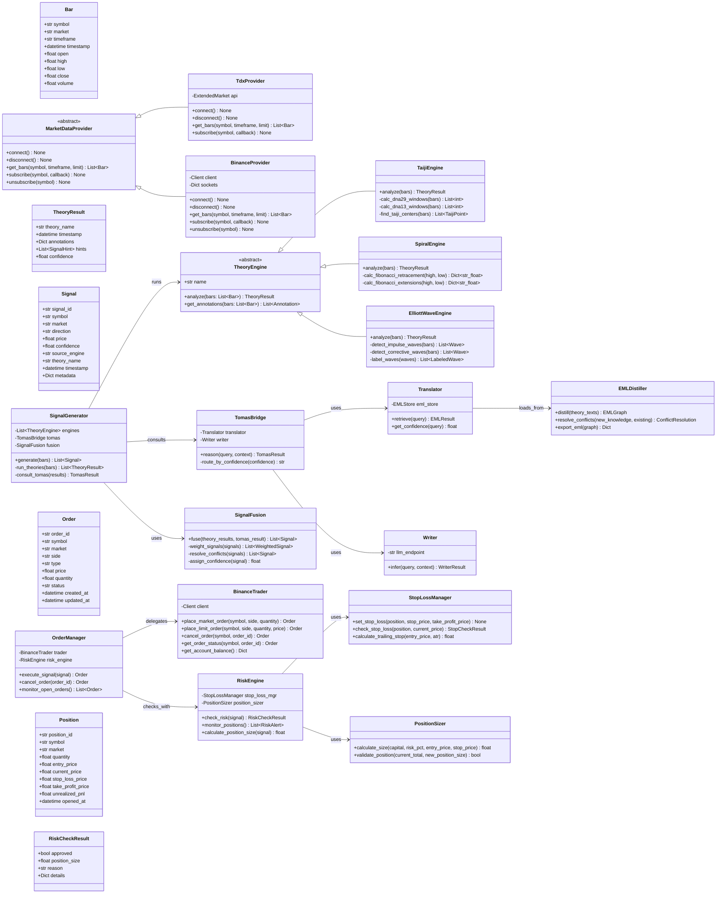
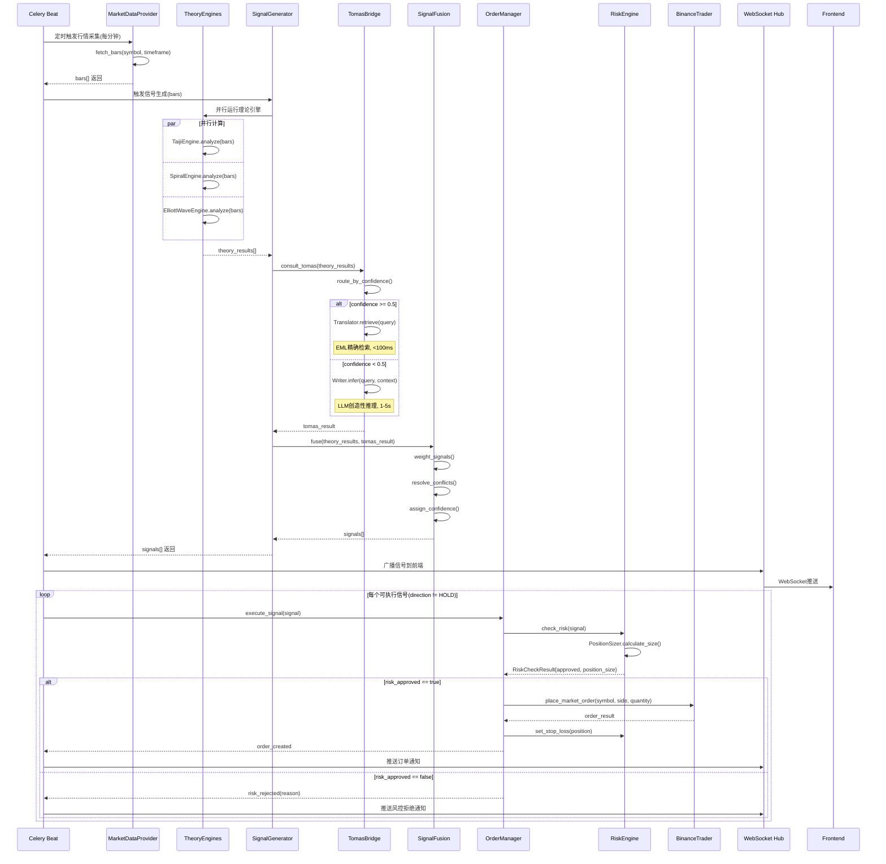
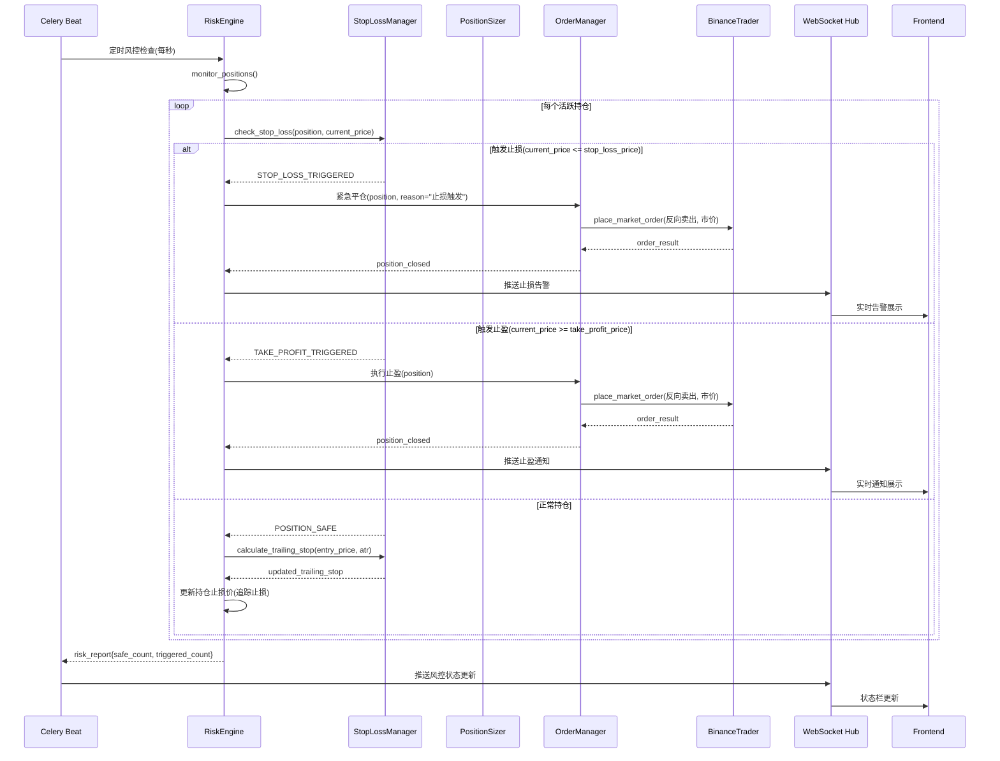
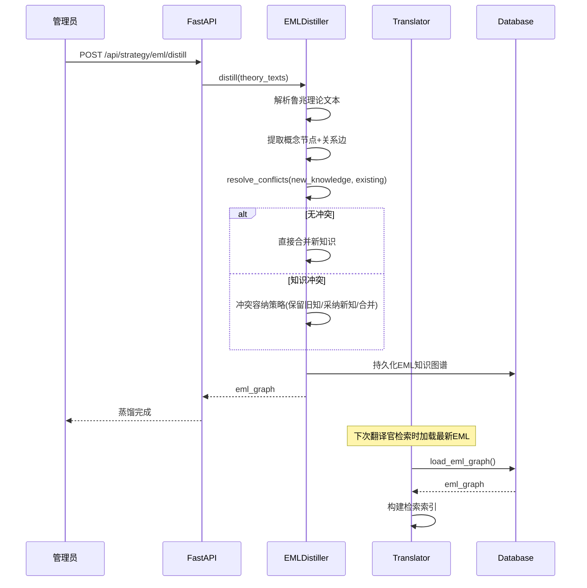
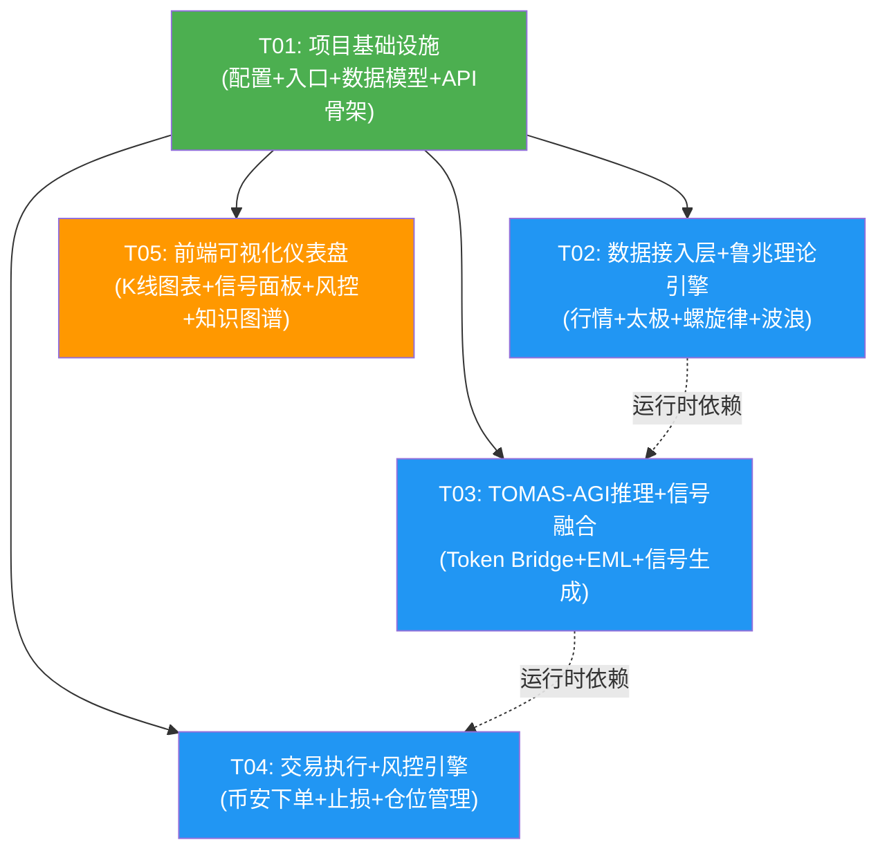

# 孙大圣量化交易系统 - 系统架构设计文档

> 架构师：高见远（Gao） | 版本：v1.0 | 日期：2026-06-17

---

## 目录

- [Part A: 系统设计](#part-a-系统设计)
  - [1. 实现方案与框架选型](#1-实现方案与框架选型)
  - [2. 文件列表及相对路径](#2-文件列表及相对路径)
  - [3. 数据结构与接口（类图）](#3-数据结构与接口类图)
  - [4. 程序调用流程（时序图）](#4-程序调用流程时序图)
  - [5. 待明确事项](#5-待明确事项)
- [Part B: 任务分解](#part-b-任务分解)
  - [6. 依赖包列表](#6-依赖包列表)
  - [7. 任务列表](#7-任务列表)
  - [8. 共享知识](#8-共享知识)
  - [9. 任务依赖图](#9-任务依赖图)

---

## Part A: 系统设计

### 1. 实现方案与框架选型

#### 1.1 核心技术挑战

| 挑战 | 说明 | 应对方案 |
|------|------|----------|
| 鲁兆理论量化 | 太极中心律/DNA时间窗口等理论需要数学化建模 | 将理论拆解为独立计算模块，每模块输入K线序列、输出结构化标注 |
| TOMAS-AGI双路由延迟 | 翻译官(EML检索)快但窄、作家(LLM)慢但广 | 置信度路由：≥0.5走翻译官(<100ms)、<0.5走作家(1-5s)，异步非阻塞 |
| 双市场数据同步 | A股(通达信)与币安(WebSocket)数据频率差异大 | 统一Bar数据模型，数据层抽象Provider接口，Celery定时+事件驱动混合调度 |
| 信号融合与冲突 | 多理论信号可能方向相反、置信度差异大 | "理论预筛 + TOMAS-AGI终裁"机制：先过滤低置信度，再由推理引擎仲裁 |
| 实时风控 | 止损/止盈需毫秒级响应 | Celery Beat高频轮询(1s) + WebSocket价格推送触发，异步下单 |

#### 1.2 后端框架选型

| 组件 | 选型 | 理由 |
|------|------|------|
| Web框架 | **FastAPI** | 原生async、自动OpenAPI文档、WebSocket支持、类型安全 |
| 任务队列 | **Celery + Redis** | 成熟的分布式任务队列，支持定时任务(Beat)和异步Worker |
| 数据库ORM | **SQLAlchemy 2.0** (async) | Python生态最成熟的ORM，支持异步、迁移(Alembic) |
| 数据库 | **SQLite**(开发) → **PostgreSQL**(生产) | 开发零配置，生产级可靠 |
| A股数据 | **pytdx** | 开源免费通达信接口，支持实时行情+历史K线 |
| 币安SDK | **python-binance** | 官方推荐社区库，覆盖REST+WebSocket+现货+合约 |
| K线计算 | **pandas + ta-lib** | 金融数据处理标准库+技术指标库 |

#### 1.3 前端框架选型

| 组件 | 选型 | 理由 |
|------|------|------|
| 构建工具 | **Vite** | 极速HMR、原生ESM、TypeScript开箱即用 |
| UI框架 | **React 18 + TypeScript** | 组件化、生态丰富、类型安全 |
| 组件库 | **MUI v5** | 企业级组件质量、主题定制强 |
| 样式方案 | **Tailwind CSS** | 原子化CSS、与MUI互补(布局+间距+响应式) |
| K线图表 | **lightweight-charts** | TradingView开源轻量K线库，性能优秀、支持自定义标注 |
| 知识图谱 | **D3.js** | 力导向图标准实现，灵活度高 |
| 状态管理 | **Zustand** | 轻量、简单、TypeScript友好 |
| HTTP客户端 | **axios** | 拦截器、取消请求、统一错误处理 |

#### 1.4 整体架构模式

采用**分层架构 + 事件驱动**混合模式：

```
┌─────────────────────────────────────────────────────────┐
│                   Frontend (React SPA)                   │
│         Vite + MUI + Tailwind + lightweight-charts       │
└────────────────────────┬────────────────────────────────┘
                         │ REST + WebSocket
┌────────────────────────▼────────────────────────────────┐
│                    API Gateway (FastAPI)                  │
│              REST Endpoints + WebSocket Hub               │
├─────────────────────────────────────────────────────────┤
│                     Service Layer                        │
│  ┌──────────────┐  ┌──────────────┐  ┌───────────────┐  │
│  │ Market Data  │  │   Theory     │  │    TOMAS      │  │
│  │  Provider    │  │   Engines    │  │    -AGI       │  │
│  │ (Tdx/Binance)│  │(Taiji/Spiral │  │ (Translator/  │  │
│  │              │  │ /ElliottWave)│  │  Writer)      │  │
│  └──────┬───────┘  └──────┬───────┘  └───────┬───────┘  │
│         │                 │                   │          │
│  ┌──────▼─────────────────▼───────────────────▼───────┐  │
│  │              Signal Fusion Engine                    │  │
│  │     (多源信号加权 + TOMAS终裁 + 置信度标注)           │  │
│  └──────────────────────┬──────────────────────────────┘  │
│                         │                                 │
│  ┌──────────────────────▼──────────────────────────────┐  │
│  │              Execution Engine                        │  │
│  │  ┌──────────────┐  ┌──────────────┐                 │  │
│  │  │ BinanceTrader│  │  RiskEngine  │                 │  │
│  │  │ (下单执行器) │  │(止损/仓位)   │                 │  │
│  │  └──────────────┘  └──────────────┘                 │  │
│  └─────────────────────────────────────────────────────┘  │
├─────────────────────────────────────────────────────────┤
│                   Task Queue (Celery)                     │
│         Beat(定时调度) + Worker(异步执行)                  │
├─────────────────────────────────────────────────────────┤
│              Data Layer (SQLAlchemy + Alembic)            │
│              SQLite(dev) / PostgreSQL(prod)               │
└─────────────────────────────────────────────────────────┘
```

---

### 2. 文件列表及相对路径

#### 2.1 后端文件

```
backend/
├── app/
│   ├── __init__.py
│   ├── main.py                          # FastAPI应用入口、中间件注册、生命周期
│   ├── config.py                        # 全局配置（Pydantic Settings）
│   ├── database.py                      # 数据库引擎、会话管理
│   ├── models/
│   │   ├── __init__.py
│   │   ├── base.py                      # SQLAlchemy Base模型
│   │   ├── market.py                    # Bar/K线数据模型
│   │   ├── signal.py                    # Signal交易信号模型
│   │   ├── order.py                     # Order订单模型
│   │   ├── position.py                  # Position持仓模型
│   │   └── risk.py                      # RiskConfig/StopLossConfig风控模型
│   ├── schemas/
│   │   ├── __init__.py
│   │   ├── market.py                    # 行情Pydantic Schema
│   │   ├── signal.py                    # 信号Pydantic Schema
│   │   ├── order.py                     # 订单Pydantic Schema
│   │   └── risk.py                      # 风控Pydantic Schema
│   ├── api/
│   │   ├── __init__.py
│   │   ├── router.py                    # API路由聚合
│   │   ├── market.py                    # 行情API端点
│   │   ├── signal.py                    # 信号API端点
│   │   ├── order.py                     # 订单API端点
│   │   ├── risk.py                      # 风控API端点
│   │   ├── strategy.py                  # 策略配置API端点
│   │   └── ws.py                        # WebSocket端点(实时推送)
│   ├── services/
│   │   ├── __init__.py
│   │   ├── market_data/
│   │   │   ├── __init__.py
│   │   │   ├── base.py                  # MarketDataProvider抽象基类
│   │   │   ├── tdx_provider.py          # 通达信数据提供商
│   │   │   └── binance_provider.py      # 币安数据提供商
│   │   ├── theory/
│   │   │   ├── __init__.py
│   │   │   ├── base.py                  # TheoryEngine抽象基类
│   │   │   ├── taiji.py                 # 太极中心律引擎
│   │   │   ├── spiral.py                # 螺旋律引擎
│   │   │   └── elliott_wave.py          # 波浪理论引擎
│   │   ├── tomas/
│   │   │   ├── __init__.py
│   │   │   ├── token_bridge.py          # Token Bridge推理引擎(路由器)
│   │   │   ├── translator.py            # 翻译官(EML知识检索)
│   │   │   ├── writer.py                # 作家(LLM创造性推理)
│   │   │   └── eml_distiller.py         # EML知识蒸馏器
│   │   ├── signal/
│   │   │   ├── __init__.py
│   │   │   ├── fusion.py                # 信号融合器(多源加权+冲突消解)
│   │   │   └── generator.py             # 信号生成器(调度理论引擎+TOMAS)
│   │   ├── execution/
│   │   │   ├── __init__.py
│   │   │   ├── binance_trader.py        # 币安交易执行器
│   │   │   └── order_manager.py         # 订单管理器(信号→下单+风控)
│   │   └── risk/
│   │       ├── __init__.py
│   │       ├── stop_loss.py             # 止损止盈管理器
│   │       └── position_sizer.py        # 仓位管理器
│   └── tasks/
│       ├── __init__.py
│       ├── celery_app.py                # Celery配置与初始化
│       ├── market_tasks.py              # 行情采集定时任务
│       ├── signal_tasks.py              # 信号计算异步任务
│       └── risk_tasks.py               # 风控检查定时任务
├── alembic/
│   ├── env.py
│   └── versions/                        # 数据库迁移脚本
├── tests/
│   ├── conftest.py
│   ├── test_taiji.py
│   ├── test_spiral.py
│   ├── test_elliott_wave.py
│   ├── test_signal_fusion.py
│   ├── test_risk_engine.py
│   └── test_binance_trader.py
├── requirements.txt
└── pyproject.toml
```

#### 2.2 前端文件

```
frontend/
├── index.html
├── package.json
├── vite.config.ts
├── tailwind.config.ts
├── tsconfig.json
├── postcss.config.js
├── src/
│   ├── main.tsx                         # React入口
│   ├── App.tsx                          # 根组件+路由
│   ├── vite-env.d.ts
│   ├── types/
│   │   └── index.ts                     # 全局TypeScript类型定义
│   ├── api/
│   │   ├── client.ts                    # Axios实例+拦截器
│   │   ├── market.ts                    # 行情API调用
│   │   ├── signal.ts                    # 信号API调用
│   │   ├── order.ts                     # 订单API调用
│   │   └── risk.ts                      # 风控API调用
│   ├── store/
│   │   ├── index.ts                     # Zustand store导出
│   │   ├── marketSlice.ts               # 行情状态
│   │   ├── signalSlice.ts               # 信号状态
│   │   └── riskSlice.ts                 # 风控状态
│   ├── hooks/
│   │   ├── useWebSocket.ts              # WebSocket连接Hook
│   │   ├── useMarketData.ts             # 行情数据Hook
│   │   └── useSignals.ts                # 信号数据Hook
│   ├── components/
│   │   ├── Layout/
│   │   │   ├── AppLayout.tsx            # 主布局(侧边栏+顶栏+状态栏)
│   │   │   ├── Sidebar.tsx              # 左侧导航栏
│   │   │   └── StatusBar.tsx            # 底部状态栏
│   │   ├── Chart/
│   │   │   ├── KlineChart.tsx           # K线图主组件(lightweight-charts)
│   │   │   ├── TheoryOverlay.tsx        # 理论标注层(太极/螺旋律/波浪)
│   │   │   └── SignalMarker.tsx         # 信号标记组件
│   │   ├── Signal/
│   │   │   └── SignalPanel.tsx          # 信号面板(实时信号流)
│   │   ├── Position/
│   │   │   └── PositionPanel.tsx        # 持仓面板(持仓+盈亏)
│   │   ├── Risk/
│   │   │   └── RiskMonitor.tsx          # 风控监控面板
│   │   └── KnowledgeGraph/
│   │       └── EmlGraph.tsx             # EML知识图谱(D3.js力导向图)
│   └── utils/
│       └── formatters.ts                # 格式化工具(数字/日期/百分比)
```

---

### 3. 数据结构与接口（类图）



---

### 4. 程序调用流程（时序图）

#### 4.1 核心流程：行情采集 → 理论计算 → 信号生成 → 下单执行



#### 4.2 风控检查流程



#### 4.3 EML知识蒸馏流程



---

### 5. 待明确事项

| # | 事项 | 影响范围 | 当前假设 |
|---|------|----------|----------|
| 1 | TOMAS-AGI Token Bridge的具体API协议和端点 | P0-06 | 假设为HTTP REST API，翻译官和作家分别暴露独立端点，后续需对接实际接口 |
| 2 | EML知识图谱的存储格式 | P0-07 | 假设使用JSON图结构存储于SQLite，D3.js前端渲染力导向图 |
| 3 | 鲁兆理论各子模块的参数阈值 | P0-03/04/05 | 使用文献常用默认值，预留配置文件可调 |
| 4 | 币安API Key的安全存储方式 | P0-09 | 使用环境变量+加密存储，前端不暴露Key |
| 5 | LLM作家的具体模型选择 | P0-06 | 预留OpenAI/本地模型切换接口，初始使用OpenAI GPT-4 |
| 6 | 通达信数据频率限制 | P0-01 | pytdx建议每分钟不超过200次请求，Celery Beat设置60s间隔 |
| 7 | 信号融合的权重配置 | P0-08 | 初始等权，后续可配置各理论权重 |
| 8 | 系统部署方式 | 全局 | 开发阶段本地运行，生产可Docker化部署 |

---

## Part B: 任务分解

### 6. 依赖包列表

#### Python后端包

```
# Web框架
fastapi==0.115.0
uvicorn[standard]==0.30.0
python-multipart==0.0.9

# 任务队列
celery==5.4.0
redis==5.0.0

# 数据库
sqlalchemy==2.0.35
alembic==1.13.0
aiosqlite==0.20.0

# 数据验证
pydantic==2.9.0
pydantic-settings==2.5.0

# 行情数据
pytdx==1.72
python-binance==1.0.19

# 数据处理
pandas==2.2.0
numpy==1.26.0
TA-Lib==0.4.28

# HTTP客户端
httpx==0.27.0

# LLM集成
openai==1.50.0

# 工具
python-dotenv==1.0.0
loguru==0.7.0
```

#### 前端npm包

```
# 核心框架
react@^18.3.0
react-dom@^18.3.0
typescript@^5.5.0

# 构建工具
vite@^5.4.0
@vitejs/plugin-react@^4.3.0

# UI组件
@mui/material@^5.16.0
@mui/icons-material@^5.16.0
@emotion/react@^11.13.0
@emotion/styled@^11.13.0

# 样式
tailwindcss@^3.4.0
postcss@^8.4.0
autoprefixer@^10.4.0

# 图表
lightweight-charts@^4.1.0
d3@^7.9.0

# 状态管理
zustand@^4.5.0

# 网络请求
axios@^1.7.0

# 路由
react-router-dom@^6.26.0

# 工具
date-fns@^3.6.0
```

---

### 7. 任务列表

#### T01: 项目基础设施（配置 + 入口 + 数据模型 + API骨架）

**目标**：搭建项目骨架，包括后端FastAPI应用、前端Vite项目、数据库模型、API路由骨架、配置管理。

**源文件**：

| 文件 | 说明 |
|------|------|
| `backend/app/__init__.py` | 包初始化 |
| `backend/app/main.py` | FastAPI应用入口、中间件、生命周期、WebSocket Hub |
| `backend/app/config.py` | Pydantic Settings全局配置 |
| `backend/app/database.py` | SQLAlchemy异步引擎、会话管理 |
| `backend/app/models/base.py` | SQLAlchemy Base模型 |
| `backend/app/models/market.py` | Bar K线数据模型 |
| `backend/app/models/signal.py` | Signal交易信号模型 |
| `backend/app/models/order.py` | Order订单模型 |
| `backend/app/models/position.py` | Position持仓模型 |
| `backend/app/models/risk.py` | RiskConfig风控配置模型 |
| `backend/app/schemas/market.py` | 行情Pydantic Schema |
| `backend/app/schemas/signal.py` | 信号Pydantic Schema |
| `backend/app/schemas/order.py` | 订单Pydantic Schema |
| `backend/app/schemas/risk.py` | 风控Pydantic Schema |
| `backend/app/api/router.py` | API路由聚合 |
| `backend/app/api/market.py` | 行情API端点骨架 |
| `backend/app/api/signal.py` | 信号API端点骨架 |
| `backend/app/api/order.py` | 订单API端点骨架 |
| `backend/app/api/risk.py` | 风控API端点骨架 |
| `backend/app/api/strategy.py` | 策略配置API端点骨架 |
| `backend/app/api/ws.py` | WebSocket端点 |
| `backend/app/tasks/celery_app.py` | Celery配置与初始化 |
| `backend/requirements.txt` | Python依赖 |
| `backend/pyproject.toml` | 项目配置 |
| `backend/alembic/env.py` | Alembic迁移配置 |
| `frontend/package.json` | 前端依赖声明 |
| `frontend/vite.config.ts` | Vite构建配置 |
| `frontend/tailwind.config.ts` | Tailwind配置 |
| `frontend/tsconfig.json` | TypeScript配置 |
| `frontend/postcss.config.js` | PostCSS配置 |
| `frontend/index.html` | HTML入口 |
| `frontend/src/main.tsx` | React入口 |
| `frontend/src/App.tsx` | 根组件+路由定义 |
| `frontend/src/vite-env.d.ts` | Vite类型声明 |
| `frontend/src/types/index.ts` | 全局TypeScript类型定义 |
| `frontend/src/api/client.ts` | Axios实例+拦截器 |
| `frontend/src/store/index.ts` | Zustand store入口 |

**依赖**：无（首个任务）
**优先级**：P0

---

#### T02: 数据接入层 + 鲁兆理论引擎层

**目标**：实现A股/币安行情数据采集，以及鲁兆理论三大P0引擎（太极中心律、螺旋律、波浪理论）。

**源文件**：

| 文件 | 说明 |
|------|------|
| `backend/app/services/market_data/__init__.py` | 包初始化 |
| `backend/app/services/market_data/base.py` | MarketDataProvider抽象基类 |
| `backend/app/services/market_data/tdx_provider.py` | 通达信数据提供商（pytdx） |
| `backend/app/services/market_data/binance_provider.py` | 币安数据提供商（python-binance） |
| `backend/app/services/theory/__init__.py` | 包初始化 |
| `backend/app/services/theory/base.py` | TheoryEngine抽象基类 |
| `backend/app/services/theory/taiji.py` | 太极中心律引擎（DNA29/DNA13窗口+太极中心点） |
| `backend/app/services/theory/spiral.py` | 螺旋律引擎（斐波那契回撤/扩展线） |
| `backend/app/services/theory/elliott_wave.py` | 波浪理论引擎（1-5浪+ABC调整） |
| `backend/app/tasks/market_tasks.py` | 行情采集Celery定时任务 |
| `frontend/src/api/market.ts` | 行情API调用 |
| `frontend/src/hooks/useMarketData.ts` | 行情数据Hook |
| `frontend/src/store/marketSlice.ts` | 行情Zustand状态 |

**依赖**：T01
**优先级**：P0

---

#### T03: TOMAS-AGI推理引擎 + 信号融合层

**目标**：实现TOMAS-AGI Token Bridge推理引擎（翻译官/作家双路由）、EML知识蒸馏、信号融合生成器。

**源文件**：

| 文件 | 说明 |
|------|------|
| `backend/app/services/tomas/__init__.py` | 包初始化 |
| `backend/app/services/tomas/token_bridge.py` | Token Bridge推理引擎（置信度路由） |
| `backend/app/services/tomas/translator.py` | 翻译官（EML知识检索） |
| `backend/app/services/tomas/writer.py` | 作家（LLM创造性推理） |
| `backend/app/services/tomas/eml_distiller.py` | EML知识蒸馏器 |
| `backend/app/services/signal/__init__.py` | 包初始化 |
| `backend/app/services/signal/fusion.py` | 信号融合器（多源加权+冲突消解） |
| `backend/app/services/signal/generator.py` | 信号生成器（调度理论引擎+TOMAS） |
| `backend/app/tasks/signal_tasks.py` | 信号计算Celery异步任务 |
| `frontend/src/api/signal.ts` | 信号API调用 |
| `frontend/src/hooks/useSignals.ts` | 信号数据Hook |
| `frontend/src/store/signalSlice.ts` | 信号Zustand状态 |

**依赖**：T01（T02的理论引擎接口由基类定义，运行时依赖但编译时不阻塞）
**优先级**：P0

---

#### T04: 交易执行 + 风控引擎

**目标**：实现币安自动下单、订单管理、止损止盈、仓位管理，以及风控定时检查任务。

**源文件**：

| 文件 | 说明 |
|------|------|
| `backend/app/services/execution/__init__.py` | 包初始化 |
| `backend/app/services/execution/binance_trader.py` | 币安交易执行器（现货+合约） |
| `backend/app/services/execution/order_manager.py` | 订单管理器（信号→下单+风控检查） |
| `backend/app/services/risk/__init__.py` | 包初始化 |
| `backend/app/services/risk/stop_loss.py` | 止损止盈管理器（固定止损+追踪止损） |
| `backend/app/services/risk/position_sizer.py` | 仓位管理器（风险预算动态计算） |
| `backend/app/tasks/risk_tasks.py` | 风控检查Celery定时任务 |
| `frontend/src/api/order.ts` | 订单API调用 |
| `frontend/src/api/risk.ts` | 风控API调用 |
| `frontend/src/store/riskSlice.ts` | 风控Zustand状态 |

**依赖**：T01（订单管理器运行时依赖T03的信号，但文件级别可独立编写）
**优先级**：P0

---

#### T05: 前端可视化仪表盘

**目标**：实现完整的前端可视化界面，包括主布局、K线图表+理论标注、信号面板、持仓面板、风控监控、EML知识图谱。

**源文件**：

| 文件 | 说明 |
|------|------|
| `frontend/src/components/Layout/AppLayout.tsx` | 主布局（侧边栏+顶栏+状态栏） |
| `frontend/src/components/Layout/Sidebar.tsx` | 左侧导航栏 |
| `frontend/src/components/Layout/StatusBar.tsx` | 底部状态栏 |
| `frontend/src/components/Chart/KlineChart.tsx` | K线图主组件（lightweight-charts） |
| `frontend/src/components/Chart/TheoryOverlay.tsx` | 理论标注层（太极/螺旋律/波浪） |
| `frontend/src/components/Chart/SignalMarker.tsx` | 信号标记组件 |
| `frontend/src/components/Signal/SignalPanel.tsx` | 信号面板（实时信号流） |
| `frontend/src/components/Position/PositionPanel.tsx` | 持仓面板（持仓+盈亏） |
| `frontend/src/components/Risk/RiskMonitor.tsx` | 风控监控面板 |
| `frontend/src/components/KnowledgeGraph/EmlGraph.tsx` | EML知识图谱（D3.js） |
| `frontend/src/hooks/useWebSocket.ts` | WebSocket连接Hook |
| `frontend/src/utils/formatters.ts` | 格式化工具函数 |

**依赖**：T01（组件依赖T01定义的类型和API骨架）
**优先级**：P0

---

### 8. 共享知识

#### 编码规范

```
- Python代码遵循PEP 8，使用Black格式化（line-length=120）
- TypeScript代码使用ESLint + Prettier，2空格缩进
- 所有文件使用UTF-8编码，换行符LF
- 命名约定：
  - Python: 类名PascalCase, 函数/变量snake_case, 常量UPPER_SNAKE_CASE
  - TypeScript: 组件PascalCase, 函数/变量camelCase, 类型PascalCase
  - 数据库表名: snake_case复数形式 (bars, signals, orders, positions)
```

#### API规范

```
- 所有REST API使用统一响应格式: { "code": int, "data": Any, "message": str }
- code=0表示成功，非0表示错误（1001=参数错误, 2001=行情异常, 3001=风控拒绝, 4001=下单失败）
- 分页接口统一参数: page, page_size, 返回total+items
- 所有时间字段使用ISO 8601 UTC格式: "2026-06-17T08:00:00Z"
- 金额/价格使用float，前端展示时format为2位小数
- WebSocket消息格式: { "type": str, "payload": Any }
  - type取值: bar_update, signal_generated, order_update, risk_alert, position_update
```

#### 日志规范

```
- 后端使用loguru，输出格式: {time:YYYY-MM-DD HH:mm:ss} | {level} | {module}:{function}:{line} | {message}
- 关键操作必须记录日志：行情采集、信号生成、下单执行、风控触发
- 日志级别：DEBUG(开发调试), INFO(正常业务流), WARNING(异常但可继续), ERROR(需人工介入)
- 敏感信息脱敏：API Key日志中显示前4位+****，账户余额不记录到DEBUG日志
```

#### 错误处理策略

```
- 数据层：行情数据缺失时使用最近一次缓存数据，记录WARNING日志
- 理论引擎：单个引擎计算异常不影响其他引擎，捕获异常后返回空TheoryResult
- TOMAS-AGI：翻译官超时(>2s)降级为作家路由，作家超时(>10s)使用纯理论信号
- 交易执行：下单失败自动重试3次(指数退避)，3次失败后推送告警
- 风控引擎：风控检查异常时保守处理(拒绝新开仓+保持现有止损)
- 前端：API调用失败显示MUI Snackbar提示，WebSocket断连自动重连(指数退避)
```

#### 配置管理

```
- 所有配置通过环境变量注入，支持.env文件本地开发
- 关键配置项：
  - DATABASE_URL: 数据库连接串
  - REDIS_URL: Redis连接串
  - BINANCE_API_KEY / BINANCE_API_SECRET: 币安API密钥
  - TOMAS_TRANSLATOR_URL / TOMAS_WRITER_URL: TOMAS-AGI端点
  - OPENAI_API_KEY: LLM作家模型密钥
  - RISK_MAX_POSITION_PCT: 单笔最大仓位比例(默认0.1=10%)
  - RISK_STOP_LOSS_PCT: 默认止损比例(默认0.05=5%)
```

---

### 9. 任务依赖图



**说明**：
- 实线箭头 = 编译时/文件依赖（必须先完成前置任务）
- 虚线箭头 = 运行时依赖（代码可独立编写，但集成运行需前置就绪）
- T02/T03/T04/T05均只依赖T01，可并行开发
- 最终集成时需按 T01 → T02 → T03 → T04 顺序联调，T05可独立联调

---

## 附录：API端点一览

| 方法 | 路径 | 说明 |
|------|------|------|
| GET | `/api/market/bars` | 获取K线数据 |
| GET | `/api/market/symbols` | 获取可用标的列表 |
| GET | `/api/signals` | 获取信号列表(分页) |
| GET | `/api/signals/latest` | 获取最新信号 |
| POST | `/api/orders` | 创建订单(手动下单) |
| GET | `/api/orders` | 获取订单列表 |
| GET | `/api/orders/{id}` | 获取订单详情 |
| DELETE | `/api/orders/{id}` | 取消订单 |
| GET | `/api/positions` | 获取持仓列表 |
| GET | `/api/risk/config` | 获取风控配置 |
| PUT | `/api/risk/config` | 更新风控配置 |
| GET | `/api/risk/alerts` | 获取风控告警 |
| GET | `/api/strategy/engines` | 获取理论引擎列表 |
| PUT | `/api/strategy/engines/{name}/toggle` | 启用/禁用理论引擎 |
| POST | `/api/strategy/eml/distill` | 触发EML知识蒸馏 |
| WS | `/ws/market` | 行情实时推送 |
| WS | `/ws/signals` | 信号实时推送 |
