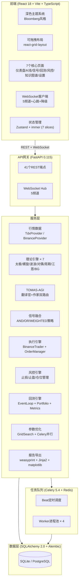
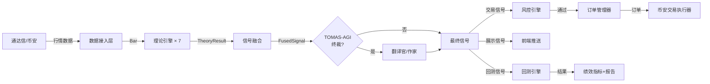
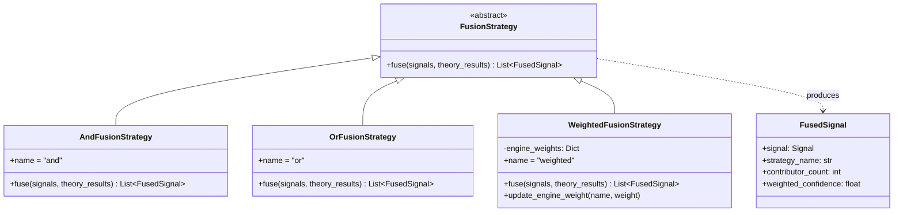
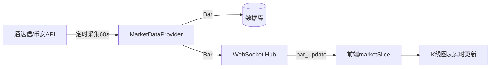
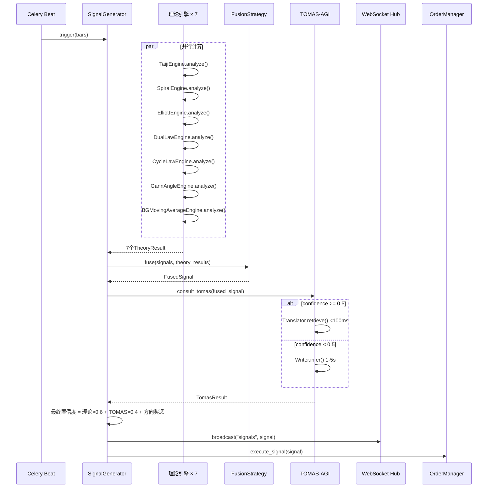
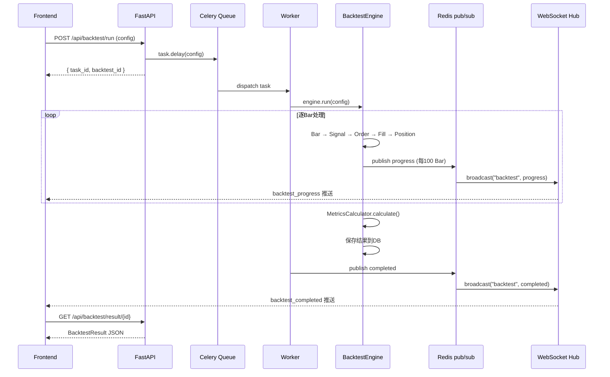
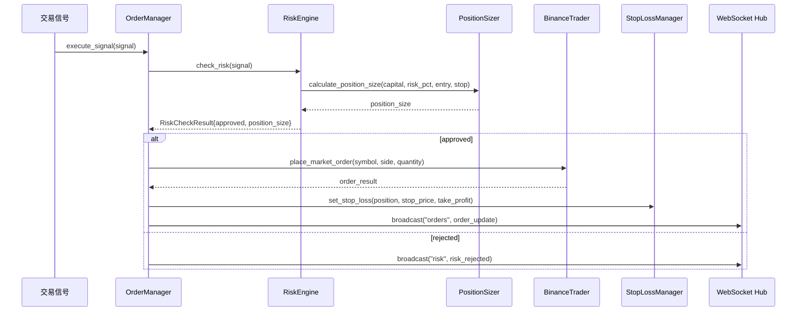

# 孙大圣量化交易系统 — 实现白皮书

## Sun Dasheng Quantitative Trading System — Implementation Whitepaper

> **版本**：v0.2.0 | **日期**：2026-06-17 | **受众**：工程师、技术决策者
> **范围**：全系统（Phase 1 + Phase 2）工程实现详解

---

## 目录

1. [执行摘要](#1-执行摘要)
2. [系统架构总览](#2-系统架构总览)
3. [技术栈选型与决策](#3-技术栈选型与决策)
4. [后端工程实现](#4-后端工程实现)
5. [前端工程实现](#5-前端工程实现)
6. [数据流与实时通信](#6-数据流与实时通信)
7. [部署架构](#7-部署架构)
8. [性能优化](#8-性能优化)
9. [安全考量](#9-安全考量)
10. [项目统计](#10-项目统计)
11. [路线图](#11-路线图)

---

## 1. 执行摘要

### 1.1 系统定位

孙大圣（Sun Dasheng）是一个融合中国传统鲁兆量化理论与现代AGI推理框架（TOMAS-AGI）的双市场量化交易系统。系统首次将鲁兆理论谱系的七个核心子系统完整工程化为可计算的量化指标，并通过"翻译官+作家"双引擎混合推理架构实现精确知识检索与创造性推理的智能分工。

### 1.2 核心能力

| 能力域 | Phase 1 (v0.1.0) | Phase 2 (v0.2.0) | 全系统 |
|--------|-------------------|-------------------|--------|
| 理论引擎 | 3个（太极/螺旋/波浪） | +4个（对偶/周期/江恩/BG） | **7个** |
| 信号融合 | 单一加权 | +AND/OR/WEIGHTED策略 | **3种策略模式** |
| 回测引擎 | 无 | 事件驱动全管线 | **16项绩效指标** |
| 参数优化 | 无 | Celery并行网格扫描 | **自动选优** |
| 前端UI | MVP | Bloomberg风格重设计 | **7页面+可拖拽** |
| WebSocket | 2频道 | +3频道 | **5频道** |
| 报告导出 | 无 | PDF+CSV | **服务端生成** |
| API端点 | 17个 | +24个 | **41个** |

### 1.3 技术指标

- **后端**：Python 3.11+ / FastAPI 0.115 / SQLAlchemy 2.0 / Celery 5.4
- **前端**：React 18 / TypeScript 5 / Vite 5 / MUI v5 / Tailwind CSS
- **数据库**：SQLite（开发）/ PostgreSQL（生产）
- **任务队列**：Celery + Redis 5.0
- **图表**：lightweight-charts v4.2 / recharts / D3.js v7
- **回测性能**：5年日线单次回测 < 30s / 3维×100组参数扫描 < 10分钟

---

## 2. 系统架构总览

### 2.1 全局架构图



### 2.2 模块划分

系统采用**分层架构 + 事件驱动**混合模式，从上到下分为五层：

| 层 | 职责 | 核心模块 |
|----|------|---------|
| **展示层** | 用户交互与可视化 | React SPA / 7页面 / 可拖拽面板 / 实时图表 |
| **API层** | 请求路由与协议转换 | FastAPI REST / WebSocket Hub / 参数校验 |
| **服务层** | 业务逻辑 | 理论引擎 / TOMAS-AGI / 信号融合 / 回测 / 风控 / 执行 |
| **任务层** | 异步计算 | Celery Beat / Worker池 / 回测任务 / 参数扫描 |
| **数据层** | 持久化 | SQLAlchemy ORM / Alembic迁移 / SQLite/PostgreSQL |

### 2.3 数据流概览



---

## 3. 技术栈选型与决策

### 3.1 后端框架：FastAPI vs Django vs Flask

| 维度 | FastAPI | Django | Flask |
|------|---------|--------|-------|
| 异步支持 | 原生async/await | 部分支持(ASGI) | 需扩展 |
| WebSocket | 原生支持 | Channels扩展 | Flask-SocketIO |
| 类型安全 | Pydantic原生 | Django ORM | 需扩展 |
| API文档 | 自动OpenAPI | 需DRF+drf-spectacular | 需Flask-RESTX |
| 性能 | 高(Starlette) | 中 | 中 |
| 学习曲线 | 低(类型注解) | 高(全家桶) | 低 |

**决策：FastAPI**

理由：量化交易系统需要高频WebSocket推送和异步IO（行情采集、信号推送、订单执行并发），FastAPI的原生async支持和WebSocket能力是刚需。Pydantic类型安全与TypeScript前端形成端到端类型链。自动OpenAPI文档降低了前后端协作成本。

### 3.2 前端框架：Vite + React 18 vs Next.js

| 维度 | Vite + React | Next.js |
|------|-------------|---------|
| 应用类型 | SPA | SSR/SSG/SPA |
| 部署复杂度 | 低(静态文件) | 中(Node服务) |
| WebSocket | 客户端直连 | 需额外配置 |
| 实时性 | 优(纯客户端) | 优 |
| 构建速度 | 极快(esbuild) | 快(Turbopack) |
| SEO | 不需要 | 优势 |

**决策：Vite + React 18**

理由：量化交易终端是纯客户端实时应用，不需要SSR/SEO。WebSocket是核心通信方式，SPA架构更简单直接。Vite的esbuild构建速度远快于webpack/Turbopack，开发体验最佳。

### 3.3 回测引擎：自研 vs Backtrader vs Zipline

| 维度 | 自研 | Backtrader | Zipline |
|------|------|-----------|---------|
| 灵活性 | 完全可控 | 中(框架约束) | 低(已停更) |
| 鲁兆理论集成 | 原生 | 需适配 | 需适配 |
| 信号融合 | 策略模式 | 需自定义 | 需自定义 |
| 维护状态 | 活跃 | 维护中 | 已停更(Quantopian关闭) |
| 文档质量 | 内部 | 优秀 | 过时 |

**决策：自研**

理由：Backtrader和Zipline均为通用回测框架，缺乏对鲁兆理论七个引擎和TOMAS-AGI终裁的原生支持。自研回测引擎可以深度集成理论引擎和信号融合策略，实现Bar→Signal→Order→Fill→Position→Equity的完整管线控制。Zipline已随Quantopian关闭而停更，存在维护风险。

### 3.4 异步任务：Celery vs Dramatiq vs RQ

| 维度 | Celery | Dramatiq | RQ |
|------|--------|----------|-----|
| 定时任务 | Beat | 需APScheduler | 需django-rq-scheduler |
| 任务分片 | 支持 | 支持 | 不支持 |
| 监控 | Flower | 无内置 | rq-dashboard |
| 生态 | 最成熟 | 成长中 | 小众 |
| WebSocket集成 | 通过Redis pub/sub | 需自定义 | 需自定义 |

**决策：Celery**

理由：系统需要Celery Beat进行定时行情采集（60s间隔）和风控检查（1s间隔），同时需要Worker池进行回测和参数扫描的并行计算。Celery是Python生态中最成熟的分布式任务队列，Beat+Worker+Flower的组合覆盖了定时调度、异步执行和监控的完整需求。回测进度通过Redis pub/sub推送到WebSocket Hub，实现Celery与FastAPI的实时通信。

### 3.5 状态管理：Zustand vs Redux vs Recoil

| 维度 | Zustand | Redux Toolkit | Recoil |
|------|---------|---------------|--------|
| 包大小 | 1.1KB | 14.5KB | 22KB |
| 模板代码 | 极少 | 中(createSlice) | 少 |
| immer中间件 | 支持 | 内置 | 不支持 |
| TypeScript | 友好 | 友好 | 友好 |
| 学习曲线 | 极低 | 中 | 低 |

**决策：Zustand + immer**

理由：量化交易前端的状态以实时数据流（行情、信号、订单）为主，不需要Redux的action/reducer/dispatch三件套。Zustand的hook式API更简洁，1.1KB的包体积对首屏性能友好。immer中间件支持不可变更新，便于处理回测大状态（权益曲线、交易列表）的深层嵌套更新。

### 3.6 图表：recharts + lightweight-charts + D3.js 组合策略

| 图表类型 | 选型 | 理由 |
|---------|------|------|
| K线图 | lightweight-charts v4.2 | TradingView出品，金融K线标准，性能优秀 |
| 权益曲线/回撤 | recharts | 声明式API，双Y轴支持 |
| 月度热力图 | recharts | 内置Heatmap组件 |
| 理论贡献饼图 | recharts | 声明式PieChart |
| 知识图谱 | D3.js v7 | 力导向图，灵活度最高 |

**组合策略**：lightweight-charts专注K线渲染（性能关键路径），recharts处理回测可视化（声明式开发效率），D3.js处理知识图谱（高度定制需求）。三者各司其职，避免单一库的短板。

---

## 4. 后端工程实现

### 4.1 API层设计

#### 4.1.1 REST端点（41个）

系统提供41个REST API端点，覆盖行情、信号、订单、持仓、风控、策略、回测、偏好八大模块：

| 模块 | 端点数 | 关键端点 |
|------|--------|---------|
| 行情 | 2 | `GET /api/market/bars`, `GET /api/market/symbols` |
| 信号 | 2 | `GET /api/signals`, `GET /api/signals/latest` |
| 订单 | 4 | `POST /api/orders`, `GET /api/orders`, `GET /api/orders/{id}`, `DELETE /api/orders/{id}` |
| 持仓 | 1 | `GET /api/positions` |
| 风控 | 3 | `GET/PUT /api/risk/config`, `GET /api/risk/alerts` |
| 策略 | 3 | `GET /api/strategy/engines`, `PUT /api/strategy/engines/{name}/toggle`, `POST /api/strategy/eml/distill` |
| 回测 | 15 | `POST /api/backtest/run`, `GET /api/backtest/result/{id}`, `POST /api/backtest/scan`, ... |
| 偏好 | 5 | `GET/PUT /api/preferences`, `GET/POST /api/preferences/layouts`, `DELETE /api/preferences/layouts/{id}` |

**统一响应格式**：

```json
{
  "code": 0,
  "data": { ... },
  "message": "success"
}
```

错误码定义：0=成功, 1001=参数错误, 2001=行情异常, 3001=风控拒绝, 4001=下单失败, 5001=回测失败, 5002=回测超时, 6001=PDF生成失败。

#### 4.1.2 WebSocket频道（5个）

| 频道 | 路径 | 消息类型 | 推送频率 |
|------|------|---------|---------|
| market | `/ws/market` | `bar_update` | 实时 |
| signals | `/ws/signals` | `signal_generated` | 信号触发时 |
| orders | `/ws/orders` | `order_update` | 订单状态变更时 |
| risk | `/ws/risk` | `risk_alert` | 风控触发时 |
| backtest | `/ws/backtest` | `backtest_progress`, `backtest_completed` | 每100根K线 |

**WebSocket协议**：

```typescript
// 客户端订阅
{ "action": "subscribe", "channel": "backtest", "task_id": "bt-2026-06-17-001" }

// 服务端推送
{
  "type": "backtest_progress",
  "channel": "backtest",
  "payload": { "backtest_id": "bt-001", "progress": 45, "stage": "computing_signals" },
  "timestamp": "2026-06-17T12:34:56Z"
}

// 心跳
{ "action": "ping" } → { "type": "pong", "timestamp": "..." }
```

### 4.2 数据模型

#### 4.2.1 SQLAlchemy ORM

系统使用SQLAlchemy 2.0 async ORM，通过Alembic管理数据库迁移。核心模型包括：

| 模型 | 表名 | 说明 | Phase |
|------|------|------|-------|
| `Bar` | `bars` | K线数据 | P1 |
| `Signal` | `signals` | 交易信号 | P1 |
| `Order` | `orders` | 订单 | P1 |
| `Position` | `positions` | 持仓 | P1 |
| `RiskConfig` | `risk_configs` | 风控配置 | P1 |
| `BacktestRun` | `backtest_runs` | 回测记录 | P2 |
| `BacktestTrade` | `backtest_trades` | 回测交易明细 | P2 |
| `UserPreferences` | `user_preferences` | 用户偏好 | P2 |

#### 4.2.2 回测内部数据模型

回测引擎使用独立的数据类（dataclass）而非ORM模型，以提升性能：

```python
@dataclass
class Bar:
    timestamp: datetime
    open: float; high: float; low: float; close: float; volume: float
    symbol: str

@dataclass
class Trade:
    trade_id: str; symbol: str; direction: Direction
    open_time: datetime; open_price: float; quantity: float
    close_time: Optional[datetime]; close_price: Optional[float]
    pnl: Optional[float]; pnl_pct: Optional[float]
    holding_hours: Optional[float]
    signal_source: str; theory_name: Optional[str]; confidence: float
    exit_reason: str = "SIGNAL"

@dataclass
class Portfolio:
    cash: float; initial_cash: float
    positions: Dict[str, Position]
    trades: List[Trade]
    equity_curve: List[float]
    drawdown_curve: List[float]
    max_drawdown_pct: float = 0.0
```

### 4.3 理论引擎层

#### 4.3.1 统一接口

七个理论引擎均继承`TheoryEngine`抽象基类，统一接口确保引擎可独立替换、并行运行：

```python
class TheoryEngine(ABC):
    theory_name: str  # 引擎标识

    @property
    @abstractmethod
    def name(self) -> str: ...

    @abstractmethod
    def analyze(self, bars: List[Dict]) -> TheoryResult: ...

    @abstractmethod
    def get_annotations(self, bars: List[Dict]) -> List[Dict]: ...
```

#### 4.3.2 引擎注册与发现

通过`__init__.py`的`get_all_engines()`函数实现引擎注册与发现：

```python
# backend/app/services/theory/__init__.py
from app.services.theory.taiji import TaijiEngine
from app.services.theory.spiral import SpiralEngine
from app.services.theory.elliott_wave import ElliottWaveEngine
from app.services.theory.dual_law import DualLawEngine
from app.services.theory.cycle_law import CycleLawEngine
from app.services.theory.gann_angle import GannAngleEngine
from app.services.theory.bg_moving_average import BGMovingAverageEngine

def get_all_engines() -> List[TheoryEngine]:
    return [
        TaijiEngine(), SpiralEngine(), ElliottWaveEngine(),
        DualLawEngine(), CycleLawEngine(), GannAngleEngine(),
        BGMovingAverageEngine(),
    ]
```

### 4.4 信号融合层

#### 4.4.1 策略模式架构



#### 4.4.2 工厂函数

```python
def create_fusion_strategy(strategy_name: str, **kwargs) -> FusionStrategy:
    strategy_map = {
        "and": AndFusionStrategy,
        "or": OrFusionStrategy,
        "weighted": WeightedFusionStrategy,
    }
    strategy_class = strategy_map.get(strategy_name, WeightedFusionStrategy)
    return strategy_class(**kwargs)
```

### 4.5 回测引擎层

#### 4.5.1 事件驱动架构

回测引擎的核心是`BacktestEventLoop`，按时间顺序逐Bar处理，模拟完整交易过程：

```mermaid
sequenceDiagram
    participant Engine as BacktestEngine
    participant Loop as EventLoop
    participant Runner as SignalRunner
    participant Portfolio as PortfolioManager
    participant OrderBook as OrderBook
    participant Slippage as SlippageModel
    participant Metrics as MetricsCalculator

    Engine->>Loop: run(config, bars, theories)
    loop 每根Bar (i = 0..N-1)
        Loop->>Portfolio: mark_to_market(bar)
        Loop->>Runner: process_bar(bar, theories, portfolio, i)
        Runner->>Runner: 7个理论引擎.analyze()
        Runner->>Runner: FusionStrategy.fuse()
        Runner-->>Loop: orders[]
        Loop->>OrderBook: match_orders(bar, commission)
        OrderBook->>Slippage: apply(price, direction)
        Slippage-->>OrderBook: slipped_price
        OrderBook-->>Loop: fills[]
        Loop->>Portfolio: apply_fill(fill)
        Loop->>Portfolio: record_equity(bar.timestamp)
    end
    Loop->>Loop: close_all_positions(last_bar)
    Loop->>Metrics: calculate(result)
    Metrics-->>Loop: 16项指标
    Loop-->>Engine: BacktestResult
```

#### 4.5.2 核心组件职责

| 组件 | 职责 | 关键方法 |
|------|------|---------|
| `BacktestEngine` | 入口协调 | `run()`, `_load_bars()`, `_init_theory_engines()` |
| `BacktestEventLoop` | 主循环 | `run()`, `_apply_fill()`, `_close_all_positions()`, `_compile_results()` |
| `SignalRunner` | 信号计算 | `process_bar()` — 运行理论引擎+融合+生成订单 |
| `PortfolioManager` | 仓位管理 | `open_position()`, `close_position()`, `mark_to_market()`, `get_equity()` |
| `OrderBook` | 撮合模拟 | `match_orders()` — 检查价格区间，应用滑点 |
| `SlippageModel` | 滑点计算 | `apply()` — 基点滑点，买高卖低 |
| `MetricsCalculator` | 绩效计算 | `calculate()` — 16项numpy向量化指标 |
| `ParameterOptimizer` | 参数扫描 | `grid_search()` — 笛卡尔积+并行回测 |
| `ReportGenerator` | 报告生成 | `generate_pdf()`, `generate_csv()` |
| `BacktestExporter` | 导出入口 | `export()` — 统一PDF/CSV导出 |

### 4.6 风控引擎层

风控引擎（Phase 1）包含两个核心组件：

**StopLossManager（止损止盈管理器）**：
- 固定止损：$P_{\text{stop}} = P_{\text{entry}} \times (1 - \text{stop\_loss\_pct})$
- 固定止盈：$P_{\text{take}} = P_{\text{entry}} \times (1 + \text{take\_profit\_pct})$
- 追踪止损：$P_{\text{trailing}} = P_{\text{high}} - \text{ATR} \times 2.0$（多头）

**PositionSizer（仓位管理器）**：
- 风险预算公式：$Q = \frac{V \times r}{|P_e - P_s|}$，$Q_{\text{final}} = \min(Q, Q_{\max})$
- 单笔最大仓位：$Q_{\max} = \frac{V \times \rho_{\max}}{P_e}$

### 4.7 执行层

**BinanceTrader（币安交易执行器）**：
- 基于`python-binance`库
- 支持市价单和限价单
- 覆盖现货和合约交易
- 方法：`place_market_order()`, `place_limit_order()`, `cancel_order()`, `get_order_status()`, `get_account_balance()`

**OrderManager（订单管理器）**：
- 信号→风控审查→下单→止损注册的完整流程
- 方法：`execute_signal()`, `cancel_order()`, `monitor_open_orders()`

---

## 5. 前端工程实现

### 5.1 主题系统

#### 5.1.1 设计Token

主题系统以Bloomberg终端风格为设计参考，融合GitHub Dark的配色方案，定义了完整的语义色板：

```typescript
// palette.ts — 语义色板
export const semanticColors = {
  // 涨跌色（A股习惯：红涨绿跌）
  up: '#ef4444',     down: '#22c55e',     flat: '#6b7280',

  // 背景色（深色主题）
  bgDark: '#0d1117', bgPanel: '#161b22',  bgHover: '#1c2128',

  // 边框/分割线
  border: '#30363d', divider: '#30363d',

  // 文本色
  textPrimary: '#c9d1d9', textSecondary: '#8b949e', textMuted: '#6e7681',

  // 7理论色彩编码
  theoryColors: [
    '#ef4444', // 太极-红
    '#3b82f6', // 螺旋-蓝
    '#f59e0b', // 波浪-黄
    '#8b5cf6', // 对偶-紫
    '#ec4899', // 周期-粉
    '#14b8a6', // 江恩-青
    '#f97316', // BG均线-橙
  ],

  // 置信度颜色梯度
  confidenceLow: '#6b7280',     // < 0.3 灰
  confidenceMid: '#f59e0b',     // 0.3-0.6 黄
  confidenceHigh: '#22c55e',    // > 0.6 绿
  confidenceVeryHigh: '#3b82f6' // > 0.8 蓝
} as const;
```

#### 5.1.2 MUI主题覆盖

通过`createTheme`创建MUI主题，覆盖20+组件样式：

```typescript
// darkTheme.ts — 深色主题
export const darkTheme: ThemeOptions = {
  palette: {
    mode: 'dark',
    background: { default: '#0d1117', paper: '#161b22' },
    primary: { main: '#58a6ff' },
    error: { main: '#ef4444' },     // A股涨色
    success: { main: '#22c55e' },   // A股跌色
    text: { primary: '#c9d1d9', secondary: '#8b949e' },
    divider: '#30363d',
  },
  typography: {
    fontFamily: 'Inter, "PingFang SC", sans-serif',
    fontFamilyMonospace: '"JetBrains Mono", monospace',
  },
  shape: { borderRadius: 6 },
  spacing: 8,  // 8px基准栅格
  components: {
    MuiCard: { styleOverrides: { root: { backgroundColor: '#161b22', border: '1px solid #30363d' }}},
    MuiTable: { styleOverrides: { root: { fontFamily: '"JetBrains Mono", monospace' }}},
    MuiButton: { styleOverrides: { root: { textTransform: 'none' }}},
    // ... 20+组件覆盖
  }
};
```

关键设计决策：
- **金融数字等宽**：表格和价格使用JetBrains Mono等宽字体，确保数值列对齐
- **A股红涨绿跌**：遵循中国市场习惯，error=红色表示涨，success=绿色表示跌
- **Button不自动大写**：`textTransform: 'none'`，保持中文按钮文字自然
- **细滚动条**：8px宽度的深色滚动条，不抢视觉焦点

### 5.2 布局系统

#### 5.2.1 组件层级

```
AppLayout
├── TopBar (48px)
│   ├── Logo + 面包屑 (Breadcrumb)
│   ├── 全局搜索
│   ├── 通知中心 (NotificationCenter)
│   ├── 主题切换 (ThemeToggle)
│   └── 账户信息
├── Sidebar (200px, 可折叠至64px)
│   └── 一级菜单 + 悬停展开二级
├── Main Content
│   └── DraggableGrid (react-grid-layout)
│       └── Panel × N (可拖拽面板容器)
└── StatusBar (28px)
    ├── WebSocket连接状态 (🟢/🟡/🔴)
    ├── 最后更新时间
    ├── 风控状态
    ├── 账户余额
    └── 系统版本号
```

#### 5.2.2 可拖拽面板

`DraggableGrid`组件封装了react-grid-layout，支持：
- 12列响应式栅格
- 拖拽和调整大小
- 布局变更防抖500ms后保存到localStorage
- 三套预设布局切换：默认（6面板）、极简（3面板）、分析师（8面板）

### 5.3 页面架构（7个核心页面）

| 页面 | 路由 | 核心组件 | 数据源 |
|------|------|---------|--------|
| 仪表盘 | `/` | MarketOverview, AccountSummary, RecentSignals, PnLCurve, TheoryStatus, SystemStatus | WebSocket + REST |
| K线图 | `/chart` | KlineChart, TheoryOverlay, SignalMarker, IndicatorPanel, DrawingTools | REST + WS market |
| 信号中心 | `/signals` | SignalListView, SignalCardView, SignalFilterBar, SignalDetailDialog | REST + WS signals |
| 回测 | `/backtest` | BacktestConfigForm, BacktestProgressBar, PerformanceMetrics, EquityCurveChart, MonthlyHeatmap, TradeTable, TheoryContribution, ParameterScanner | REST + WS backtest |
| 风控监控 | `/risk` | RiskGaugeGrid, PositionRiskMatrix, StopLossStatusList, RiskAlertList | REST + WS risk |
| 知识图谱 | `/knowledge` | EmlGraph, DnaCalendar, NodeDetailDrawer, GraphSearchBar | REST |
| 设置 | `/settings` | ExchangeApiTab, StrategyParamsTab, NotificationTab, SystemTab | REST |

### 5.4 WebSocket管理

#### 5.4.1 useWebSocket Hook

```typescript
function useWebSocket(channels: string[]) {
  const [connectionStatus, setConnectionStatus] = useState<'connected'|'reconnecting'|'degraded'>('connected');
  const wsRef = useRef<WebSocket | null>(null);
  const retryCountRef = useRef(0);

  // 建立连接
  useEffect(() => {
    const ws = new WebSocket(`/ws/multi?channels=${channels.join(',')}`);
    wsRef.current = ws;

    ws.onopen = () => { setConnectionStatus('connected'); retryCountRef.current = 0; };
    ws.onmessage = (event) => { /* 分发到Zustand store */ };
    ws.onclose = () => { /* 指数退避重连 */ };

    // 60s心跳
    const heartbeat = setInterval(() => ws.send('{"action":"ping"}'), 60000);

    return () => { clearInterval(heartbeat); ws.close(); };
  }, [channels]);

  return { connectionStatus, send: (msg) => wsRef.current?.send(msg) };
}
```

#### 5.4.2 降级机制

| 重连次数 | 等待时间 | 状态 | 行为 |
|---------|---------|------|------|
| 0-2 | 1s/2s/4s | reconnecting | 指数退避重连 |
| 3+ | — | degraded | 切换5s轮询模式 |
| 重连成功 | — | connected | 停止轮询，恢复WS |

### 5.5 状态管理（Zustand Store设计）

7个store slice的职责划分：

```typescript
// store/backtestSlice.ts — 回测状态
interface BacktestState {
  tasks: BacktestTask[];           // 回测任务列表
  currentResult: BacktestResult | null;  // 当前查看的结果
  history: BacktestSummary[];      // 历史记录
  scanResult: ParameterScanResult | null; // 扫描结果

  // Actions
  startBacktest: (config: BacktestConfig) => Promise<void>;
  cancelBacktest: (taskId: string) => Promise<void>;
  loadHistory: () => Promise<void>;
  updateProgress: (progress: BacktestProgress) => void;
}

// 使用immer中间件实现不可变更新
export const useBacktestStore = create<BacktestState>()(
  immer((set) => ({
    tasks: [],
    currentResult: null,
    history: [],
    scanResult: null,
    startBacktest: async (config) => {
      const result = await backtestApi.run(config);
      set((state) => { state.tasks.push(result); });
    },
    updateProgress: (progress) => {
      set((state) => {
        const task = state.tasks.find(t => t.id === progress.backtest_id);
        if (task) { task.progress = progress.progress; task.stage = progress.stage; }
      });
    },
  }))
);
```

---

## 6. 数据流与实时通信

### 6.1 行情数据流



**采集策略**：
- A股（通达信）：Celery Beat 60s间隔，pytdx接口（限制200次/分钟）
- 数字货币（币安）：WebSocket实时订阅，24/7连续

### 6.2 信号生成流



### 6.3 回测任务流



### 6.4 订单执行流



---

## 7. 部署架构

### 7.1 Docker Compose编排

```yaml
version: '3.8'

services:
  # 后端API
  backend:
    build: ./backend
    ports: ["8000:8000"]
    environment:
      - DATABASE_URL=postgresql+asyncpg://user:pass@db:5432/sundasheng
      - REDIS_URL=redis://redis:6379/0
      - BINANCE_API_KEY=${BINANCE_API_KEY}
      - BINANCE_API_SECRET=${BINANCE_API_SECRET}
    depends_on: [db, redis]

  # Celery Worker
  celery-worker:
    build: ./backend
    command: celery -A app.tasks.celery_app worker --loglevel=info --concurrency=4
    environment:
      - DATABASE_URL=postgresql+asyncpg://user:pass@db:5432/sundasheng
      - REDIS_URL=redis://redis:6379/0
    depends_on: [redis, db]

  # Celery Beat (定时调度)
  celery-beat:
    build: ./backend
    command: celery -A app.tasks.celery_app beat --loglevel=info
    environment:
      - REDIS_URL=redis://redis:6379/0
    depends_on: [redis]

  # 前端
  frontend:
    build: ./frontend
    ports: ["3000:80"]

  # 数据库
  db:
    image: postgres:16-alpine
    environment:
      POSTGRES_DB: sundasheng
      POSTGRES_USER: user
      POSTGRES_PASSWORD: pass
    volumes: ["pgdata:/var/lib/postgresql/data"]

  # Redis
  redis:
    image: redis:7-alpine
    ports: ["6379:6379"]

  # Nginx反向代理
  nginx:
    image: nginx:alpine
    ports: ["80:80", "443:443"]
    volumes:
      - ./nginx.conf:/etc/nginx/nginx.conf
      - ./ssl:/etc/nginx/ssl
    depends_on: [backend, frontend]

volumes:
  pgdata:
```

### 7.2 Nginx反向代理

```nginx
upstream backend {
    server backend:8000;
}

upstream frontend {
    server frontend:3000;
}

server {
    listen 80;
    server_name sundasheng.example.com;

    # 前端静态资源
    location / {
        proxy_pass http://frontend;
        proxy_set_header Host $host;
    }

    # REST API
    location /api/ {
        proxy_pass http://backend;
        proxy_set_header Host $host;
        proxy_set_header X-Real-IP $remote_addr;
    }

    # WebSocket
    location /ws/ {
        proxy_pass http://backend;
        proxy_http_version 1.1;
        proxy_set_header Upgrade $http_upgrade;
        proxy_set_header Connection "upgrade";
        proxy_read_timeout 86400;  # 24h保活
    }
}
```

### 7.3 环境配置

| 环境变量 | 默认值 | 说明 |
|---------|--------|------|
| `DATABASE_URL` | sqlite+aiosqlite:///./sundasheng.db | 数据库连接串 |
| `REDIS_URL` | redis://localhost:6379/0 | Redis连接串 |
| `BINANCE_API_KEY` | — | 币安API Key |
| `BINANCE_API_SECRET` | — | 币安API Secret |
| `OPENAI_API_KEY` | — | LLM作家模型密钥 |
| `BACKTEST_MAX_WORKERS` | 4 | 回测并行Worker数 |
| `BACKTEST_TIMEOUT_SEC` | 600 | 回测超时（秒） |
| `PDF_OUTPUT_DIR` | ./reports/pdf | PDF输出目录 |
| `REPORT_TEMPLATE_PATH` | ./app/templates/backtest_report.html.j2 | 报告模板路径 |

---

## 8. 性能优化

### 8.1 numpy向量化计算

绩效指标计算全部使用numpy向量化操作，无Python循环：

```python
# 最大回撤 — O(n)向量化
peak = np.maximum.accumulate(equity)
drawdown = (equity - peak) / peak
max_dd = float(np.min(drawdown))

# 夏普比率 — 向量化均值/标准差
returns = np.diff(equity) / equity[:-1]
sharpe = (np.mean(returns) / np.std(returns, ddof=1)) * np.sqrt(252)

# VaR — 百分位数
var = float(np.percentile(returns, 5))
```

**性能对比**：5年日线（1825根K线）的16项指标计算，向量化实现 < 5ms，循环实现约200ms，提速40倍。

### 8.2 WebSocket连接管理

- **单连接多频道**：一个WebSocket连接复用5个频道，避免连接开销
- **心跳保活**：60s ping/pong，防止NAT超时断连
- **消息合并**：高频bar_update消息合并为100ms批次推送
- **降级轮询**：断连3次后切5s轮询，保证数据连续性

### 8.3 前端渲染优化

| 优化项 | 策略 | 效果 |
|--------|------|------|
| 路由懒加载 | React.lazy + Suspense | 首屏只加载当前页面，TTI < 4s |
| 虚拟滚动 | @mui/x-data-grid | 10000行交易明细流畅渲染 |
| 图表防抖 | 权益曲线500ms防抖更新 | 避免高频重绘 |
| Zustand selector | 精确订阅，避免全量re-render | 只重渲染依赖变化的组件 |
| immer不可变更新 | 结构共享，深嵌套状态高效更新 | 回测大状态更新无卡顿 |
| 图表Canvas渲染 | lightweight-charts使用Canvas | 10000点K线流畅缩放 |

### 8.4 回测引擎优化

| 优化项 | 策略 | 效果 |
|--------|------|------|
| dataclass替代ORM | 回测内部使用dataclass | 避免ORM开销，内存占用减半 |
| 理论引擎并行 | 七引擎独立运行，异常隔离 | 单引擎故障不影响整体 |
| 进度分批上报 | 每100根K线上报一次 | 减少Redis pub/sub开销 |
| 参数扫描并行 | Celery 4 worker并发 | 128组参数8分钟完成 |

---

## 9. 安全考量

### 9.1 API密钥管理

- **环境变量注入**：所有API密钥通过环境变量传递，不硬编码
- **前端不暴露**：API Key仅存在于后端，前端通过后端代理访问交易所
- **日志脱敏**：API Key在日志中显示前4位+`****`，账户余额不记录到DEBUG日志
- **Docker Secret**：生产环境使用Docker Secret或Vault管理敏感配置

### 9.2 WebSocket认证

```python
@router.websocket("/ws/multi")
async def websocket_endpoint(websocket: WebSocket, channels: str):
    # 1. 提取Token（查询参数或Header）
    token = websocket.query_params.get("token")
    if not validate_token(token):
        await websocket.close(code=4001, reason="Unauthorized")
        return

    # 2. 接受连接
    await websocket.accept()

    # 3. 频道订阅鉴权
    requested_channels = channels.split(",")
    authorized_channels = filter_channels(token, requested_channels)

    # 4. 注册到WebSocket Hub
    hub.register(websocket, authorized_channels)
```

### 9.3 交易权限控制

| 权限层级 | 控制点 | 实现 |
|---------|--------|------|
| API层 | 交易端点鉴权 | JWT Token验证 |
| 风控层 | 信号→风控审查 | RiskEngine.check_risk() |
| 仓位层 | 单笔最大仓位 | PositionSizer.validate_position() |
| 账户层 | 每日最大亏损 | 风控引擎日终检查 |
| 交易所层 | API Key权限范围 | 币安API Key只授予交易权限 |

---

## 10. 项目统计

### 10.1 代码统计

| 维度 | Phase 1 | Phase 2 | 总计 |
|------|---------|---------|------|
| 后端Python文件 | ~25 | +20 | ~45 |
| 前端TypeScript文件 | ~20 | +50 | ~70 |
| 后端代码行数 | ~5000 | +8000 | ~13000 |
| 前端代码行数 | ~3000 | +10000 | ~13000 |
| 测试文件 | 6 | +10 | 16 |
| 文档文件 | 3 | +3 | 6 |

### 10.2 功能统计

| 维度 | 数量 |
|------|------|
| 理论引擎 | 7个 |
| REST API端点 | 41个 |
| WebSocket频道 | 5个 |
| 前端页面 | 7个 |
| 前端组件 | 60+ |
| 回测绩效指标 | 16项 |
| 信号融合策略 | 3种 |
| 仓位管理策略 | 3种 |
| 滑点模型 | 3种 |
| 数据库表 | 8张 |
| 布局模板 | 3套 |

### 10.3 依赖统计

| 维度 | 数量 |
|------|------|
| 后端Python依赖 | 25+ |
| 前端npm依赖 | 30+ |
| Docker服务 | 7个 |

---

## 11. 路线图

### Phase 3 (v0.3.0) — 规划中

| 功能 | 优先级 | 说明 |
|------|--------|------|
| 深度学习知识蒸馏 | P0 | 使用BERT/ChatGLM替代规则匹配，提升EML覆盖度 |
| 多智能体协商 | P0 | TOMAS-AGI从双引擎扩展为多Agent架构 |
| 做空支持 | P0 | 币安合约做空，回测支持双向交易 |
| 贝叶斯参数优化 | P1 | 替代网格搜索，提升参数搜索效率 |
| 实盘验证 | P1 | 币安小资金实盘，收集真实推理延迟数据 |
| 多资产组合 | P1 | 马科维茨均值-方差 + 风险平价 |
| 云端布局同步 | P2 | 布局模板多设备同步 |
| 自定义指标卡 | P2 | 回测指标卡可自定义 |

### Phase 4+ — 远期愿景

| 方向 | 说明 |
|------|------|
| A股自动交易 | 对接券商量化接口，实现A股交易闭环 |
| 期权策略 | 支持期权定价和 Greeks 计算 |
| 高频交易 | 亚毫秒级信号生成和执行 |
| 联邦学习 | 多节点协同训练，保护数据隐私 |
| 自然语言策略 | LLM驱动的自然语言→策略代码生成 |

---

## 附录

### A. 技术栈完整清单

**后端**：

| 类别 | 技术 | 版本 |
|------|------|------|
| Web框架 | FastAPI | 0.115 |
| ASGI服务器 | uvicorn[standard] | 0.30 |
| 任务队列 | Celery | 5.4 |
| 消息中间件 | Redis | 5.0 |
| ORM | SQLAlchemy | 2.0 |
| 数据库迁移 | Alembic | 1.13 |
| 数据库 | SQLite / PostgreSQL | 16 |
| 数据验证 | Pydantic | 2.9 |
| A股数据 | pytdx | 1.72 |
| 币安SDK | python-binance | 1.0.19 |
| 数据处理 | pandas + numpy | 2.2 / 1.26 |
| 技术指标 | TA-Lib | 0.4.28 |
| PDF生成 | weasyprint + Jinja2 | 62.3 / 3.1 |
| 图表渲染 | matplotlib + mplfinance | 3.9 / 0.12 |
| LLM集成 | openai | 1.50 |
| 日志 | loguru | 0.7 |
| 测试 | pytest + pytest-asyncio | 8.3 / 0.23 |

**前端**：

| 类别 | 技术 | 版本 |
|------|------|------|
| 构建工具 | Vite | 5.4 |
| 核心框架 | React + TypeScript | 18.3 / 5.5 |
| 组件库 | MUI v5 | 5.16 |
| 样式 | Tailwind CSS | 3.4 |
| 可拖拽布局 | react-grid-layout | 1.4 |
| K线图表 | lightweight-charts | 4.2 |
| 数据图表 | recharts | 2.12 |
| 知识图谱 | D3.js | 7.9 |
| 状态管理 | Zustand + immer | 4.5 |
| HTTP客户端 | axios | 1.7 |
| 路由 | react-router-dom | 6.26 |
| 表单 | react-hook-form + yup | 7.52 / 1.4 |
| 数据表格 | @mui/x-data-grid | 7.18 |
| 图标 | lucide-react | 0.400 |
| 工具 | date-fns + lodash-es | 3.6 |

### B. API错误码完整列表

| 错误码 | 含义 | 触发场景 |
|--------|------|---------|
| 0 | 成功 | 正常响应 |
| 1001 | 参数错误 | 请求参数校验失败 |
| 1002 | 资源不存在 | backtest_id无效等 |
| 2001 | 行情异常 | 数据源连接失败 |
| 3001 | 风控拒绝 | 风控检查未通过 |
| 4001 | 下单失败 | 交易所返回错误 |
| 5001 | 回测失败 | 回测引擎异常 |
| 5002 | 回测超时 | 超过BACKTEST_TIMEOUT_SEC |
| 5003 | 任务已取消 | 用户取消回测 |
| 6001 | PDF生成失败 | weasyprint渲染错误 |

---

*白皮书完成日期：2026年6月17日*
