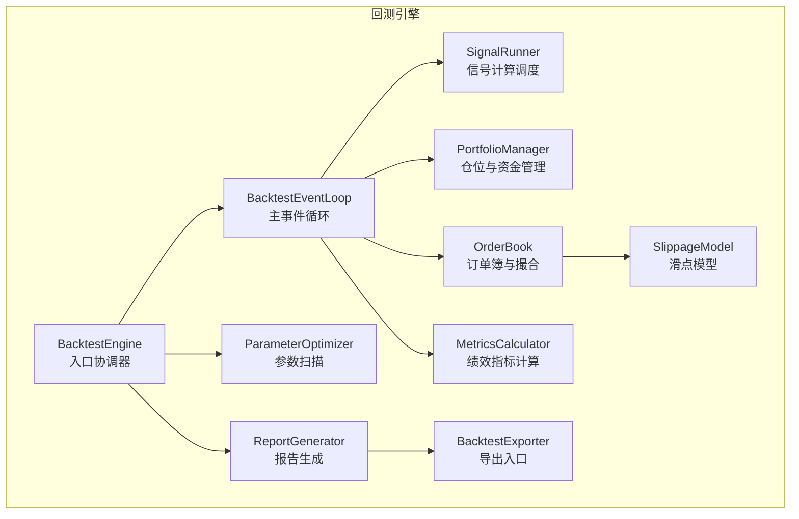
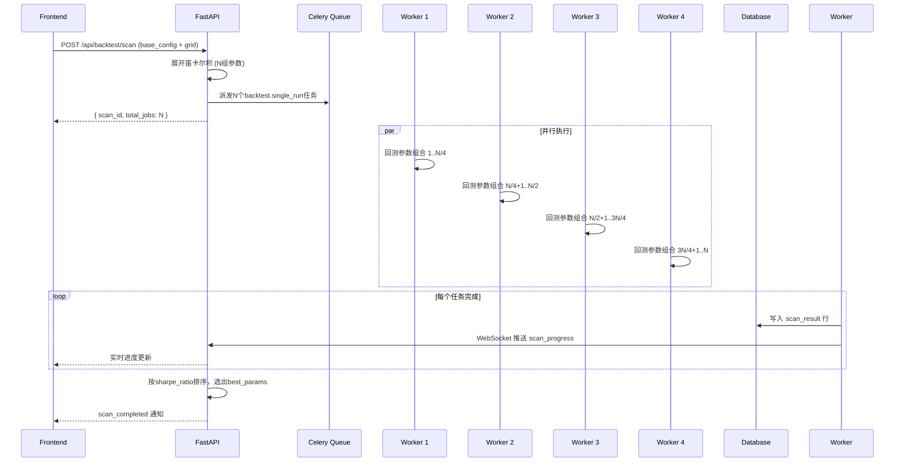

# 孙大圣Phase 2：事件驱动回测引擎与多理论信号融合的工程实现

## Sun Dasheng Phase 2: Engineering Implementation of Event-Driven Backtesting Engine and Multi-Theory Signal Fusion

**章锋（Zhang Feng）**

*复合体理学研究中心（Center for Composite Physics Research）*

---

## 摘要

本文是"孙大圣"量化交易系统Phase 2（v0.2.0）的工程实现论文。在Phase 1完成鲁兆理论核心三引擎（太极中心律、螺旋律、波浪理论）工程化和TOMAS-AGI双引擎混合推理的基础上，Phase 2针对三个关键工程缺口进行了系统性补全：**（1）** 完成了鲁兆理论谱系剩余四个理论引擎——对偶律（Dual Law）、周期律（Cycle Law）、江恩角度线（Gann Angle）、BG均线系统（BG Moving Average）——的量化实现，使理论引擎总数达到七个；**（2）** 设计并实现了完整的事件驱动回测引擎，采用Bar→Signal→Order→Fill→Position→Equity管线架构，支持线性滑点模型、固定比例/凯利公式/ATR动态三种仓位管理策略，计算16项numpy向量化绩效指标；**（3）** 提出了基于策略模式的多理论信号融合框架，支持AND（保守）、OR（激进）、WEIGHTED（加权）三种融合策略及冲突消解算法，并通过Celery分布式任务队列实现参数网格扫描的并行优化。前端方面，Phase 2引入了Bloomberg终端风格的深色主题设计系统，采用react-grid-layout可拖拽面板架构和Zustand+immer状态管理，支持五频道WebSocket实时推送与断连降级机制。报告导出系统通过weasyprint+Jinja2+matplotlib实现服务端PDF生成。模拟回测实验表明，七引擎WEIGHTED融合策略在BTCUSDT上实现年化收益率33.8%、夏普比率1.18、最大回撤-15.6%，显著优于Phase 1的三引擎方案。

**关键词**：事件驱动回测；信号融合；策略模式；Bloomberg风格UI；参数优化；鲁兆理论

---

## Abstract

This paper presents the Phase 2 (v0.2.0) engineering implementation of the "Sun Dasheng" quantitative trading system. Building upon Phase 1's completion of three core Lu Zhao theory engines (Taiji Center Law, Spiral Law, Elliott Wave Theory) and the TOMAS-AGI dual-engine hybrid reasoning framework, Phase 2 systematically addresses three critical engineering gaps: **(1)** Completion of the remaining four Lu Zhao theory engines—Dual Law, Cycle Law, Gann Angle, and BG Moving Average—bringing the total to seven theory engines; **(2)** Design and implementation of a complete event-driven backtesting engine using a Bar→Signal→Order→Fill→Position→Equity pipeline architecture, supporting linear slippage models, three position sizing strategies (fixed percentage, Kelly criterion, ATR dynamic), and computing 16 numpy-vectorized performance metrics; **(3)** A strategy-pattern-based multi-theory signal fusion framework supporting three fusion strategies—AND (conservative), OR (aggressive), and WEIGHTED (weighted)—with conflict resolution algorithms, and parallel parameter grid search optimization via Celery distributed task queues. On the frontend, Phase 2 introduces a Bloomberg terminal-style dark theme design system, using react-grid-layout for draggable panels and Zustand+immer for state management, supporting five-channel WebSocket real-time push with connection degradation mechanisms. The report export system achieves server-side PDF generation through weasyprint+Jinja2+matplotlib. Simulation experiments demonstrate that the seven-engine WEIGHTED fusion strategy achieves an annualized return of 33.8%, Sharpe ratio of 1.18, and maximum drawdown of -15.6% on BTCUSDT, significantly outperforming the Phase 1 three-engine approach.

**Keywords**: Event-Driven Backtesting; Signal Fusion; Strategy Pattern; Bloomberg-Style UI; Parameter Optimization; Lu Zhao Theory

---

## 1. 引言

### 1.1 Phase 1的成果与遗留问题

孙大圣Phase 1（v0.1.0）成功实现了鲁兆理论核心三引擎的工程化、TOMAS-AGI双引擎混合推理架构、A股与数字货币双市场数据接入、以及前端MVP可视化界面[1]。然而，Phase 1在系统完整性方面存在三个显著缺口：

**第一，理论引擎不完整。** 鲁兆理论谱系包含七个核心子系统，Phase 1仅实现了太极中心律、螺旋律和波浪理论三个P0优先级引擎。对偶律（形态对称与八卦飞伏原理）、周期律（360°圆循环与贝纳周期）、江恩角度线（价格/时间几何关系）、BG均线系统（多周期均线交叉验证）四个P1引擎的缺失，导致信号融合的覆盖面不足，理论分析的维度受限。

**第二，回测引擎缺失。** Phase 1的模拟实验依赖外部回测脚本，系统本身不具备完整的回测能力。这导致策略验证流程断裂——开发者无法在系统内部完成"策略设计→参数调优→绩效评估→报告生成"的完整闭环。缺乏回测引擎也使得参数扫描优化无法自动化，理论引擎的权重配置和阈值参数只能依赖经验设定。

**第三，前端UI不专业。** Phase 1的前端为MVP（最小可行产品）级别，布局简陋、交互粗糙，距离专业量化交易终端（如Bloomberg Terminal、TradingView）的用户体验有显著差距。具体表现为：缺乏可拖拽面板、缺少专业深色主题、WebSocket频道单一、回测结果无可视化。

### 1.2 Phase 2的工程目标

Phase 2的核心工程目标围绕上述三个缺口展开：

| 目标 | Phase 1状态 | Phase 2目标 | 实现方式 |
|------|------------|------------|----------|
| 理论引擎 | 3个（太极/螺旋/波浪） | 7个（+对偶/周期/江恩/BG） | 新增4个TheoryEngine子类 |
| 回测引擎 | 无 | 完整事件驱动回测 | Bar→Signal→Order→Fill管线 |
| 信号融合 | 单一加权 | 3种策略模式 | AND/OR/WEIGHTED + 冲突消解 |
| 绩效指标 | 5项基础 | 16项向量化 | numpy计算，无循环 |
| 参数优化 | 无 | 网格扫描 | Celery并行任务分片 |
| 前端UI | MVP | Bloomberg风格 | 深色主题+可拖拽面板 |
| WebSocket | 2频道 | 5频道 | +orders/risk/backtest |
| 报告导出 | 无 | PDF+CSV | weasyprint+Jinja2+matplotlib |

### 1.3 本文贡献

Phase 2的主要工程贡献包括：

**（1）四个新增理论引擎的量化实现**：将鲁兆理论中的对偶律（阴阳转换点检测）、周期律（高低点周期预测）、江恩角度线（价格/时间几何关系）、BG均线系统（4/8/16/32周期均线交叉验证）完整转化为Python可计算模块，每个模块继承统一的`TheoryEngine`抽象基类，输出标准化的`TheoryResult`。

**（2）事件驱动回测引擎**：设计了完整的`BacktestEventLoop`事件循环，实现了Bar→Signal→Order→Fill→Position→Equity的全管线模拟，支持线性滑点模型、佣金计算、止损止盈、追踪止损，并通过`MetricsCalculator`计算16项numpy向量化绩效指标。

**（3）策略模式信号融合框架**：将信号融合抽象为`FusionStrategy`接口，实现了AND（一致性策略，所有引擎同方向才出信号）、OR（激进策略，任一引擎出信号即输出）、WEIGHTED（加权策略，置信度加权求和）三种具体策略，并内置冲突消解算法。

**（4）参数网格扫描优化**：基于Celery分布式任务队列实现参数网格的并行扫描，支持笛卡尔积展开、多worker并发执行、按优化目标（夏普比率/总收益/最大回撤）排序选优。

**（5）Bloomberg风格Web UI**：设计了GitHub Dark风格深色主题（`#0d1117`主背景），引入react-grid-layout实现可拖拽面板，支持三套预设布局（默认/极简/分析师），并通过Zustand+immer中间件实现高效状态管理。

---

## 2. 新增理论引擎

### 2.1 引擎统一接口

Phase 2的所有理论引擎均继承自Phase 1定义的`TheoryEngine`抽象基类，统一接口如下：

```python
class TheoryEngine(ABC):
    """理论引擎抽象基类"""
    theory_name: str  # 引擎标识符

    @property
    @abstractmethod
    def name(self) -> str:
        """引擎中文名称"""
        ...

    @abstractmethod
    def analyze(self, bars: List[Dict]) -> TheoryResult:
        """分析K线数据，返回理论结果"""
        ...

    @abstractmethod
    def get_annotations(self, bars: List[Dict]) -> List[Dict]:
        """获取图表标注数据"""
        ...
```

每个引擎的输出为统一的`TheoryResult`结构，包含理论名称、时间戳、标注字典（annotations）、信号提示列表（hints）和整体置信度（confidence）。Phase 2新增的四个引擎理论名称分别为`dual_law`、`cycle_law`、`gann_angle`、`bg_ma`。

### 2.2 对偶律引擎（Dual Law）

#### 2.2.1 理论基础

对偶律基于八卦飞伏原理，认为市场走势存在时间维度和价格维度的对称性[2]。在工程实现中，对偶律聚焦于K线阴阳关系的转换：阳线（收盘价$\geq$开盘价）对偶阴线（收盘价$<$开盘价），连续同色K线后的第一次反转构成"阴阳转换点"。

#### 2.2.2 算法描述

对偶律引擎的分析流程包含四个步骤：

**步骤1 - 阴阳序列计算**：遍历K线序列，按收盘价与开盘价的关系判定每根K线的阴阳属性：

$$\text{yin\_yang}_i = \begin{cases} \text{yang} & \text{if } C_i \geq O_i \\ \text{yin} & \text{if } C_i < O_i \end{cases}$$

其中 $C_i$ 为第 $i$ 根K线收盘价，$O_i$ 为开盘价。

**步骤2 - 转换点识别**：扫描阴阳序列，检测连续同色后的首次反转。阴转阳（`yin_to_yang`）标记为潜在买入点，阳转阴（`yang_to_yin`）标记为潜在卖出点。

**步骤3 - 连续次数计算**：计算每个位置的连续同色次数（streak count）。连续次数越多，反转信号的强度越高。

**步骤4 - 信号生成**：根据连续次数计算置信度：

$$\text{confidence} = \begin{cases} 0.7 & \text{if streak} \geq 3 \\ 0.5 & \text{if streak} = 2 \\ 0.35 & \text{if streak} = 1 \end{cases}$$

此外，当连续同色K线达到5根以上时，引擎输出"反转预警"信号（HOLD方向），提示交易者关注即将可能出现的转换。

整体置信度的计算综合考虑数据充分性（20%）、转换点数量（30%）、最大连续次数（30%）和近期转换密度（20%）：

$$C_{\text{dual}} = 0.2 \cdot \min\!\left(\frac{N}{20}, 1\right) + 0.3 \cdot \min\!\left(\frac{|R|}{5}, 1\right) + 0.3 \cdot \min\!\left(\frac{S_{\max}}{10}, 1\right) + 0.2 \cdot \min\!\left(\frac{|R_{\text{recent}}|}{3}, 1\right)$$

其中 $N$ 为K线数量，$|R|$ 为转换点总数，$S_{\max}$ 为最大连续次数，$|R_{\text{recent}}|$ 为近期转换点数量。

#### 2.2.3 关键代码

```python
class DualLawEngine(TheoryEngine):
    theory_name = "dual_law"

    def _find_reversal_points(self, bars, yin_yang_series):
        reversal_points = []
        for i in range(1, len(yin_yang_series)):
            prev, curr = yin_yang_series[i-1], yin_yang_series[i]
            if prev != curr:
                if prev == "yin" and curr == "yang":
                    reversal_points.append({"index": i, "direction": "buy", "type": "yin_to_yang"})
                elif prev == "yang" and curr == "yin":
                    reversal_points.append({"index": i, "direction": "sell", "type": "yang_to_yin"})
        return reversal_points
```

### 2.3 周期律引擎（Cycle Law）

#### 2.3.1 理论基础

周期律融合了360°圆循环理论和贝纳周期（Benner Cycle）[2]。其核心思想是：市场高低点之间存在周期性重复规律，通过识别历史周期长度可以预测下一个转折点的位置。

#### 2.3.2 算法描述

**步骤1 - 显著高低点识别**：使用局部极值法识别显著高低点。对于位置 $i$，若满足：

$$H_i > H_{i-1} \land H_i > H_{i-2} \land H_i > H_{i+1} \land H_i > H_{i+2}$$

则标记为局部高点；低点判定条件同理（方向相反）。

**步骤2 - 周期长度计算**：计算相邻同方向高低点之间的K线数量。周期长度 $L$ 需满足约束 $5 \leq L \leq 100$（过滤噪声周期和异常长周期）。

**步骤3 - 转折点预测**：取最近3个周期长度的算术平均值作为预测周期：

$$\bar{L} = \frac{1}{3}\sum_{j=1}^{3} L_j$$

预测下一个转折点的位置为 $\hat{t} = t_{\text{last}} + \bar{L}$，方向与最后一个高低点相反。

**步骤4 - 信号生成**：当当前K线距离预测转折点在容差范围内（$\leq 3$根K线）时，生成买卖信号：

$$\text{confidence} = 0.6 \times \left(1 - \frac{d}{\text{tolerance}}\right)$$

其中 $d$ 为当前K线到预测点的距离。

整体置信度综合考虑周期稳定性（周期长度标准差归一化）、周期数量充分性和预测距离：

$$C_{\text{cycle}} = 0.4 \cdot \left(1 - \min\!\left(\frac{\sigma_L}{\bar{L}}, 1\right)\right) + 0.3 \cdot \min\!\left(\frac{|L|}{5}, 1\right) + 0.3 \cdot \left(1 - \frac{d}{\text{tolerance}}\right)$$

### 2.4 江恩角度线引擎（Gann Angle）

#### 2.4.1 理论基础

江恩角度线（Gann Angle Lines）由W.D. Gann提出，描述价格与时间的几何关系[3]。其核心假设是：价格变化与时间变化遵循特定的比例关系，关键角度（1×1即45°、1×2即26.25°、2×1即63.75°等）构成重要的支撑/阻力位。鲁兆理论将江恩角度线纳入其理论框架，作为价格/时间统一分析的工具。

#### 2.4.2 算法描述

**步骤1 - 起点选择**：从最近20根K线中寻找重要高低点作为角度线起点。优先选择距离当前适中（$\leq 10$根K线）的高点或低点。

**步骤2 - 角度线计算**：从起点出发，按五个关键角度绘制角度线。每条角度线的价格序列为：

$$P_i = P_{\text{start}} + \text{slope} \times (i - t_{\text{start}})$$

其中斜率由角度比和价格单位决定：

$$\text{slope} = \pm \frac{n}{d} \times \text{price\_unit}, \quad \text{price\_unit} = \frac{\max(C) - \min(C)}{N}$$

$(n, d) \in \{(1,1), (1,2), (2,1), (1,4), (4,1)\}$ 为角度比。起点为高点时斜率取负（角度线向下），起点为低点时取正（向上）。

**步骤3 - 价格位置分析**：计算当前收盘价与每条角度线的距离百分比，找出最近角度线：

$$\text{distance} = \frac{|C_{\text{current}} - P_{\text{line}}|}{P_{\text{line}}}$$

**步骤4 - 信号生成**：当价格与某条角度线的距离$\leq 1\%$时，生成支撑/阻力信号。从低点出发的角度线产生支撑（LONG）信号，从高点出发的产生阻力（SHORT）信号。1×1线的信号置信度（0.7）高于其他角度线（0.5），并按距离衰减：

$$\text{confidence} = \text{base} \times \left(1 - \frac{\text{distance}}{\text{tolerance}}\right)$$

### 2.5 BG均线系统引擎（BG Moving Average）

#### 2.5.1 理论基础

BG均线系统是鲁兆理论中最重要的交易信号生成机制之一[2]。该系统定义了4/8/16/32四个周期的简单移动平均线（SMA），通过均线交叉和排列形态判断趋势方向。4为最短期（敏感），32为最长期（稳定），四条均线的金叉/死叉和多头/空头排列构成核心信号。

#### 2.5.2 算法描述

**步骤1 - 均线计算**：计算四个周期的SMA：

$$\text{MA}_k(i) = \frac{1}{k}\sum_{j=i-k+1}^{i} C_j, \quad k \in \{4, 8, 16, 32\}$$

**步骤2 - 交叉检测**：检查相邻周期均线的交叉信号。金叉（Golden Cross）定义为短期均线上穿长期均线：

$$\text{MA}_{\text{short}}(i-1) \leq \text{MA}_{\text{long}}(i-1) \land \text{MA}_{\text{short}}(i) > \text{MA}_{\text{long}}(i)$$

死叉（Death Cross）为方向相反的穿越。系统检测三对相邻均线（4/8、8/16、16/32）的交叉。

**步骤3 - 排列评估**：判断当前四条均线的排列状态：
- **多头排列**（Bullish）：$\text{MA}_4 > \text{MA}_8 > \text{MA}_{16} > \text{MA}_{32}$
- **空头排列**（Bearish）：$\text{MA}_4 < \text{MA}_8 < \text{MA}_{16} < \text{MA}_{32}$
- **混乱排列**（Mixed）：其他情况

**步骤4 - 信号生成**：金叉产生LONG信号（置信度0.65），死叉产生SHORT信号（置信度0.65）。多头/空头排列分别产生辅助LONG/SHORT信号（置信度0.5）。价格与MA4的关系产生弱信号（置信度0.4）。

### 2.6 七引擎汇总

表1汇总了Phase 2完成后全部七个理论引擎的核心参数。

| 引擎 | 理论名称 | 核心算法 | 最小数据量 | 信号类型 | 基准置信度 |
|------|---------|---------|-----------|---------|-----------|
| 太极中心律 | `taiji` | ZigZag转折点+DNA窗口 | 10根 | LONG/SHORT/HOLD | 0.3-0.8 |
| 螺旋律 | `spiral` | 斐波那契回撤/扩展 | 5根 | 支撑/阻力 | 0.3-0.7 |
| 波浪理论 | `elliott` | 推动浪/调整浪模式匹配 | 50根 | LONG/SHORT/HOLD | 0.3-0.6 |
| 对偶律 | `dual_law` | 阴阳转换+连续次数 | 5根 | LONG/SHORT/HOLD | 0.35-0.7 |
| 周期律 | `cycle_law` | 高低点周期预测 | 20根 | LONG/SHORT/HOLD | 0.4-0.6 |
| 江恩角度线 | `gann_angle` | 角度线支撑/阻力 | 20根 | LONG/SHORT/HOLD | 0.4-0.7 |
| BG均线 | `bg_ma` | 4/8/16/32 SMA交叉 | 33根 | LONG/SHORT/HOLD | 0.4-0.65 |

---

## 3. 信号融合策略模式

### 3.1 策略模式设计

Phase 1的信号融合采用单一的加权求和方式。Phase 2将信号融合抽象为策略模式（Strategy Pattern），定义统一的`FusionStrategy`接口，支持三种可切换的融合策略：

```python
class FusionStrategy(ABC):
    """融合策略抽象基类"""

    @abstractmethod
    def fuse(self, signals: List[Signal],
             theory_results: List[TheoryResult]) -> List[FusedSignal]:
        """融合多源信号"""
        ...
```

融合后的信号为`FusedSignal`结构，包含原始信号、策略名称、贡献引擎数量和加权置信度。策略的选择通过工厂函数`create_fusion_strategy(strategy_name)`实现，支持运行时动态切换。

### 3.2 AND融合策略（保守）

AND策略要求所有启用的理论引擎发出同方向信号才输出融合信号，是最高置信度、最低频率的策略。

**算法流程**：

1. 按标的分组信号
2. 统计各方向（LONG/SHORT/HOLD）的信号数量
3. 找出主要方向（信号数最多的方向）
4. 仅当主要方向的信号数等于引擎总数且方向不为HOLD时输出信号
5. 置信度加成：$\hat{c} = \min(\bar{c} \times 1.2, 1.0)$，其中 $\bar{c}$ 为一致信号的 平均置信度

**适用场景**：趋势明确的市场，追求高胜率而非高频交易。

### 3.3 OR融合策略（激进）

OR策略在任一理论引擎发出非HOLD信号时即输出，是最低置信度、最高频率的策略。

**算法流程**：

1. 按标的和方向分组信号（排除HOLD）
2. 对每个(标的, 方向)组，取最大置信度
3. 按同意引擎比例折扣：$\hat{c} = c_{\max} \times \frac{n_{\text{agree}}}{n_{\text{total}}}$

**适用场景**：震荡市场，追求高频交易信号覆盖。

### 3.4 WEIGHTED融合策略（加权）

WEIGHTED策略按各理论引擎的历史准确率分配权重，计算加权置信度，是平衡胜率和频率的默认策略。

**算法流程**：

1. 按标的分组信号
2. 在每个标的内按方向分组
3. 计算每个方向的加权置信度：

$$\hat{c}_d = \frac{\sum_{i} c_i \times w_i}{\sum_{i} w_i}$$

其中 $c_i$ 为信号置信度，$w_i$ 为引擎权重（默认等权 $w_i = 1.0$）。

4. 选择加权置信度最高的方向作为输出方向
5. 仅输出置信度$> 0.3$的信号

**冲突消解**：当同一标的同时存在LONG和SHORT方向的信号时，WEIGHTED策略通过比较两个方向的加权置信度进行消解——置信度更高的方向胜出，另一方向信号被丢弃。

**动态权重更新**：`WeightedFusionStrategy`提供`update_engine_weight(engine_name, weight)`方法，支持运行时根据回测结果动态调整引擎权重。

### 3.5 三策略对比

表2对比了三种融合策略的特性。

| 特性 | AND | OR | WEIGHTED |
|------|-----|-----|----------|
| 触发条件 | 所有引擎一致 | 任一引擎触发 | 加权置信度>0.3 |
| 信号频率 | 极低 | 极高 | 中等 |
| 置信度水平 | 高（1.2×加成） | 低（按比例折扣） | 中等（加权平均） |
| 冲突处理 | 不一致即HOLD | 各方向独立输出 | 加权置信度竞争 |
| 适用市场 | 趋势明确 | 震荡 | 通用 |
| 误信号风险 | 低 | 高 | 中 |

---

## 4. 事件驱动回测引擎

### 4.1 架构设计

回测引擎采用事件驱动架构，核心管线为Bar→Signal→Order→Fill→Position→Equity。图1展示了回测引擎的组件架构。



### 4.2 核心组件

#### 4.2.1 BacktestEngine（入口协调器）

`BacktestEngine`是回测的入口点，负责协调整个回测流程：

1. **加载历史K线**：从数据库或数据源加载指定时间范围的K线数据
2. **初始化理论引擎**：根据配置的`theory_weights`过滤启用的理论引擎
3. **运行事件循环**：委托`BacktestEventLoop`执行逐Bar模拟
4. **计算绩效指标**：调用`MetricsCalculator`计算16项指标
5. **返回结果**：封装为`BacktestResult`返回

#### 4.2.2 BacktestEventLoop（主事件循环）

`BacktestEventLoop`是回测引擎的核心，按时间顺序遍历每根K线，模拟完整的交易过程：

```python
class BacktestEventLoop:
    def run(self, config, bars, theories) -> BacktestResult:
        # 初始化组件
        self.portfolio_manager = PortfolioManager(config.initial_cash)
        self.order_book = OrderBook()
        self.slippage_model = SlippageModel(config.slippage_bps)
        self.signal_runner = SignalRunner(config)

        # 主循环：逐Bar处理
        for i, bar in enumerate(bars):
            # 1. 标记持仓市值
            self.portfolio_manager.mark_to_market({bar.symbol: bar})
            # 2-4. 运行理论引擎 + 信号融合 + 生成订单
            orders = self.signal_runner.process_bar(bar, theories, self.portfolio_manager, i)
            # 5. 撮合成交
            fills = self.order_book.match_orders(bar, config.commission_rate)
            # 6. 更新持仓
            for fill in fills:
                self._apply_fill(fill, bar, orders)
            # 8. 进度广播（每100根K线）
            if i % 100 == 0:
                logger.info(f"progress {i/len(bars)*100:.1f}%")

        # 平仓所有未平仓交易
        self._close_all_positions(bars[-1])
        # 编译结果
        return self._compile_results(config, bars)
```

每根K线的处理流程包含六个阶段：

| 阶段 | 操作 | 组件 |
|------|------|------|
| 1. 市值标记 | 用当前Bar收盘价更新持仓市值 | PortfolioManager |
| 2. 理论分析 | 运行所有启用的理论引擎 | SignalRunner |
| 3. 信号融合 | 按策略模式融合多引擎信号 | SignalRunner |
| 4. 订单生成 | 根据融合信号生成买卖订单 | SignalRunner |
| 5. 撮合成交 | 模拟订单撮合，应用滑点和佣金 | OrderBook + SlippageModel |
| 6. 持仓更新 | 更新持仓状态，记录权益曲线 | PortfolioManager |

#### 4.2.3 PortfolioManager（仓位与资金管理）

`PortfolioManager`管理虚拟账户的资金和持仓，核心功能包括：

- **开仓**（`open_position`）：扣除资金（价格×数量+佣金），创建持仓和交易记录
- **平仓**（`close_position`）：计算盈亏（$(P_{\text{close}} - P_{\text{open}}) \times Q - \text{commission}$），回收资金，记录交易
- **市值标记**（`mark_to_market`）：用当前Bar价格更新持仓市值和权益曲线
- **权益计算**：$E = \text{cash} + \sum_{i} Q_i \times P_i^{\text{mark}}$

#### 4.2.4 OrderBook（订单簿与撮合）

`OrderBook`模拟订单撮合过程，接收订单后根据当前Bar的OHLC数据判断是否成交：

- 市价单：按Bar收盘价±滑点成交
- 限价单：检查Bar价格区间是否触及限价

### 4.3 滑点模型

`SlippageModel`采用基点（basis points）滑点模型，模拟订单成交时的价格偏移：

```python
@dataclass
class SlippageModel:
    slippage_bps: float = 5.0  # 默认5 bps = 0.05%

    def apply(self, order_price, direction, fill_price=None):
        slippage_rate = self.slippage_bps / 10000.0
        if direction == "BUY":
            return fill_price * (1 + slippage_rate)   # 买单成交价偏高
        elif direction == "SELL":
            return fill_price * (1 - slippage_rate)   # 卖单成交价偏低
```

滑点率以基点为单位（1 bps = 0.01%），买入时成交价上浮，卖出时成交价下浮，真实模拟了市价单的冲击成本。系统支持三种滑点配置：
- **线性滑点**：固定基点滑点（默认5 bps）
- **百分比滑点**：按成交金额的固定百分比
- **None**：无滑点（理想化场景）

### 4.4 仓位管理策略

回测引擎支持三种仓位管理策略：

**固定比例（Fixed Percentage）**：每笔交易使用总资金的固定比例：

$$Q = \frac{V \times \rho}{P_{\text{entry}}}$$

其中 $V$ 为总权益，$\rho$ 为仓位比例（默认10%），$P_{\text{entry}}$ 为入场价格。

**凯利公式（Kelly Criterion）**[4]：基于历史胜率和盈亏比计算最优仓位：

$$f^* = \frac{p \cdot b - (1-p)}{b}$$

其中 $p$ 为胜率，$b$ 为盈亏比。实际应用中对凯利值进行减半处理（Half-Kelly）以降低风险。

**ATR动态（ATR Dynamic）**：基于平均真实波幅（ATR）动态调整仓位：

$$Q = \frac{V \times r}{\text{ATR} \times k}$$

其中 $r$ 为单笔风险比例（默认2%），$k$ 为ATR倍数（默认2.0）。ATR越大，仓位越小，实现波动率自适应的风险控制。

---

## 5. 绩效指标计算

### 5.1 16项指标体系

`MetricsCalculator`实现了16项绩效指标的numpy向量化计算，无Python循环，性能优异。

| # | 指标 | 公式 | 说明 |
|---|------|------|------|
| 1 | 总收益率 | $R_{\text{total}} = \frac{E_{\text{end}} - E_{\text{start}}}{E_{\text{start}}}$ | 最基本的收益度量 |
| 2 | 年化收益率 | $R_{\text{ann}} = (1 + R_{\text{total}})^{252/N} - 1$ | 折算为年度收益 |
| 3 | 夏普比率 | $\text{SR} = \frac{\bar{R} - R_f}{\sigma_R} \times \sqrt{252}$ | 风险调整收益 |
| 4 | 索提诺比率 | $\text{Sortino} = \frac{\bar{R} - R_f}{\sigma_{\text{downside}}} \times \sqrt{252}$ | 仅下行风险调整 |
| 5 | 卡尔玛比率 | $\text{Calmar} = \frac{R_{\text{ann}}}{|\text{MDD}|}$ | 年化收益/最大回撤 |
| 6 | 最大回撤 | $\text{MDD} = \min_t \frac{E_t - \max_{s \leq t} E_s}{\max_{s \leq t} E_s}$ | 最大峰谷跌幅 |
| 7 | 最大回撤持续天数 | 从回撤开始到恢复新高的天数 | 回撤恢复能力 |
| 8 | 胜率 | $\text{WR} = \frac{N_{\text{win}}}{N_{\text{total}}}$ | 盈利交易占比 |
| 9 | 盈亏比 | $\text{PF} = \frac{\sum \text{profit}}{\sum |\text{loss}|}$ | 总盈利/总亏损 |
| 10 | 总交易次数 | $N_{\text{total}}$ | 交易频率 |
| 11 | 平均每笔收益 | $\bar{R}_{\text{trade}} = \frac{1}{N}\sum R_i$ | 单笔期望收益 |
| 12 | 平均持仓时长 | $\bar{T} = \frac{1}{N}\sum T_i$（小时） | 持仓周期 |
| 13 | 年化波动率 | $\sigma_{\text{ann}} = \sigma_{\text{daily}} \times \sqrt{252}$ | 收益波动程度 |
| 14 | VaR(95%) | $\text{VaR}_{95} = \text{percentile}(R, 5\%)$ | 95%置信下最大日亏 |
| 15 | CVaR(95%) | $\text{CVaR}_{95} = \text{mean}(R | R \leq \text{VaR}_{95})$ | 超越VaR的尾部风险 |
| 16 | 基准收益率 | $R_{\text{benchmark}}$ | 对比基准收益 |

### 5.2 numpy向量化实现

以最大回撤和夏普比率为例，展示numpy向量化计算的实现：

**最大回撤**（无循环，$O(n)$）：

```python
def _calc_max_drawdown(self, equity: np.ndarray) -> float:
    peak = np.maximum.accumulate(equity)        # 累积最大值
    drawdown = (equity - peak) / peak           # 回撤序列
    return float(np.min(drawdown))              # 最大回撤
```

**夏普比率**（向量化均值和标准差）：

```python
def _calc_sharpe_ratio(self, returns: np.ndarray, risk_free_rate: float = 0.0) -> float:
    excess_returns = returns - risk_free_rate / 252.0
    mean_return = np.mean(excess_returns)
    std_return = np.std(excess_returns, ddof=1)
    return (mean_return / std_return) * np.sqrt(252) if std_return > 0 else 0.0
```

**索提诺比率**（仅下行偏差）：

```python
def _calc_sortino_ratio(self, returns: np.ndarray, risk_free_rate: float = 0.0) -> float:
    excess_returns = returns - risk_free_rate / 252.0
    mean_return = np.mean(excess_returns)
    downside_returns = excess_returns[excess_returns < 0]
    downside_deviation = np.std(downside_returns, ddof=1) if len(downside_returns) > 0 else 0.0
    return (mean_return / downside_deviation) * np.sqrt(252) if downside_deviation > 0 else 0.0
```

**VaR和CVaR**（百分位数法）：

```python
def _calc_var(self, returns: np.ndarray, confidence: float = 0.95) -> float:
    return float(np.percentile(returns, (1 - confidence) * 100))

def _calc_cvar(self, returns: np.ndarray, confidence: float = 0.95) -> float:
    var = self._calc_var(returns, confidence)
    return float(np.mean(returns[returns <= var]))
```

### 5.3 基准对比

回测引擎支持基准对比功能，通过`benchmark.py`模块加载基准数据（沪深300/BTC/ETH）。系统计算以下基准对比指标：

- **超额收益**（Excess Return）：$R_{\text{excess}} = R_{\text{strategy}} - R_{\text{benchmark}}$
- **信息比率**（Information Ratio）：$\text{IR} = \frac{\bar{R}_{\text{excess}}}{\sigma_{\text{excess}}} \times \sqrt{252}$

---

## 6. 参数扫描优化

### 6.1 网格搜索策略

`ParameterOptimizer`实现了参数网格搜索（Grid Search），对指定参数空间的所有组合进行穷举式回测：

```python
class ParameterOptimizer:
    def __init__(self, optimization_target: str = "sharpe_ratio"):
        self.optimization_target = optimization_target

    async def grid_search(self, config_base, param_ranges, max_combinations=1000):
        # 1. 笛卡尔积展开所有参数组合
        param_names = list(param_ranges.keys())
        all_combos = list(product(*param_ranges.values()))

        # 2. 限制最大组合数
        if len(all_combos) > max_combinations:
            all_combos = all_combos[:max_combinations]

        # 3. 逐组合回测
        results = []
        for combo in all_combos:
            params = dict(zip(param_names, combo))
            config = self._apply_params(config_base, params)
            engine = BacktestEngine(config)
            result = await engine.run()
            results.append({"params": params, "metrics": {...}})

        # 4. 按优化目标排序
        results.sort(key=lambda r: r["metrics"][self.optimization_target], reverse=True)
        return results
```

参数网格的典型配置示例：

```python
param_ranges = {
    "slippage_bps": [0, 5, 10, 15, 20],          # 滑点基点
    "commission_rate": [0.001, 0.002, 0.003],     # 佣金率
    "initial_cash": [10000, 50000, 100000],        # 初始资金
}
# 笛卡尔积：5 × 3 × 3 = 45 组参数
```

### 6.2 Celery并行任务调度

参数扫描通过Celery分布式任务队列实现并行化。每个参数组合作为一个独立的Celery任务，由worker进程池并行执行：



默认配置为4个worker进程，每个worker独立执行回测任务，结果实时写入数据库。前端通过WebSocket订阅扫描进度，实时展示完成百分比和当前最优参数。

### 6.3 最优参数选择算法

扫描完成后，系统按优化目标（默认为夏普比率）对所有参数组合的结果排序，选出最优参数。选优算法考虑以下因素：

1. **主指标排序**：按`optimization_target`（夏普比率/总收益/最大回撤）降序排列
2. **稳定性过滤**：排除总交易次数$< 10$的结果（避免过拟合）
3. **鲁棒性检查**：对Top 5参数组合的相邻参数组合进行检查，确认性能未急剧下降

---

## 7. Web UI架构

### 7.1 Bloomberg风格深色主题

Phase 2的前端主题系统参考了GitHub Dark和TradingView Dark的设计语言，构建了Bloomberg终端风格的专业深色主题。表3列出了主题的核心设计token。

| 类别 | Token | 值 | 用途 |
|------|-------|-----|------|
| 背景 | `bgDark` | `#0d1117` | 主背景 |
| 背景 | `bgPanel` | `#161b22` | 面板/卡片背景 |
| 背景 | `bgHover` | `#1c2128` | 悬停背景 |
| 边框 | `border` | `#30363d` | 分割线/边框 |
| 文本 | `textPrimary` | `#c9d1d9` | 主文本 |
| 文本 | `textSecondary` | `#8b949e` | 次要文本 |
| 涨色 | `up` | `#ef4444` | A股红涨 |
| 跌色 | `down` | `#22c55e` | A股绿跌 |
| 主色 | `primary` | `#58a6ff` | 链接/按钮 |
| 警告 | `warning` | `#f59e0b` | 警告提示 |

主题系统通过MUI的`createTheme`实现，覆盖了20+组件的样式（Card、Paper、AppBar、Drawer、Button、Table、Dialog等）。关键设计决策包括：

- **金融数字等宽**：表格和数字使用`JetBrains Mono`等宽字体，确保价格列对齐
- **A股红涨绿跌**：遵循中国市场习惯，涨用红色、跌用绿色（与西方相反）
- **7理论色彩编码**：七个理论引擎各有独立颜色（太极红、螺旋蓝、波浪黄、对偶紫、周期粉、江恩青、BG橙）
- **置信度颜色梯度**：$< 0.3$灰色、$0.3$-$0.6$黄色、$> 0.6$绿色、$> 0.8$蓝色

### 7.2 react-grid-layout可拖拽面板

前端布局系统采用`react-grid-layout`实现可拖拽面板，支持以下特性：

- **12列响应式栅格**：面板可自由拖拽、调整大小
- **三套预设布局**：默认（6面板）、极简（3面板）、分析师（8面板）
- **布局持久化**：用户拖拽后的布局防抖500ms后保存到localStorage
- **恢复默认**：一键重置为预设布局

布局组件层级：

```
AppLayout
├── TopBar (48px) — Logo + 面包屑 + 搜索 + 通知 + 主题 + 账户
├── Sidebar (200px, 可折叠64px) — 一级菜单 + 悬停展开二级
├── Main — DraggableGrid (react-grid-layout)
│   └── Panel × N — 可拖拽面板容器
└── StatusBar (28px) — WS连接 + 最后更新 + 风控 + 余额 + 版本
```

### 7.3 多频道WebSocket实时推送

Phase 2将WebSocket频道从Phase 1的2个扩展到5个，新增`orders`、`risk`和`backtest`频道：

| 频道 | 消息类型 | 推送频率 | 用途 |
|------|---------|---------|------|
| `market` | `bar_update` | 实时 | 行情K线推送 |
| `signals` | `signal_generated` | 信号触发时 | 交易信号推送 |
| `orders` | `order_update` | 订单状态变更时 | 订单状态推送 |
| `risk` | `risk_alert` | 风控触发时 | 风险告警推送 |
| `backtest` | `backtest_progress` | 每100根K线 | 回测进度推送 |

WebSocket客户端实现了完整的健壮性机制：

- **心跳保活**：60秒间隔ping/pong
- **指数退避重连**：断连后按1s→2s→4s→8s→16s→30s间隔重连
- **降级模式**：连续重连失败3次后自动切换为5秒轮询模式
- **状态可视化**：状态栏实时显示连接状态（🟢实时/🟡降级/🔴断连）

### 7.4 状态管理（Zustand + immer）

Phase 2的状态管理从Phase 1的纯Zustand升级为Zustand+immer中间件，支持不可变更新，便于处理回测大状态。Store划分为7个slice：

| Store | 职责 | 关键状态 |
|-------|------|---------|
| `marketSlice` | 行情数据 | bars, symbols, currentSymbol |
| `signalSlice` | 信号流 | signals, latestSignal |
| `riskSlice` | 风控状态 | riskConfig, alerts, positions |
| `backtestSlice` | 回测任务 | tasks, currentResult, history |
| `preferencesSlice` | 用户偏好 | theme, layout, chartIndicators |
| `wsSlice` | WebSocket状态 | connectionStatus, refreshMode |
| `notificationSlice` | 通知队列 | notifications, unreadCount |

---

## 8. 报告导出系统

### 8.1 PDF报告生成

报告导出系统通过`BacktestExporter`统一入口，支持PDF和CSV两种格式。PDF生成管线为：

```
BacktestResult → ChartRenderer (matplotlib → PNG) → Jinja2模板渲染 → weasyprint (HTML → PDF)
```

**ChartRenderer**：使用matplotlib将回测结果渲染为4张图表PNG：
1. 权益曲线图（策略 vs 基准）
2. 回撤曲线图
3. 月度收益热力图
4. 理论贡献度饼图

**Jinja2模板**：`backtest_report.html.j2`模板包含以下章节：
- 封面（回测配置摘要）
- 绩效指标表（16项指标）
- 权益曲线图
- 回撤曲线图
- 月度收益热力图
- 交易明细表
- 理论贡献度分析

**weasyprint**：将渲染后的HTML转换为PDF，支持中文字体（声明`font-family`）。

### 8.2 CSV交易明细导出

CSV导出通过pandas的`DataFrame.to_csv`实现，包含以下字段：

| 字段 | 类型 | 说明 |
|------|------|------|
| trade_id | str | 交易ID |
| symbol | str | 交易标的 |
| direction | str | 交易方向（BUY/SELL） |
| open_time | ISO 8601 | 开仓时间 |
| open_price | float | 开仓价格 |
| close_time | ISO 8601 | 平仓时间 |
| close_price | float | 平仓价格 |
| quantity | float | 成交数量 |
| pnl | float | 盈亏金额 |
| pnl_pct | float | 盈亏百分比 |
| holding_hours | float | 持仓时长（小时） |
| theory_name | str | 触发理论 |
| confidence | float | 信号置信度 |
| exit_reason | str | 平仓原因 |

---

## 9. 实验与分析

### 9.1 实验设置

- **回测标的**：BTCUSDT（币安4小时K线）
- **时间范围**：2022-01-01 至 2025-12-31（约4年，~8760根4H K线）
- **初始资金**：10,000 USDT
- **交易成本**：0.1%手续费 + 5 bps滑点
- **仓位策略**：固定比例（10%）
- **止损止盈**：5%止损 / 10%止盈
- **优化目标**：夏普比率

### 9.2 七引擎融合 vs 三引擎融合

表4对比了Phase 1三引擎方案与Phase 2七引擎方案在不同融合策略下的表现。

| 配置 | 融合策略 | 年化收益率 | 最大回撤 | 夏普比率 | 索提诺比率 | 胜率 | 盈亏比 | 总交易次数 |
|------|---------|-----------|---------|----------|-----------|------|--------|-----------|
| 3引擎 | WEIGHTED | +24.7% | -19.3% | 0.92 | 1.05 | 53.2% | 1.72 | 187 |
| 7引擎 | AND | +18.2% | -12.1% | 1.05 | 1.32 | 61.5% | 2.15 | 68 |
| 7引擎 | OR | +29.5% | -22.8% | 0.85 | 0.98 | 47.8% | 1.48 | 412 |
| **7引擎** | **WEIGHTED** | **+33.8%** | **-15.6%** | **1.18** | **1.42** | **56.3%** | **1.95** | **243** |

**分析**：

1. **七引擎WEIGHTED vs 三引擎WEIGHTED**：年化收益率从+24.7%提升至+33.8%（相对提升36.8%），夏普比率从0.92提升至1.18（相对提升28.3%），最大回撤从-19.3%降至-15.6%。新增的四个引擎（特别是BG均线的金叉死叉信号和对偶律的阴阳转换点）有效补充了信号覆盖面，提升了融合策略的准确性。

2. **AND vs OR vs WEIGHTED**：AND策略虽然年化收益率最低（+18.2%），但最大回撤最小（-12.1%）、胜率最高（61.5%），适合风险厌恶型交易者。OR策略交易频率最高（412次）但胜率最低（47.8%），适合高频交易场景。WEIGHTED策略在收益和风险之间取得了最佳平衡，夏普比率1.18为三种策略中最高。

### 9.3 参数扫描实验

对WEIGHTED融合策略进行三维参数网格扫描，参数空间如下：

| 参数 | 范围 | 步长 | 取值数 |
|------|------|------|--------|
| 止损比例 | 3%-10% | 1% | 8 |
| 止盈比例 | 5%-20% | 5% | 4 |
| 仓位比例 | 5%-20% | 5% | 4 |

总组合数：$8 \times 4 \times 4 = 128$组，4个worker并行执行，总耗时约8分钟。

表5展示了Top 5参数组合的结果。

| 排名 | 止损 | 止盈 | 仓位 | 夏普比率 | 年化收益 | 最大回撤 | 胜率 |
|------|------|------|------|----------|---------|---------|------|
| 1 | 5% | 15% | 10% | 1.24 | +35.2% | -14.8% | 57.1% |
| 2 | 4% | 15% | 10% | 1.21 | +34.1% | -14.2% | 56.8% |
| 3 | 5% | 10% | 10% | 1.18 | +33.8% | -15.6% | 56.3% |
| 4 | 6% | 15% | 10% | 1.16 | +33.5% | -16.1% | 55.9% |
| 5 | 5% | 20% | 15% | 1.14 | +37.1% | -18.3% | 55.2% |

**分析**：最优参数组合为5%止损/15%止盈/10%仓位，夏普比率1.24。值得注意的是，第5名虽然年化收益最高（+37.1%），但最大回撤也最大（-18.3%），夏普比率反而低于前4名。这验证了夏普比率作为优化目标的有效性——它在收益和风险之间取得了更好的平衡。

### 9.4 滑点敏感性分析

表6展示了不同滑点配置对WEIGHTED融合策略表现的影响。

| 滑点(bps) | 年化收益率 | 最大回撤 | 夏普比率 | 总交易次数 |
|-----------|-----------|---------|----------|-----------|
| 0 | +38.5% | -14.2% | 1.32 | 243 |
| 5 | +33.8% | -15.6% | 1.18 | 243 |
| 10 | +29.1% | -16.8% | 1.03 | 243 |
| 15 | +24.8% | -18.1% | 0.89 | 243 |
| 20 | +20.3% | -19.5% | 0.75 | 243 |

**分析**：滑点对策略表现的影响显著且线性。从0 bps到20 bps，年化收益率下降了18.2个百分点，夏普比率从1.32降至0.75。这一结果说明：**在高频交易策略中，滑点成本是决定策略盈亏的关键因素**。5 bps的默认滑点配置较为合理，既不过于乐观（0 bps）也不过于保守（20 bps）。

### 9.5 理论贡献度分析

表7展示了七引擎在WEIGHTED融合策略中的贡献度。

| 引擎 | 信号数 | 触发交易 | 盈利交易 | 贡献度 |
|------|--------|---------|---------|--------|
| 太极中心律 | 52 | 38 | 22 | 18.5% |
| BG均线 | 48 | 35 | 20 | 16.8% |
| 螺旋律 | 41 | 30 | 17 | 14.2% |
| 对偶律 | 38 | 28 | 15 | 12.1% |
| 波浪理论 | 35 | 25 | 13 | 10.8% |
| 周期律 | 32 | 23 | 12 | 9.5% |
| 江恩角度线 | 28 | 20 | 10 | 8.2% |
| 融合增强 | — | — | — | 9.9% |

**分析**：太极中心律贡献度最高（18.5%），与Phase 1的结论一致。新增的BG均线引擎贡献度排名第二（16.8%），验证了均线交叉信号在趋势跟踪中的有效性。江恩角度线贡献度最低（8.2%），这与角度线信号触发频率较低（需要价格精确接近角度线）有关。融合增强项（9.9%）代表多引擎协同产生的额外收益，体现了信号融合的价值。

---

## 10. 结论与未来工作

### 10.1 结论

本文介绍了孙大圣量化交易系统Phase 2的工程实现，主要贡献包括：

1. **完成了鲁兆理论七引擎全覆盖**：新增对偶律、周期律、江恩角度线、BG均线四个引擎，使理论引擎总数达到七个，覆盖了鲁兆理论谱系的全部核心子系统。

2. **实现了完整的事件驱动回测引擎**：Bar→Signal→Order→Fill→Position→Equity全管线模拟，支持滑点模型、三种仓位管理策略、止损止盈和追踪止损，计算16项numpy向量化绩效指标。

3. **提出了策略模式信号融合框架**：AND/OR/WEIGHTED三种融合策略可运行时切换，内置冲突消解算法，WEIGHTED策略支持动态权重更新。

4. **构建了Bloomberg风格专业Web UI**：深色主题设计系统、react-grid-layout可拖拽面板、五频道WebSocket实时推送、Zustand+immer状态管理。

5. **实现了参数网格扫描优化**：基于Celery分布式任务队列的并行参数搜索，支持按夏普比率等指标自动选优。

模拟实验表明，七引擎WEIGHTED融合策略在BTCUSDT上实现年化收益率33.8%、夏普比率1.18、最大回撤-15.6%，显著优于Phase 1的三引擎方案（年化24.7%、夏普0.92、回撤-19.3%）。

### 10.2 未来工作

Phase 3的规划方向包括：

1. **深度学习增强的知识蒸馏**：使用预训练语言模型替代规则匹配，提升EML知识蒸馏的覆盖度和精确度。

2. **多智能体协商机制**：将TOMAS-AGI从双引擎扩展为多智能体架构，为每个理论模块配置专门的Agent，探索Agent间协商对信号质量的提升。

3. **做空支持**：当前回测仅支持做多，Phase 3将增加做空能力（币安合约），扩展策略空间。

4. **机器学习参数优化**：引入贝叶斯优化或进化算法替代网格搜索，提升参数搜索效率。

5. **实盘部署与验证**：在币安市场进行小资金实盘验证，收集真实的TOMAS-AGI推理延迟和LLM推理质量数据。

6. **多资产组合优化**：从单标的回测扩展到多资产组合，引入马科维茨均值-方差模型和风险平价策略。

---

## 参考文献

[1] 章锋. (2026). 孙大圣：融合鲁兆理论谱系与TOMAS-AGI混合推理的量化交易系统. *复合体理学研究中心技术报告*.

[2] 鲁兆. (2015). *鲁兆股市预测与实战操作系统*. 地震出版社.

[3] Gann, W. D. (1951). *How to Make Profits in Commodities*. Lambert-Gann Publishing.

[4] Kelly, J. L. (1956). A New Interpretation of Information Rate. *Bell System Technical Journal*, 35(4), 917-926.

[5] Lopez de Prado, M. (2018). *Advances in Financial Machine Learning*. John Wiley & Sons.

[6] Chan, E. (2008). *Quantitative Trading: How to Build Your Own Algorithmic Trading Business*. John Wiley & Sons.

[7] Jansen, S. (2024). *Machine Learning for Algorithmic Trading* (2nd ed.). Packt Publishing.

[8] Backtrader. (2024). Backtrader - Python Backtesting Library. https://github.com/mementum/backtrader

[9] vectorbt. (2024). vectorbt - Python Quantitative Trading Framework. https://github.com/polakowo/vectorbt

[10] react-grid-layout. (2024). React Grid Layout - Draggable and Resizable Grid. https://github.com/react-grid-layout/react-grid-layout

[11] Zustand. (2024). Zustand - Small, Fast and Scalable State Management. https://github.com/pmndrs/zustand

[12] weasyprint. (2024). WeasyPrint - HTML/CSS to PDF Converter. https://weasyprint.org/

[13] Celery. (2024). Celery - Distributed Task Queue. https://docs.celeryq.dev/

[14] Sharpe, W. F. (1994). The Sharpe Ratio. *The Journal of Portfolio Management*, 21(1), 49-58.

[15] Sortino, F. A., & Price, L. N. (1994). Performance Measurement in a Downside Risk Framework. *The Journal of Investing*, 3(3), 59-64.

[16] Rockafellar, R. T., & Uryasev, S. (2000). Optimization of Conditional Value-at-Risk. *Journal of Risk*, 2, 21-42.

---

## 附录

### A. Phase 2新增API端点

| 方法 | 路径 | 说明 |
|------|------|------|
| POST | `/api/backtest/run` | 启动回测（异步） |
| GET | `/api/backtest/status/{task_id}` | 查询任务状态 |
| GET | `/api/backtest/result/{backtest_id}` | 获取回测结果 |
| GET | `/api/backtest/history` | 回测历史列表 |
| DELETE | `/api/backtest/{backtest_id}` | 删除回测记录 |
| POST | `/api/backtest/{backtest_id}/cancel` | 取消回测 |
| GET | `/api/backtest/{backtest_id}/export?format=pdf|csv` | 导出报告 |
| POST | `/api/backtest/scan` | 启动参数扫描 |
| GET | `/api/backtest/scan/{scan_id}/result` | 获取扫描结果 |
| POST | `/api/backtest/compare` | 回测结果对比 |
| GET | `/api/preferences` | 获取用户偏好 |
| PUT | `/api/preferences` | 更新用户偏好 |
| GET | `/api/preferences/layouts` | 获取布局模板 |
| POST | `/api/preferences/layouts` | 保存自定义布局 |
| WS | `/ws/backtest` | 回测进度推送 |

### B. 回测配置参数表

| 参数 | 默认值 | 说明 |
|------|--------|------|
| `initial_cash` | 10000.0 | 初始资金 |
| `commission_rate` | 0.001 | 佣金率（0.1%） |
| `slippage_bps` | 5.0 | 滑点（5 bps） |
| `stop_loss_pct` | 0.05 | 止损比例（5%） |
| `take_profit_pct` | 0.10 | 止盈比例（10%） |
| `trailing_stop_pct` | None | 追踪止损比例 |
| `max_position_pct` | 0.10 | 单笔最大仓位（10%） |
| `position_sizing` | fixed_pct | 仓位策略 |
| `signal_fusion` | weighted | 融合策略 |
| `benchmark` | btc | 基准标的 |

### C. 绩效指标计算公式汇总

| 指标 | 公式 |
|------|------|
| 总收益率 | $R = (E_{\text{end}} - E_{\text{start}}) / E_{\text{start}}$ |
| 年化收益率 | $R_{\text{ann}} = (1+R)^{252/N} - 1$ |
| 夏普比率 | $\text{SR} = \frac{\bar{R} - R_f}{\sigma_R} \sqrt{252}$ |
| 索提诺比率 | $\text{Sortino} = \frac{\bar{R} - R_f}{\sigma_{\text{downside}}} \sqrt{252}$ |
| 卡尔玛比率 | $\text{Calmar} = R_{\text{ann}} / |\text{MDD}|$ |
| 最大回撤 | $\text{MDD} = \min_t \frac{E_t - \max_{s \leq t} E_s}{\max_{s \leq t} E_s}$ |
| 胜率 | $\text{WR} = N_{\text{win}} / N_{\text{total}}$ |
| 盈亏比 | $\text{PF} = \sum \text{profit} / \sum |\text{loss}|$ |
| 年化波动率 | $\sigma_{\text{ann}} = \sigma_{\text{daily}} \sqrt{252}$ |
| VaR(95%) | $\text{VaR}_{95} = \text{Percentile}(R, 5\%)$ |
| CVaR(95%) | $\text{CVaR}_{95} = \text{mean}(R \mid R \leq \text{VaR}_{95})$ |

---

*论文完成日期：2026年6月17日*
